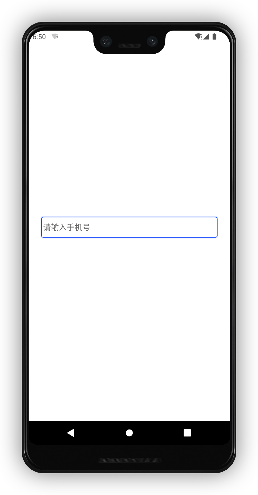
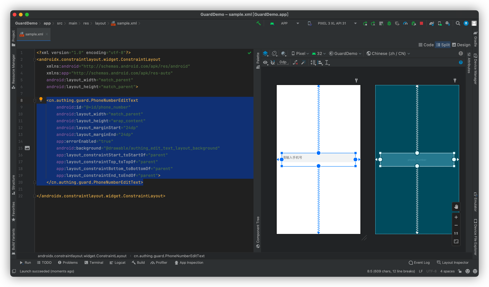

# PhoneNumberEditText

<LastUpdated/>

此组件将用户输入作为电话号码字段传给服务端，errorEnabled 属性控制是否显示错误信息。

## 示例



## 创建

放置一个 PhoneNumberEditText

```xml
<cn.authing.guard.PhoneNumberEditText
    android:id="@+id/phone_number"
    android:layout_width="match_parent"
    android:layout_height="wrap_content"
    android:layout_marginStart="24dp"
    android:layout_marginEnd="24dp"
    app:errorEnabled="true"
    android:background="@drawable/authing_edit_text_layout_background"
    app:layout_constraintStart_toStartOf="parent"
    app:layout_constraintTop_toTopOf="parent"
    app:layout_constraintBottom_toBottomOf="parent"
    app:layout_constraintEnd_toEndOf="parent">
</cn.authing.guard.PhoneNumberEditText>
```



