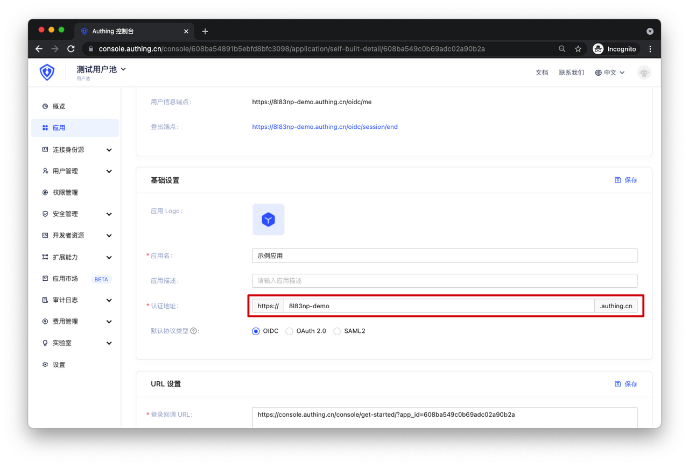

# 加入 APN 前的注意事项

<LastUpdated/>

在你的应用加入 APN 前，除了具备 OIDC 的基本能力以外，还需要注意以下几点，来确保授权的安全性和合理性：

## 多租户业务模型

如果你的应用同时为众多公司或者团队使用，他们共享一套服务集群与服务资源，但是独立拥有各自的数据与配置，那么这就是典型的**多租户场景**。

你需要确保你的应用中已有**多租户的业务模型**，保障不同租户间的数据相互隔离。

### 场景

如果 X 公司和 Y 公司采购了你的应用，X 公司在你的 SP（应用服务器） 创建了用户 A、B、C，如果这个时候 Y 公司在 Authing 上也创建了 A、B、C 三个一模一样的用户，你的 SP 就需要能够识别多租户的用户授权。

这是一个多租户模型，最简单的实现方式是，AX、BX、CX、AY、BY、CY 保证用户 + 请求域（或租户 ID）是唯一值的做法。

### 最佳实践

- 如果你的应用需要通过企业邮箱作为登录账号，那么就已经具备多租户业务模型。
- 如果你的应用不同的公司或者团队都拥有独立的登录域名，那么就已经具备多租户业务模型。
- 另外你目前也可以通过 Authing 的应用域名 + 用户名进行多租户实践。

Authing 的应用域名可以在以下的地方找到：

## 单租户业务模型

如果你的应用同时为众多公司或者团队使用，但是他们各自都独立拥有使用专属的服务集群与服务资源，独立拥有各自的数据与配置，那么这就是**单租户业务模型**。

在单租户业务模型下，你的租户数据是物理隔离的，不会产生数据权限混乱的风险。但是可能需要注意的是单租户可能会使用多个 IDP 的场景。

### 场景

如果 X 公司采购了你的应用，曾经创建了用户 A、B、C、D，近期又采购了新的 （IDaaS）IDP 合作商实现了 SSO，并在（IDaaS） IDP 服务商系统上创建了一样的 A、B、C 三个用户，X 公司希望可以 A、B、C 三个用户在任意一方登录都可以获取自己的资源，而 D 用户只能去你的 IDP 登录才能拿到自己的资源。

### 最佳实践

你需要将（IDaaS） IDP 请求过去的用户 A、B、C 和你应用服务器的 A、B、C 通过关联信息实现身份数据关联。