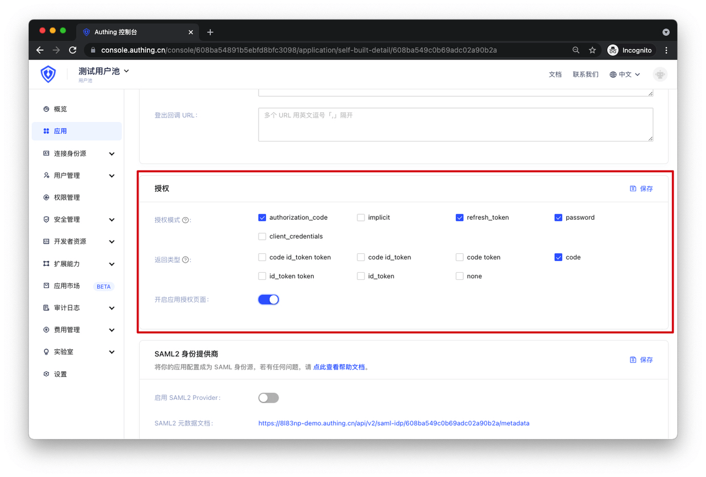
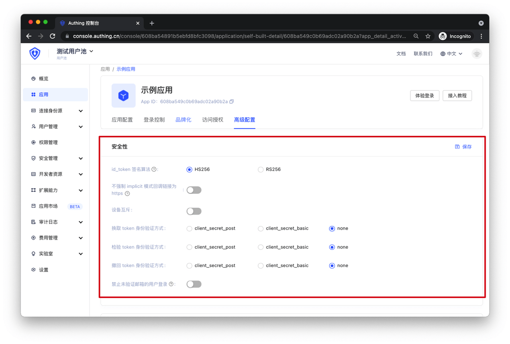
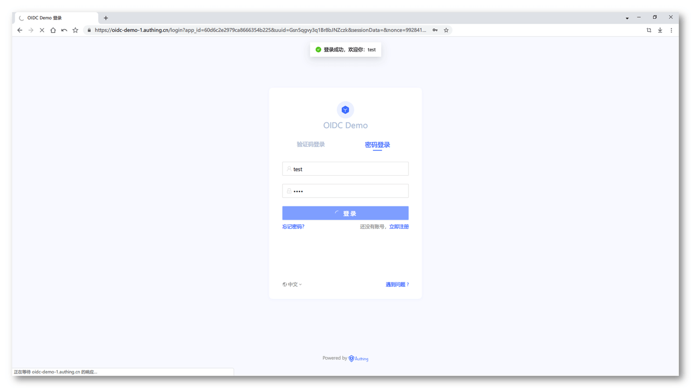
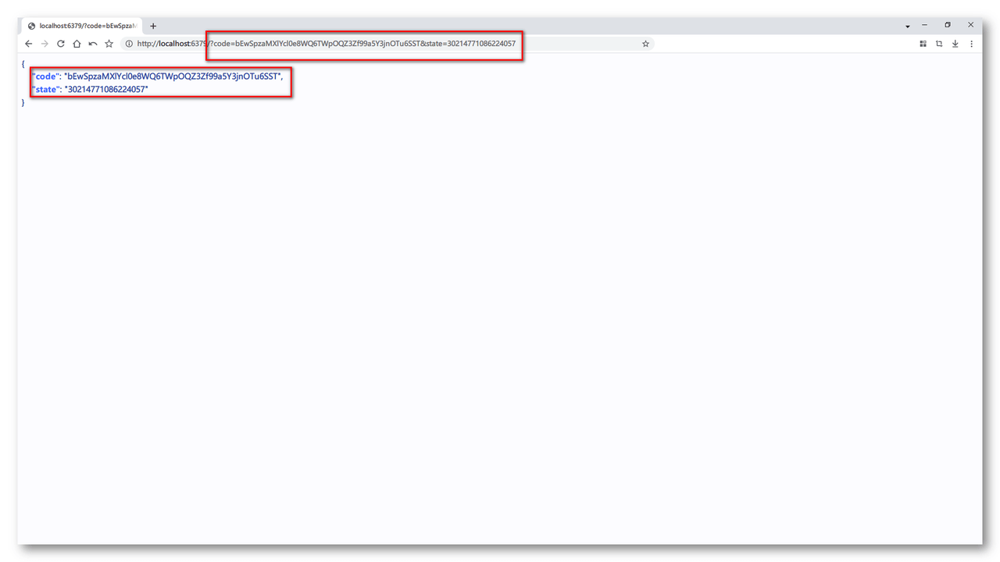
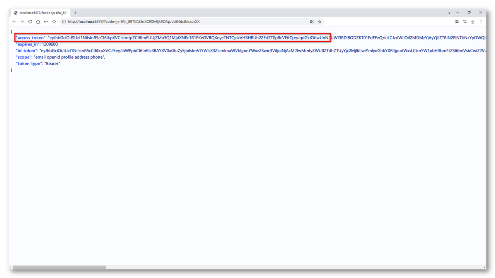
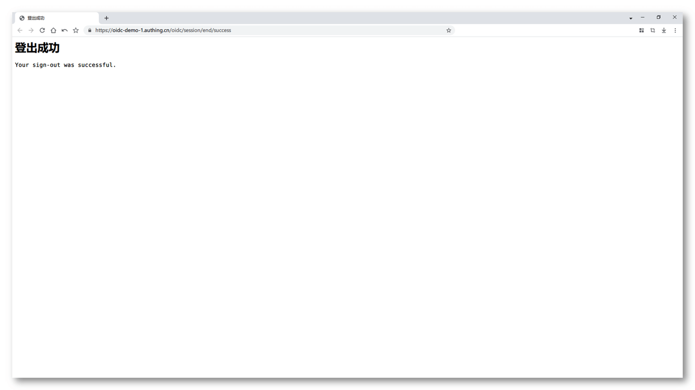

# Type 2 授权码 + PKCE 模式测试

<LastUpdated/>

**建议**
> 如果你的应用是一个 **SPA 前端应用或移动端 App**，建议使用**授权码 + PKCE 模式**来完成用户的认证和授权。授权码 + PKCE 模式**适合不能安全存储密钥的场景**（例如前端浏览器）。

在 Authing 设置你的应用程序的认证方式：



接下来就可以开始测试了。

## 1. 配置你的 OIDC 身份提供商

让你的应用程序支持 OIDC 协议的之前，首先需要在你的前端应用程序配置以下信息：

```Groovy
// OIDC 身份提供商的配置信息端点
OIDC_ISSUER: https://oidc-demo-1.authing.cn/oidc
// OIDC 身份提供商的唯一标识符 ID
OIDC_CLIENT_ID: xxxxxxxxxxxxxx
```

## 2. 获取 OIDC 身份提供商提供给你的配置信息

/.well-known/openid-configuration 是一个标准的 OIDC 端点，用于获取关于 OIDC 身份提供商的所有必要的端点和公钥位置信息。

通过 HTTP GET 请求获取你的 OIDC 身份提供商的配置信息。

```http
GET {你的 OIDC_ISSUER}/.well-known/openid-configuration HTTP/1.1
```

请求成功后，你将会得到以下配置信息。



## 3. 发起 OIDC 授权码 + PKCE 模式的认证

通过第二步获取的 openid-configuration，你需要使用其中的 authorization_endpoint 认证端点信息拼接的认证地址来完成 OIDC 的认证操作。

OIDC 授权码 + PKCE 模式认证地址的示例如下：

```D
{AUTHORIZATION_ENDPOINT}?nonce={NONCE}&scope={SCOPES_SUPPORTED}&client_id={OIDC_CLIENT_ID}&redirect_uri={YOUR_APPLICATION_URL}&response_type=code&code_challenge=xxxxxxxxx&code_challenge_method=S256
```

最终拼接出来的 OIDC 认证地址如下所示：

```Apache
https://oidc-demo-1.authing.cn/oidc/auth?nonce=8705127600621325&scope=openid+profile+email+phone+address&client_id=60d6c2e2979ca8666354b225&redirect_uri=http%3A%2F%2Flocalhost%3A6379&response_type=code&code_challenge=K3FT8eD3LtOrqcujmyZbjhOPB9qI-3T81L2RBZg33ZE&code_challenge_method=S256
```

> 在 OIDC 的授权码 + PKCE 模式下，你的应用程序需要生成一个随机字符串 code_challenge，并本地保存，每次发起认证请求的时候将这个随机字符串的摘要值传递给 OIDC 身份提供商并进行认证。

> 认证成功后使用 code 换取 AccessToken 的时候需要将 code_challenge 原始值一起传递给 OIDC 身份提供商。

> code_challenge 原始值：一个长度大于等于 43 位的随机字符串。

> code_challenge 摘要值：将 code_challenge 原始值先进行 SHA256 加密，然后进行 URL 安全的 Base64 编码生成的摘要。

参数说明：

```Groovy
// 通过第二步获取的 openid-configuration 中的 authorization_endpoint 字段
https://oidc-demo-1.authing.cn/oidc/auth
// 随机字符串
nonce=8705127600621325
// 通过第二步获取的 openid-configuration 中的 scopes_supported 字段
scope=openid+profile+email+phone+address
// 你配置的 OIDC 身份提供商的唯一标识符 ID
client_id=60d6c2e2979ca8666354b225
// 你的应用的地址
redirect_uri=http://localhost:6379
// 使用授权码 + PKCE 模式进行认证，OIDC 身份提供商将 Code 返回给你的应用程序
response_type=code
// 上述提到的 code_challenge 摘要值
code_challenge=xxxxxxxxxxxxxx
// 固定值，表示 code_challenge 的摘要值是通过 S256 算法生成
code_challenge_method=S256
```

访问上面的地址，你将会看到 Authing 的登录认证页：


使用 OIDC 身份提供商的用户登录（ Authing 上创建的用户账号）：



登录成功后 OIDC 身份提供商将会携带 Code 跳转到你的应用程序：



## 4. 使用 Code 换取 AccessToken

OIDC 中的 Code 是一个临时的、时效性较短的一个授权码，用于换取 AccessToken。

关于 AccessToken 更多的释义，请参考这篇文章：什么是 [Access Token](/concepts/access-token.md)

当你的应用程序接收到了 OIDC 身份提供商传给你的 Code 的时候，接下来你需要通过 Code 换取 AccessToken。

这时候你需要发送一个 HTTP POST 请求，请求格式如下：

```Groovy
// 通过第二步获取的 openid-configuration 中的 token_endpoint 字段
POST https://oidc-demo-1.authing.cn/oidc/token HTTP/1.1
Content-Type: application/x-www-form-urlencoded
Data:
    // 你配置的 OIDC 身份提供商的唯一标识符 ID
    client_id:60d6c2e2979ca8666354b225
    // 通过授权码 Code 方式获取 AccessToken
    grant_type:authorization_code
    // OIDC 身份提供商传给你的 Code
    code:xxxxxxxxxxxxxxxxxxxxxxxxxxxx
    // 你的应用的地址
    redirect_uri:http://localhost:6379
    // 上述提到的 code_challenge 原始值
    code_verifier:xxxxxxxxxxxxxxxxxxxxxxxxxxxx
```

请求成功后，你将会得到以下信息，其中包含了 AccessToken：



## 5. 使用 AccessToken 获取用户信息

当你的应用程序通过 Code 和 CodeVerifier 获取到了 AccessToken 后，接下你需要使用 AccessToken 换取用户信息。

这时候你需要发送一个 HTTP GET 请求，请求格式如下：

```Groovy
// 通过第二步获取的 openid-configuration 中的 userinfo_endpoint 字段
GET https://oidc-demo-1.authing.cn/oidc/me HTTP/1.1
params:
    // 通过第四步获取的 access_token 字段
    access_token:xxxxxxxxxxxxxxxxxxxxxx
```

请求成功后，你将会得到以下信息，其中包含了当前登录用户的相关信息：



当你看到这个界面时，你已经完成了 OIDC 的用户登出。

