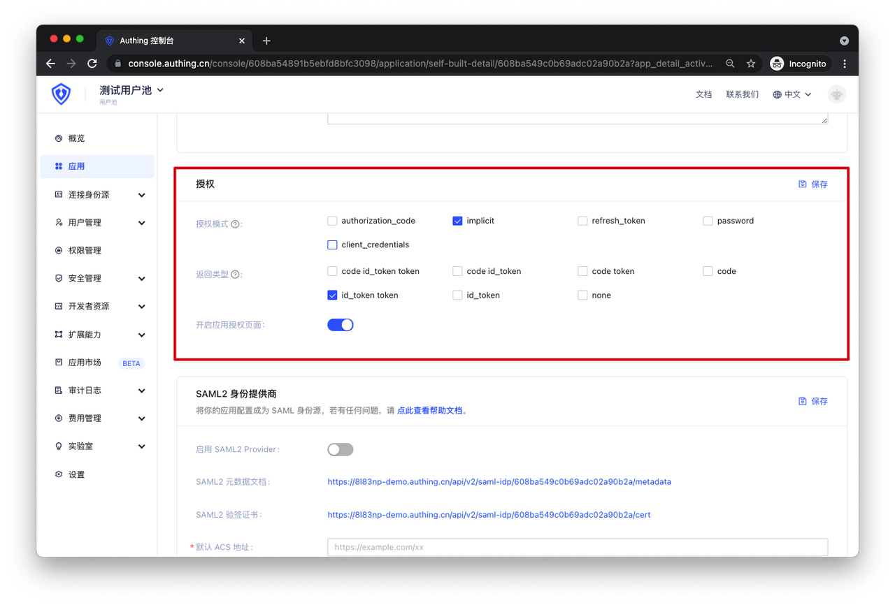
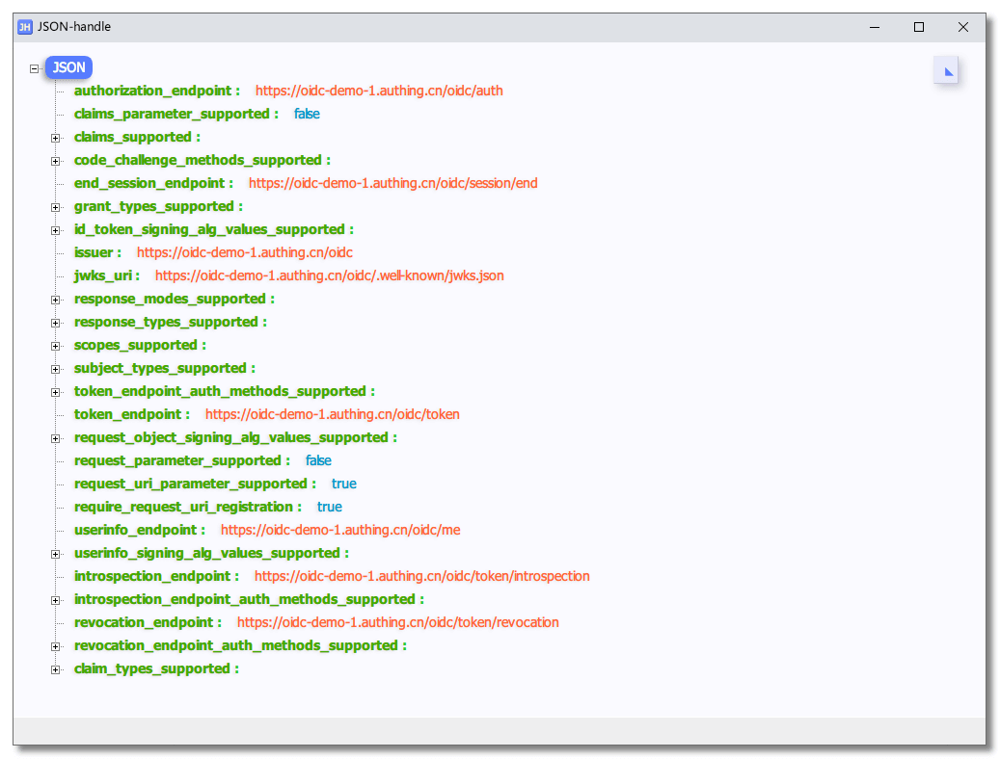
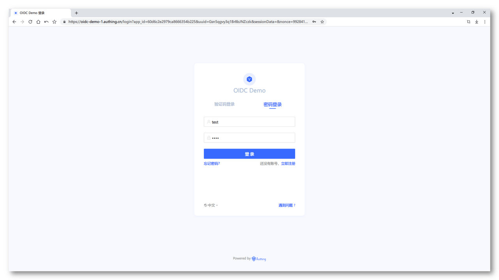
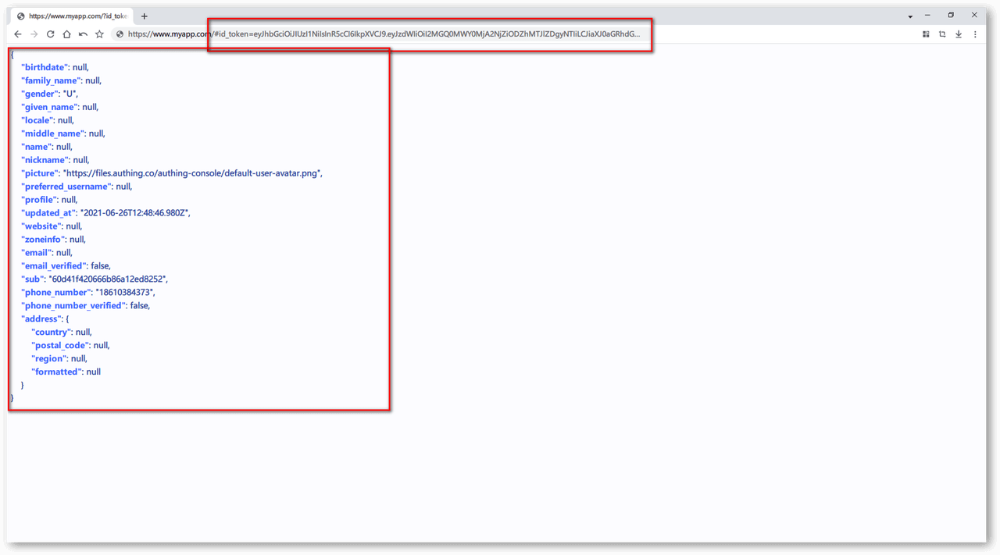

# Type 3 隐式模式测试

<LastUpdated/>

**建议：**

> 如果你的应用是一个 **SPA 前端应用**，不具备后端服务，建议使用**隐式模式**来完成用户的认证和授权。隐式模式**适合不能安全存储密钥的场景**（例如前端浏览器）。在**隐式模式**中，应用不需要使用 code 换 token，无需请求 `/token` 端点，AccessToken 和 IdToken 会直接从**认证端点**返回。

> ***注：在 OIDC 隐式模式下，为了保证安全性，你的前端应用必须是 HTTPS 协议***

在 Authing 设置你的应用程序的认证方式：



接下来就可以开始测试了。

## 1. 配置你的 OIDC 身份提供商

让你的应用程序支持 OIDC 协议的之前，首先需要在你的前端应用程序配置以下信息：

```Groovy
// OIDC 身份提供商的配置信息端点
OIDC_ISSUER: https://oidc-demo-1.authing.cn/oidc
// OIDC 身份提供商的唯一标识符 ID
OIDC_CLIENT_ID: xxxxxxxxxxxxxx
```

## 2. 获取 OIDC 身份提供商提供给你的配置信息

/.well-known/openid-configuration 是一个标准的 OIDC 端点，用于获取关于 OIDC 身份提供商的所有必要的端点和公钥位置信息。

通过 HTTP GET 请求获取你的 OIDC 身份提供商的配置信息：

```http
GET {你的 OIDC_ISSUER}/.well-known/openid-configuration HTTP/1.1
```

请求成功后，你将会得到以下配置信息：



## 3. 发起 OIDC 隐式模式的认证

通过第二步获取的 openid-configuration，你需要使用其中的 authorization_endpoint 认证端点信息拼接的认证地址来完成 OIDC 的认证操作。

OIDC 隐式模式认证地址的示例如下：

```D
{AUTHORIZATION_ENDPOINT}?nonce={NONCE}&scope={SCOPES_SUPPORTED}&client_id={OIDC_CLIENT_ID}&redirect_uri={YOUR_APPLICATION_URL}&response_type=id_token+token
```

最终拼接出来的 OIDC 认证地址如下所示：

```Apache
https://oidc-demo-1.authing.cn/oidc/auth?nonce=4481594720762121&scope=openid+profile+email+phone+address&client_id=60d6c2e2979ca8666354b225&redirect_uri=https%3A%2F%2Fwww.myapp.com&response_type=id_token+token
```

参数说明：

```Groovy
// 通过第二步获取的 openid-configuration 中的 authorization_endpoint 字段
https://oidc-demo-1.authing.cn/oidc/auth
// 随机字符串
nonce=4481594720762121
// 通过第二步获取的 openid-configuration 中的 scopes_supported 字段
scope=openid+profile+email+phone+address
// 你配置的 OIDC 身份提供商的唯一标识符 ID
client_id=60d6c2e2979ca8666354b225
// 你的应用的地址
redirect_uri=https://www.myapp.com
// 使用隐式模式进行认证
response_type=id_token+token
```

访问上面的地址，你将会看到 Authing 的登录认证页。



使用 OIDC 身份提供商的用户登录（Authing 上创建的用户账号）。


登录成功后，你的 SPA 前端应用将会以 url hash 的方式接收到以下信息，其中包括了 access_token、id_token 等。


## 4. 使用 AccessToken 获取用户信息

当你的前端应用程序通过 url hash 获取到了 AccessToken 后，接下你需要使用 AccessToken 换取用户信息。

这时你需要发送一个 HTTP GET 请求，格式如下：

```Groovy
// 通过第二步获取的 openid-configuration 中的 userinfo_endpoint 字段
GET https://oidc-demo-1.authing.cn/oidc/me HTTP/1.1
params:
    // 通过第三步获取的 access_token 字段
    access_token:xxxxxxxxxxxxxxxxxxxxxx
```

请求成功后，你将会得到以下信息，其中当前登录用户的相关信息。



恭喜你，你的应用已经拥有 OIDC 能力。

## 5. 使用 OIDC 完成用户退出登录

当完成前四步操作后，已经让你的应用实现了通过 OIDC 标准协议认证用户的能力。

接下来你需要使用 OIDC 完成用户退出登录的操作。

这时候你需要发送一个 HTTP GET 请求，请求格式如下：

```Groovy
// 通过第二步获取的 openid-configuration 中的 end_session_endpoint 字段
GET https://oidc-demo-1.authing.cn/oidc/session/end HTTP/1.1
```

请求成功后，你将会看到如下界面：


当你看到这个界面时，你已经完成了 OIDC 的用户登出。