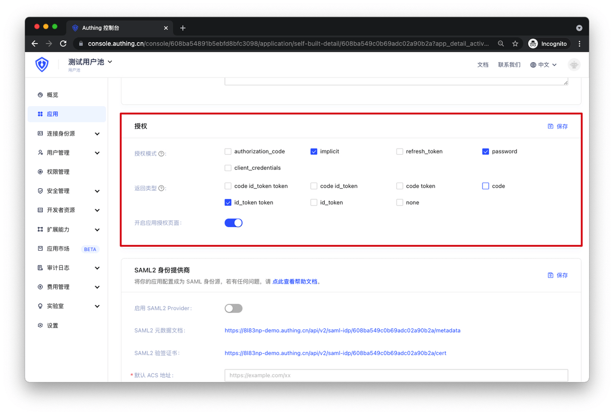
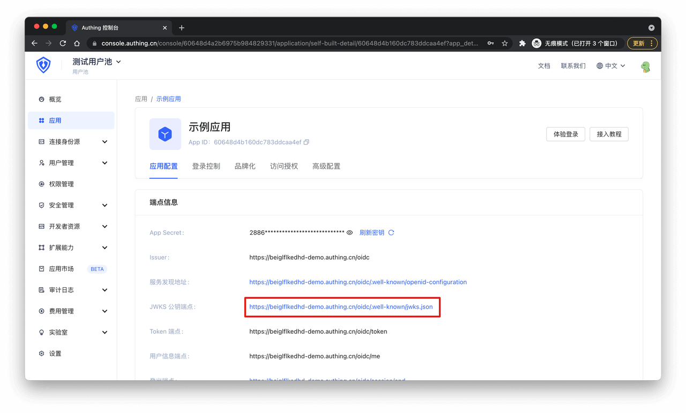
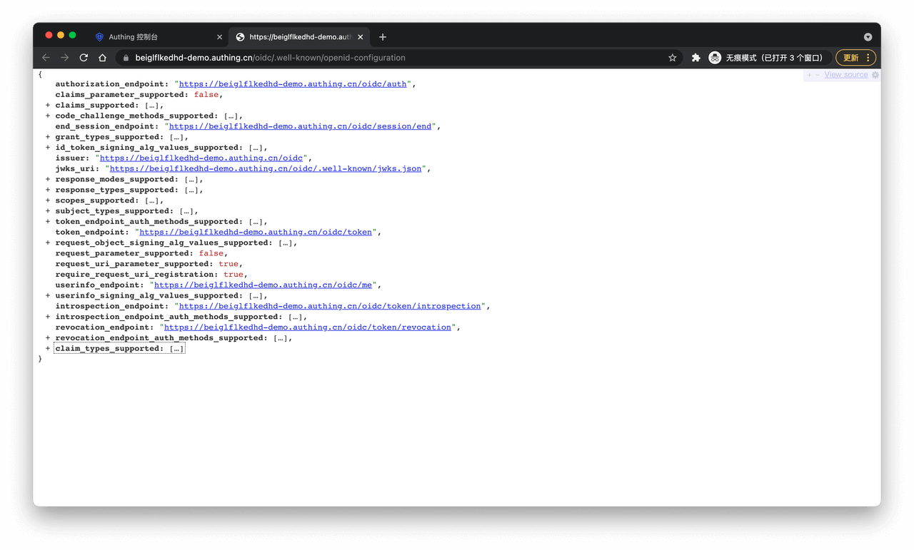
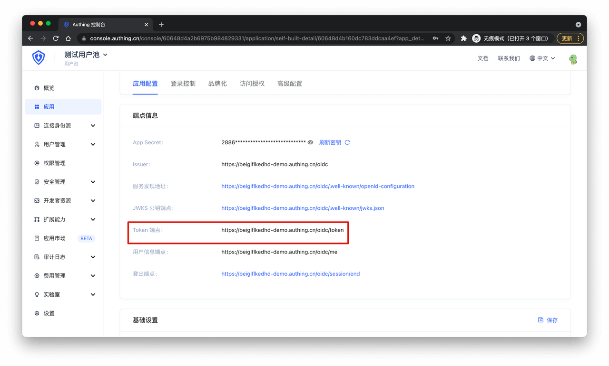
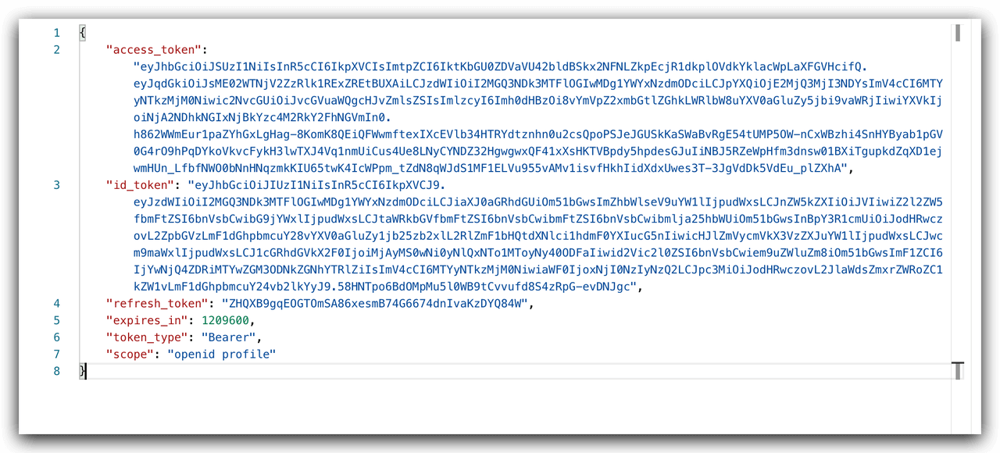
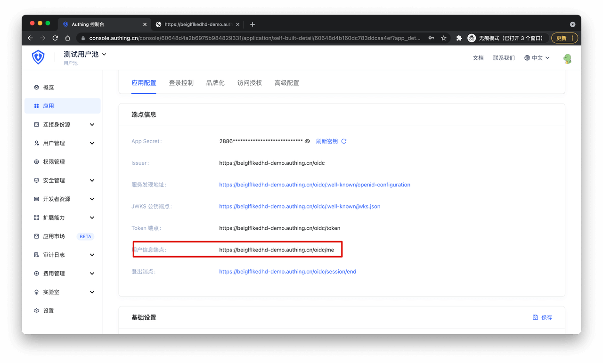
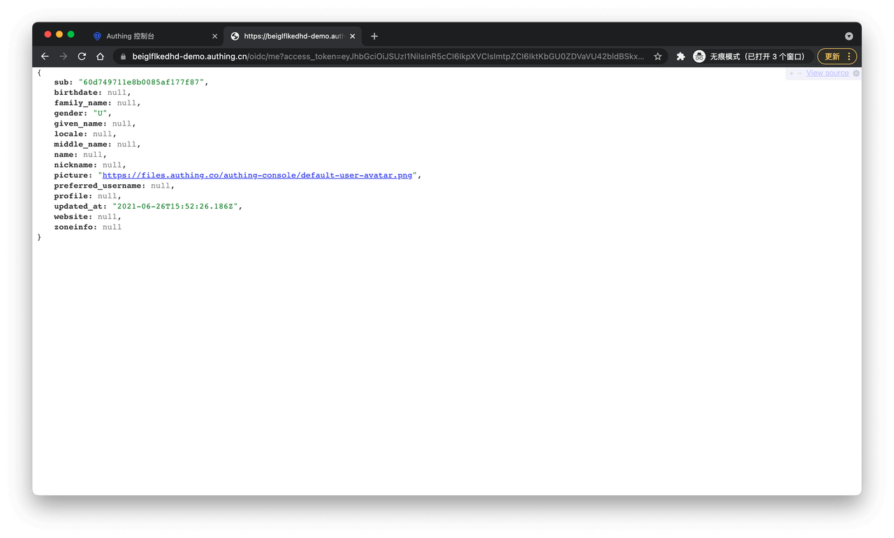

# Type 4 密码模式测试

<LastUpdated/>

**建议：**
> 密码模式需要你的应用携带用户名和密码请求 OIDC 身份提供商，而且你的应用不应该存储这些信息，这需要你的应用完全被用户信任。

在 Authing 设置你的应用程序的认证方式：

接下来就可以开始测试了。

## 1. 获取 Authing OIDC IdP 配置

通过访问以上地址，你会得到以下配置信息：

## 2. 发起 OIDC 密码模式认证

在你的应用服务端使用 `HTTP POST` 请求 OIDC token 端点，token 端点获取方式如下：

所需参数如下：

| 参数 | 说明 | 是否必填 |
| --  | --| -- |
| client_id | OIDC 应用 ID，即 Authing 应用 ID | 是 |
| client_secret | OIDC 应用秘钥，即 Authing 应用秘钥 | 是 |
| username | 需要登录用户的用户名 | 是 |
| password | 需要登录用户的密码 |是 |
| grant_type | 授权模式，密码模式中必须为 password 字符串 | 是 |
| scope | 授权范围，默认为 openid profile，可选值为 OIDC IdP 配置信息中的 scopes_supported 中的值 | 否|

以 `application/x-www-form-urlencoded` 或 `applicaton/json` 格式携带以上参数请求 token 端点，你会得到如下信息，其中包含 `access_token` ：

## 

3. 使用 AccessToken 获取用户信息

当你的应用程序获取 `access_token` 后，你可以发起 `HTTP GET` 请求用户信息端点获取用户信息，用户信息端点获取方式如下：

请求时需要携带 `access_token` 参数，请求成功后，你将会获取到如下信息：

恭喜你 你的应用已经拥有 OIDC 能力。

