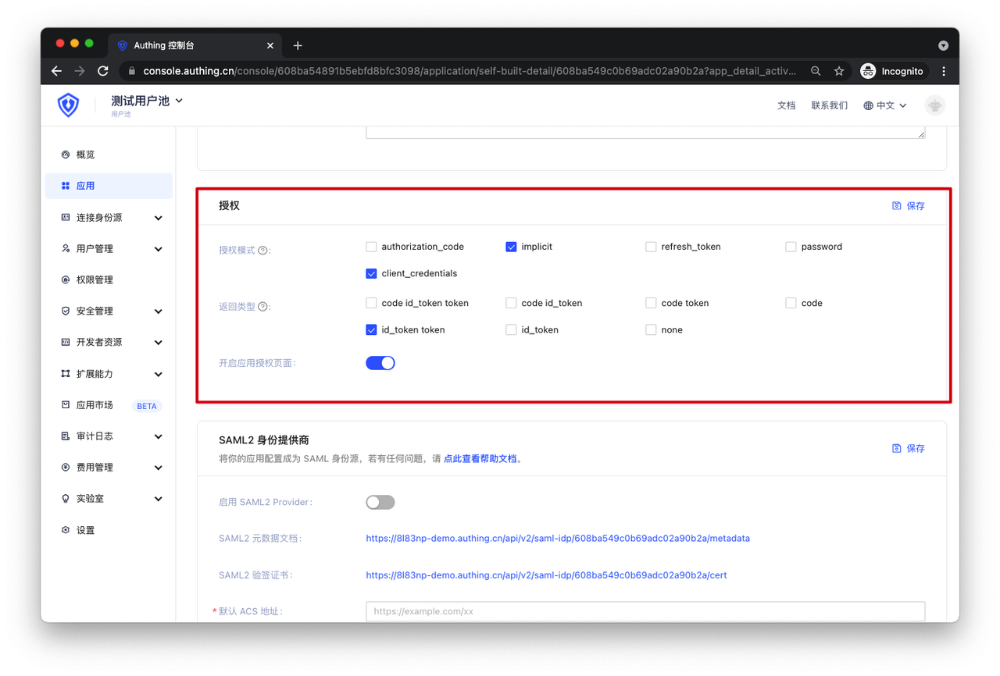
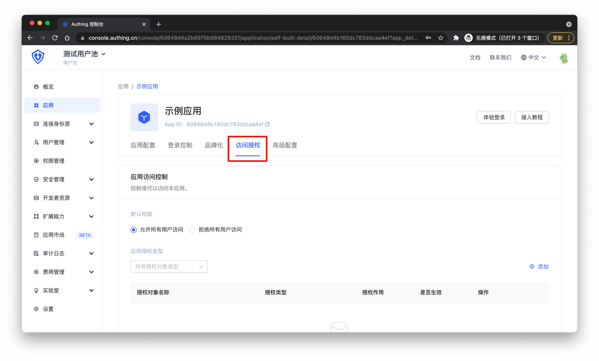
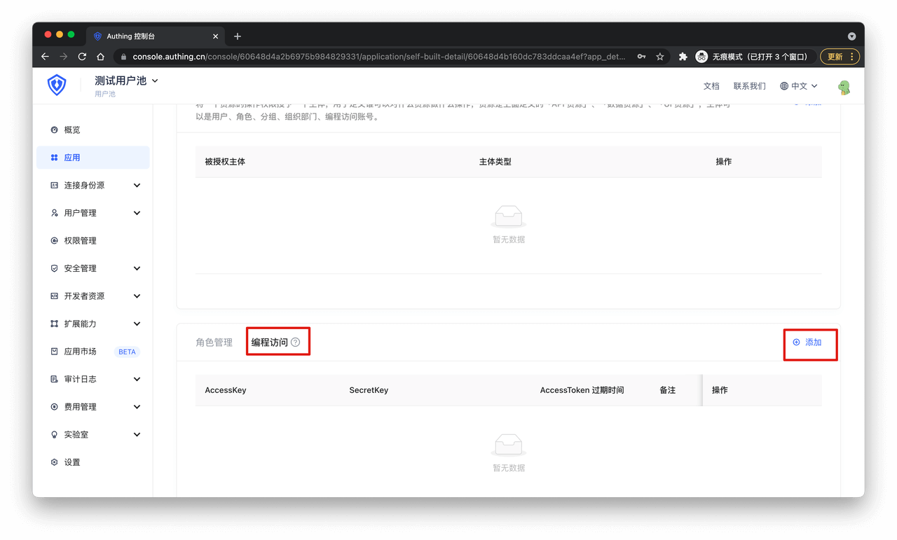
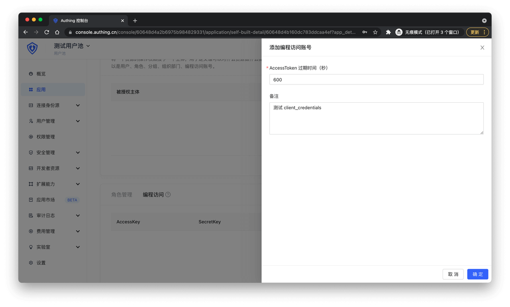
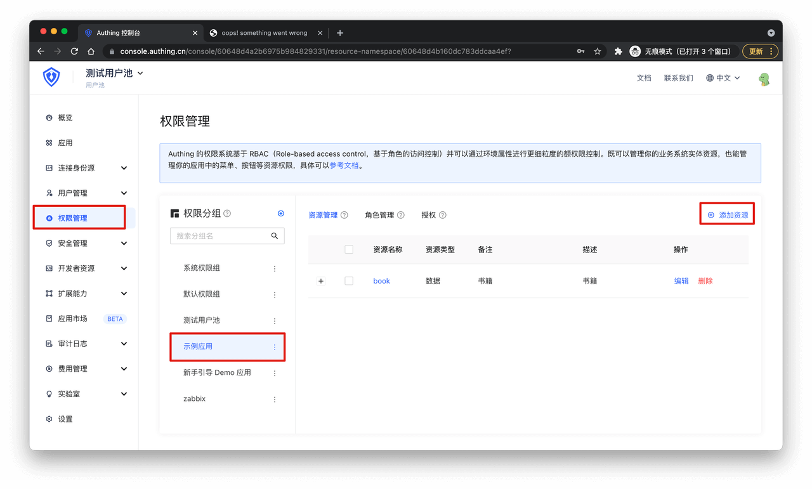
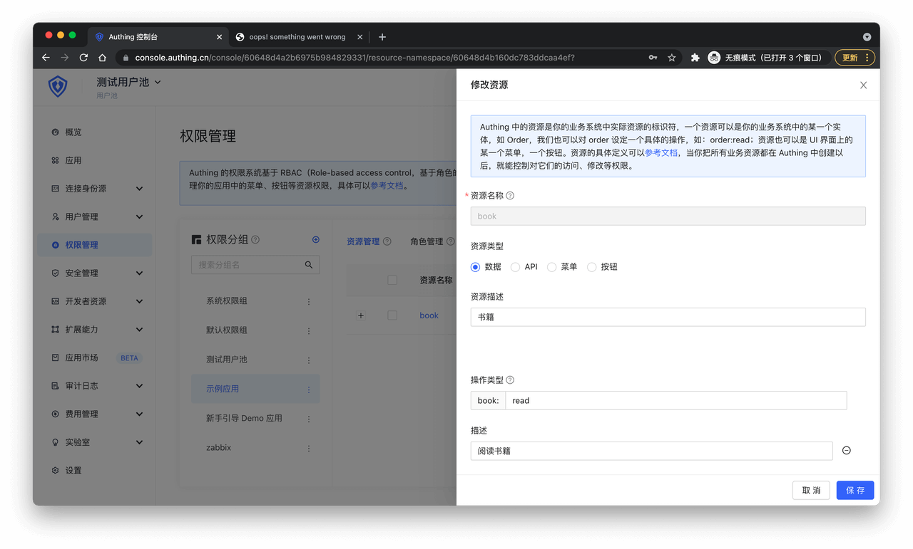
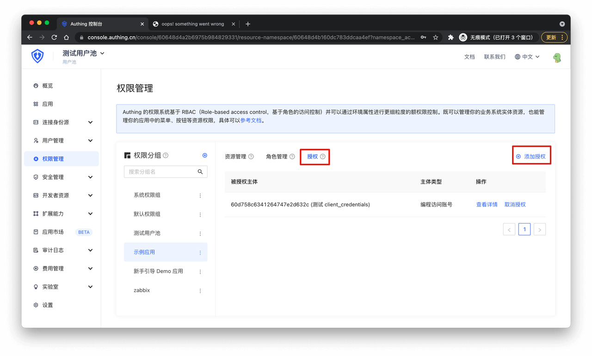
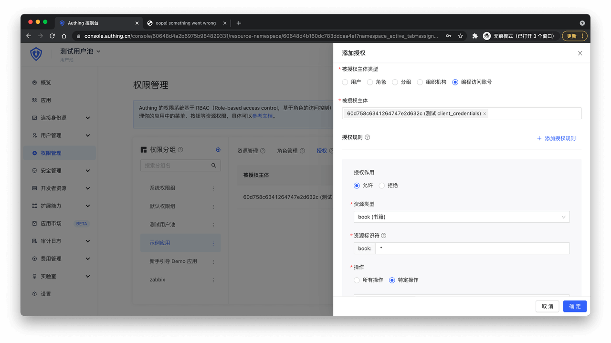

# Type 5 Client Credentials 模式测试

<LastUpdated/>

**建议：**
> Client Credentials 模式用于进行服务器对服务器间的授权（M2M 授权），期间没有用户的参与。

在 Authing 设置你的应用程序的认证方式。

接下来就可以开始测试了。

## 1. 获取 Authing OIDC IdP 配置

通过访问以上地址，你会得到以下配置信息：

## 2. 获取编程访问账号

Client Credentials 模式需要有一个约定的访问令牌来获取 `access_token` ，在 Authing 中是编程访问账号。
找到应用访问授权 tab：

往下滑找到「编程访问」，并点击「添加」按钮。

随意输入备注信息并点击「保存」。

接下来就可以使用 `AccessKey` 和 `SecretKey` 获取 `access_key` 了。

## 3. 给编程访问账号授权

在 Authing 控制台找到「权限管理」-> 「你创建的应用」，点击「添加资源」。

输入如下信息：

- 资源名称，你想测试的资源名，本示例为 `book` 。

- 资源描述，资源的备注信息。

- 操作类型，对资源的操作，本示例中添加了一个 `read` 操作，表示阅读书籍。

- 操作描述，操作的描述信息。

点击「保存」，然后点击「授权」，「添加授权」：

填写如下信息：

- 被授权主体类型选择「编程访问账号」。

- 被授权主体选择之前创建的编程访问账号。

- 授权规则中，资源类型选择之前创建的「book」，资源标识符填入「*」，表示允许所有 book 资源，操作选择「特定操作」，并在下拉框选择之前创建的「book:read」。

点击「确定」。

## 4. 发起 OIDC Client Credentials 模式认证

在你的应用服务端使用 `HTTP POST` 请求 OIDC token 端点，token 端点获取方式如下：

所需参数如下：

| 参数 | 说明 | 是否必填 |
| -- | -- | -- |
| client_id | OIDC 应用 ID，即编程访问账号的 AccessKey | 是 |
| client_secret | 访问令牌，即编程访问账号的 SecretKey | 是 |
| grant_type | 授权模式，Client Credentials 模式中必须为 client_credentials 字符串 | 是 |
| scope | 授权范围，格式为 resourceName:resourceScope:action，如所有书籍的阅读权限标识为 book:*read，多个范围用空格分隔 | 是 |

以 `application/x-www-form-urlencoded` 或 `applicaton/json` 格式携带以上参数请求 token 端点，你会得到如下信息，其中包含 `access_token` ：

本示例中请求的 `scope` 为 `book:*:read book:*:edit`，由于只给此账号授予了 `book:*:read` 权限，所以 `rejected_scope` 包含 `book:*:edit`。

恭喜你，你的应用已经拥有 OIDC 能力。