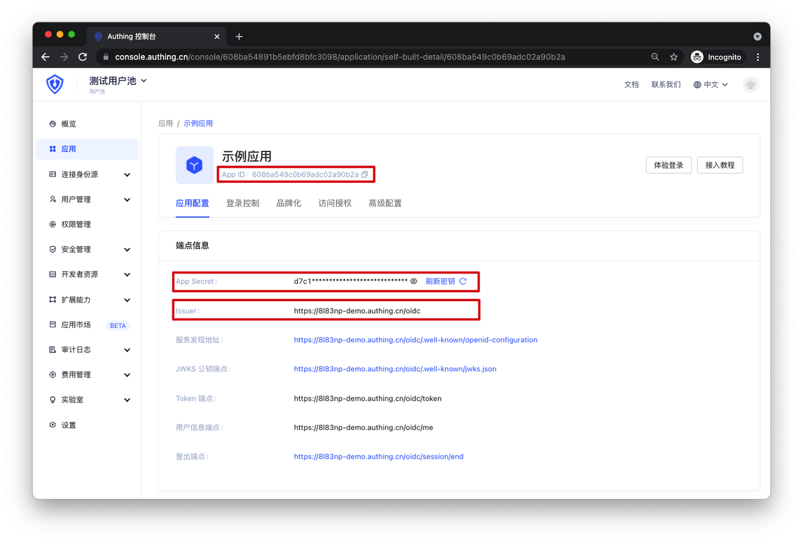
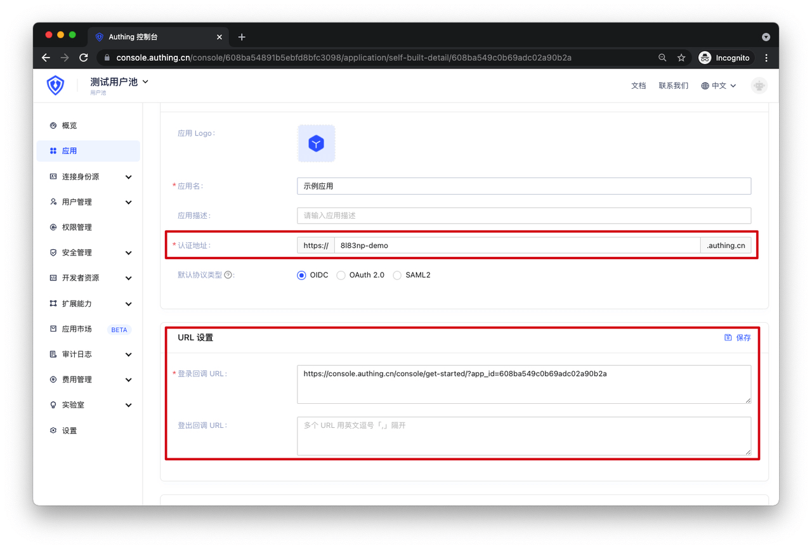

# 第二步：点击刚创建的应用，获取 OIDC 参数

<LastUpdated/>

在应用详情中，你可以获得应用的以下参数：

- App ID
- App Secret
- Issuer

- 认证地址：即 appHost 参数
- 登录/登出回调 URL：需要在 Authing 上配置用户登录成功和退出的应用地址

scope（授权范围）：授权访问用户的详细信息。

scope 参数对应的用户信息：

| scope 名称 | 对应信息 |
| -- | -- |
| username        | username                                                     |
| address         | address                                                      |
| email           | email，email_verified                                        |
| phone           | phone_number, phone_number_verified                          |
| profile         | birthdate，family_name，gender，given_name，locale，middle_name，name，nickname，picture，preferred_username，profile，updated_at，website，zoneinfo |
| offline_access  | 如果存在此参数，token 接口会返回 refresh_token 字段          |
| roles           | 对应 role 信息，用户的角色列表                                    |
| unionid         | 用户的 unionid 字段                                          |
| openid         | 用户的 openid 字段                                           |
| external_id     | 用户在原有系统的用户 ID                                      |
| extended_fields | 用户的扩展字段信息，内容为一个对象，key 为扩展字段名，value 为扩展字段值 |