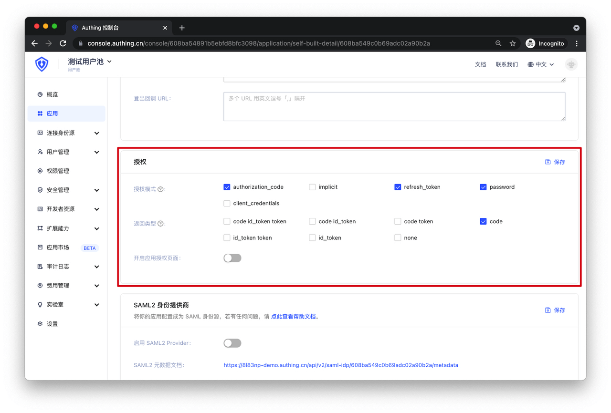
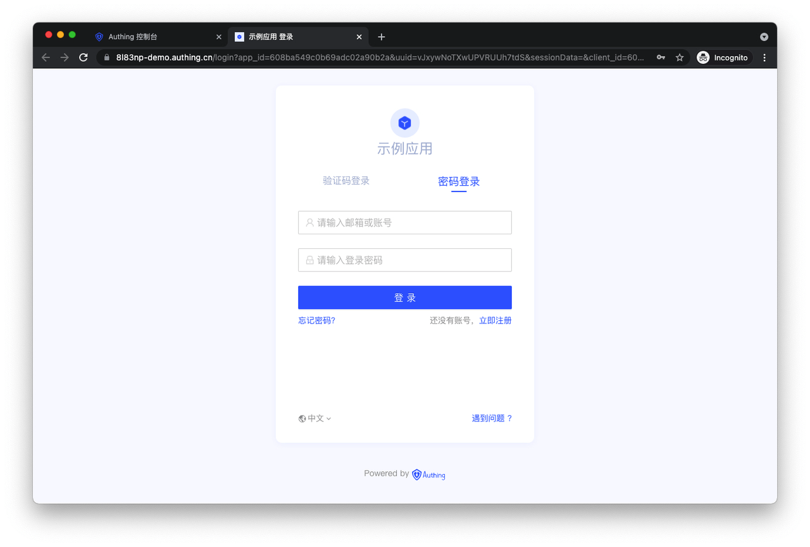
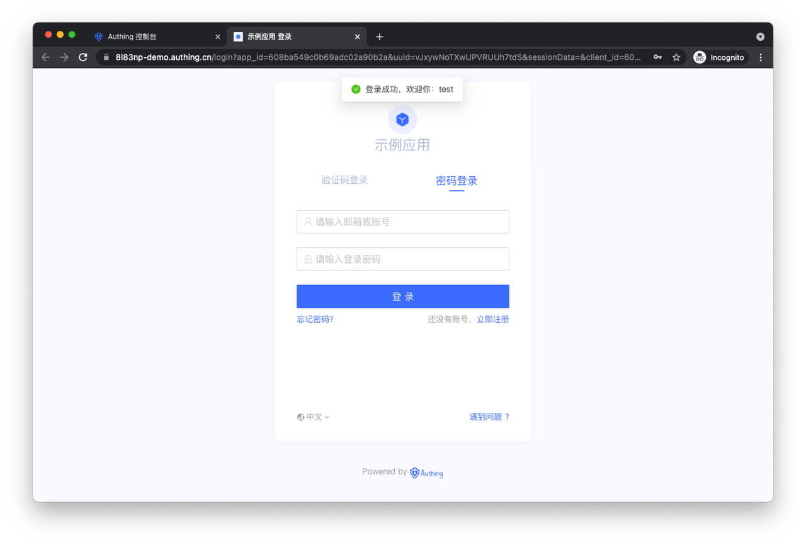
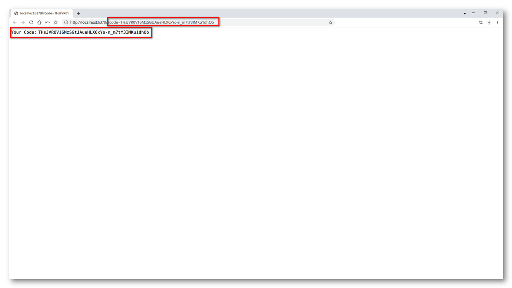
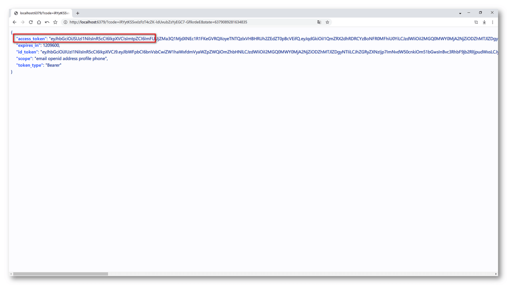
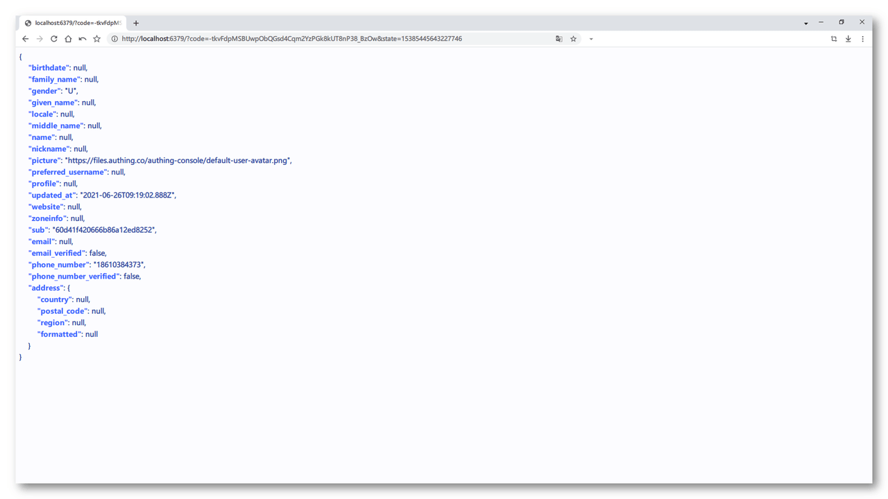
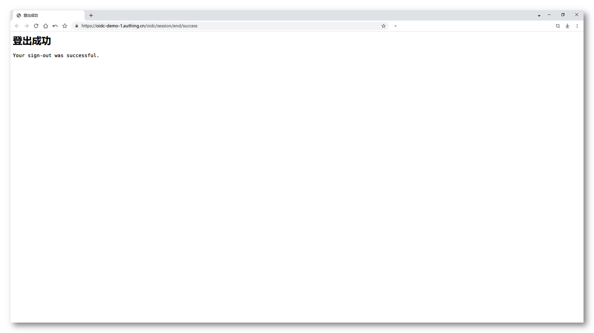

# 第四步：通过 Authing 的 IDP 测试你的应用

<LastUpdated/>

下面我们会提供五种不同的授权模式测试样例，帮助你可以快速的验证 OIDC 集成是否成功。

你只需要选择自己集成的授权模式进行测试即可，如果你不知道该选择何种模式，请使用最普遍的**授权码模式**测试。如果你想选用其他模式测试，请参考[更多 OIDC 测试方法](/apn/more-oidc-tests/)。

## Type 1 授权码模式测试（推荐）

**建议：**

> 如果你的应用项目有**后端服务**，能够安全存储密钥，建议使用**授权码模式**。

在 Authing 设置你的应用的认证方式：



接下来就可以开始测试了。

### 1. 配置你的 OIDC 身份提供商

让你的应用程序支持 OIDC 协议的之前，首先需要在你的后端应用程序配置以下信息：

```Groovy
// OIDC 身份提供商的配置信息端点
OIDC_ISSUER: https://oidc-demo-1.authing.cn/oidc
// OIDC 身份提供商的唯一标识符 ID
OIDC_CLIENT_ID: xxxxxxxxxxxxxx
// OIDC 身份提供商的唯一标识符 Secret
OIDC_CLIENT_SECRET: xxxxxxxxxxxxxx
```

### 2. 获取 OIDC 身份提供商提供给你的配置信息

/.well-known/openid-configuration 是一个标准的 OIDC 端点，用于获取关于 OIDC 身份提供商的所有必要的端点和公钥位置信息。

通过 HTTP GET 请求获取你的 OIDC 身份提供商的配置信息：

```http
GET {你的 OIDC_ISSUER}/.well-known/openid-configuration HTTP/1.1
```

请求成功后，你将会得到以下配置信息：


### 3. 发起 OIDC 授权码模式的认证

通过第二步获取的 openid-configuration，你需要使用其中的 authorization_endpoint 认证端点信息拼接的认证地址来完成 OIDC 的认证操作。

OIDC 认证地址的示例如下：

```D
{AUTHORIZATION_ENDPOINT}?nonce={NONCE}&scope={SCOPES_SUPPORTED}&client_id={OIDC_CLIENT_ID}&redirect_uri={YOUR_APPLICATION_URL}&response_type=code
```

最终拼接出来的 OIDC 认证地址如下所示：

```Apache
https://oidc-demo-1.authing.cn/oidc/auth?nonce=6266751455540045&scope=openid+profile+email+phone+address&client_id=60d6c2e2979ca8666354b225&redirect_uri=http%3A%2F%2Flocalhost%3A6379&response_type=code
```

参数说明：

```Groovy
// 通过第二步获取的 openid-configuration 中的 authorization_endpoint 字段
https://oidc-demo-1.authing.cn/oidc/auth
// 随机字符串
nonce=4095587973501673 
// 通过第二步获取的 openid-configuration 中的 scopes_supported 字段
scope=openid+profile+email+phone+external_id
// 你配置的 OIDC 身份提供商的唯一标识符 ID
client_id=60d6c2e2979ca8666354b225
// 你的应用的地址
redirect_uri=http://localhost:6379
// 使用授权码模式进行认证
response_type=code
```

访问上面的地址，你将会看到 Authing 的登录认证页：




使用 OIDC 身份提供商的用户登录（Authing 上创建的用户账号）：



登录成功后 OIDC 服务提供商将会携带 Code 跳转到你的应用程序：



### 4. 使用 Code 换取 AccessToken

OIDC 中的 Code 是一个临时的、时效性较短的一个授权码，用于换取 AccessToken。

关于 AccessToken 更多的释义，请参考这篇文章：[什么是 Access Token](/concepts/access-token.md)

当你的应用程序接收到了 OIDC 身份提供商传给你的 Code 的时候，接下来你需要通过 Code 换取 AccessToken。

这时候你需要发送一个 HTTP POST 请求，请求格式如下：

```groovy
// 通过第二步获取的 openid-configuration 中的 token_endpoint 字段
POST https://oidc-demo-1.authing.cn/oidc/token HTTP/1.1
Content-Type: application/x-www-form-urlencoded
Data:
    // 你配置的 OIDC 身份提供商的唯一标识符 ID
    client_id:60d6c2e2979ca8666354b225
    // 你配置的 OIDC 身份提供商的唯一标识符 Secret
    client_secret:xxxxxxxxxxxxxxxxxxxx
    // 通过授权码 Code 方式获取 AccessToken
    grant_type:authorization_code
    // OIDC 身份提供商传给你的 Code
    code:xxxxxxxxxxxxxxxxxxxx
    // 你的应用的地址
    redirect_uri:http://localhost:6379
```

请求成功后，你将会得到以下信息，其中包含了 AccessToken：



### 5. 使用 AccessToken 获取用户信息

当你的应用程序通过 Code 获取到了 AccessToken 后，接下你需要使用 AccessToken 换取用户信息
这时候你需要发送一个 HTTP GET 请求，请求格式如下：

```groovy
// 通过第二步获取的 openid-configuration 中的 userinfo_endpoint 字段
GET https://oidc-demo-1.authing.cn/oidc/me HTTP/1.1
params:
    // 通过第四步获取的 access_token 字段
    access_token:xxxxxxxxxxxxxxxxxxxxxx
```

请求成功后，你将会得到以下信息，其中包含了当前登录用户的相关信息：



恭喜你，你的应用已经拥有 OIDC 能力。

### 6. 使用 OIDC 完成用户退出登录

当完成前五步操作后，你已经让你的应用实现了通过 OIDC 标准协议认证用户的能力

接下来你需要使用 OIDC 完成用户退出登录的操作

这时候你需要发送一个 HTTP GET 请求，请求格式如下：

```groovy
// 通过第二步获取的 openid-configuration 中的 end_session_endpoint 字段
GET https://oidc-demo-1.authing.cn/oidc/session/end HTTP/1.1
```

请求成功后，你将会看到如下界面：



当你看到这个界面时，你已经完成了 OIDC 的用户登出。

## 更多测试方式

如果你想了解更多测试方式，请参考[更多 OIDC 测试方法](/apn/more-oidc-tests/)。