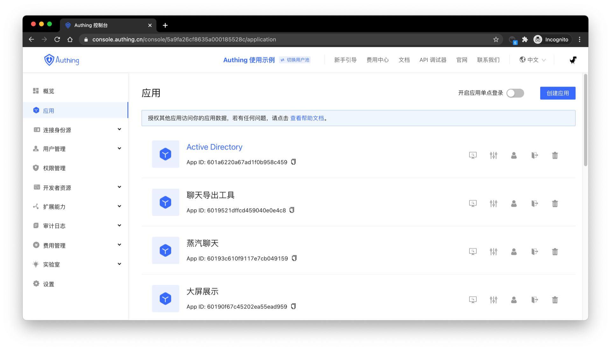
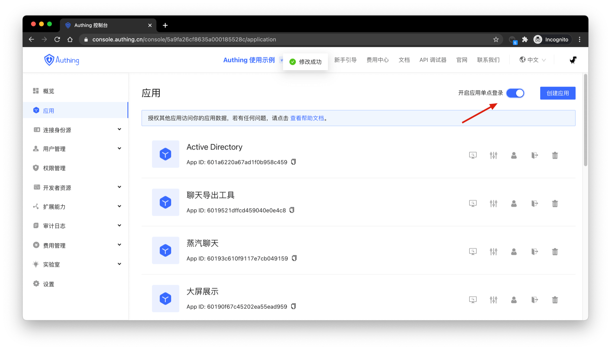
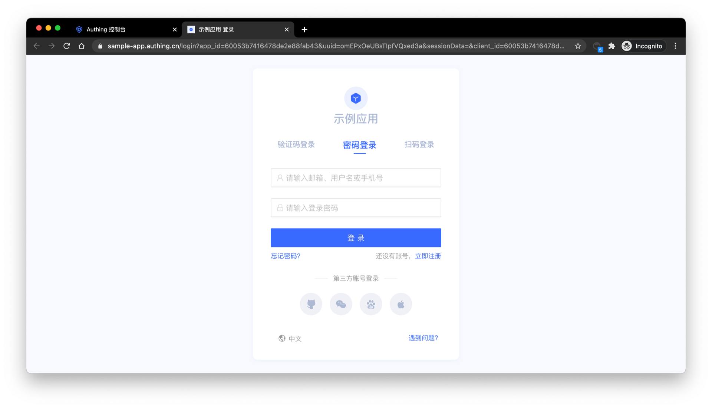
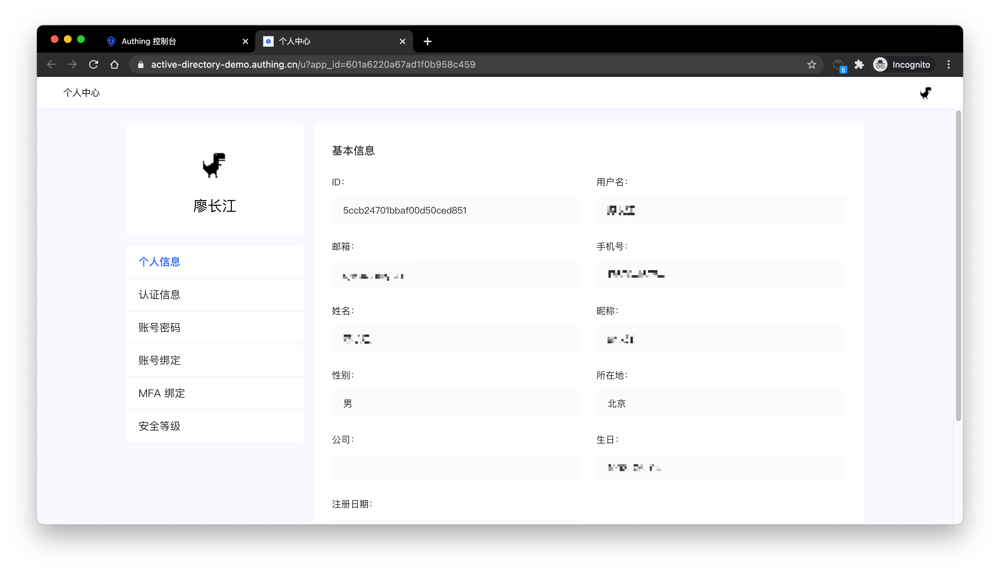
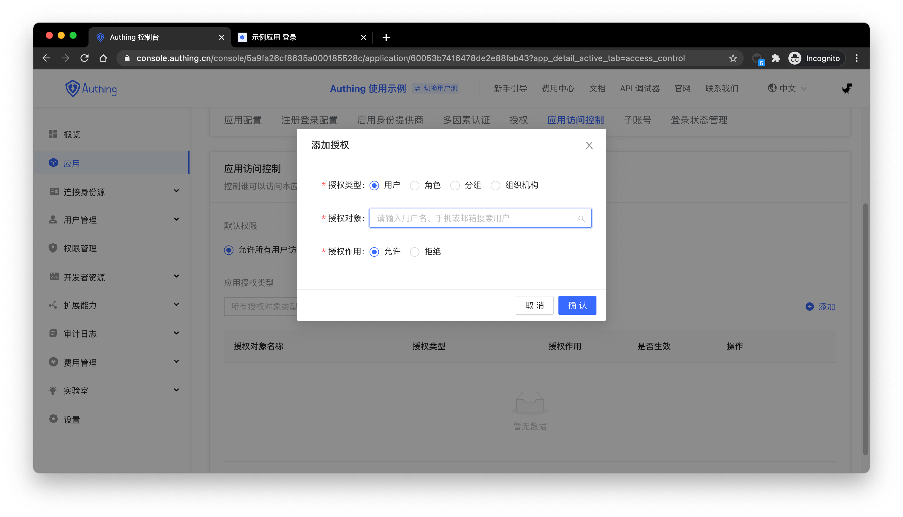

# 什么是应用

<LastUpdated/>

前面我们介绍了[用户池](./user-pool.md)是你在 {{$localeConfig.brandName}} 中租户隔离的最小单位，存储了你用户系统中所有的用户数据；而应用则对应的是你现实中创建的业务应用。

一个用户池可能会有多个应用，比如一个学校所有的学生在一个用户池里，而学校会同时开发了选课应用、邮箱应用、师生服务中心等多个应用，这些应用会使用同一个用户系统。

## 在哪可以看到我的所有应用

你可以在[控制台](https://console.authing.cn)的**应用**页面查看自己的所有应用：

## 应用之间共用一个用户目录

你需要首先记住的是，一个用户池中的所有应用是共用一个用户目录的，这种设计在根本上解决了老旧系统普遍存在的用户系统割裂的问题。

## 在应用之间实现单点登录

你需要先在**应用**管理页面开启**应用间单点登录**，如下图所示：

开启这个开关之后，用户在应用 A 登录之后，用户访问应用 B 将会自动登录。更多详情请查看[实现单点登录（SSO）](/guides/authentication/sso/)指引和[单点登录 SDK](/reference-new/sdk-for-sso.md)。

## 访问在线版的登录表单

在 {{$localeConfig.brandName}} 中每个应用都有一个在线的登录注册页面供终端用户使用，你可以访问 `https://<YOUR_APP_DOMAIN>.authing.cn/` 或者 `https://<YOUR_APP_DOMAIN>.authing.cn/login` 访问：

## 将组件版的应用登录框集成到你的应用系统中

{{$localeConfig.brandName}} 内嵌登录组件是 {{$localeConfig.brandName}} 提供的轻量、现代化、高扩展性的前端登录组件，支持原生 JavaScript 以及 React、Vue、Angular 三大前端框架。此内嵌登录组件和 {{$localeConfig.brandName}} 托管的登录页功能基本保持一致，同时具备很强的自定义能力。该组件内置了重置密码、MFA、社会化登录、扫码登录等功能，这些功能都是高配置化的。

详情查看[使用内嵌登录组件完成认证](/guides/basics/authenticate-first-user/use-embeded-login-component/)。

## 访问在线版的个人中心

在 {{$localeConfig.brandName}} 中每个应用都有一个在线的个人中心页面供终端用户使用，你可以访问 `https://<YOUR_APP_DOMAIN>.authing.cn/u` 访问：

## 控制用户是否能访问某个特定应用

默认情况下，你用户池中的所有用户都可以登录你的应用，你也可以在**应用详情**的**应用访问控制**控制谁可以访问本应用。

> 你可以授权给用户、角色、分组、组织机构访问该应用的权限。

## 其他功能

在 {{$localeConfig.brandName}} 中每个应用都具备以下能力：

- [成为一个 OIDC 身份源](/guides/federation/oidc.md)；
- [成为一个 OAuth 身份源](/guides/federation/oauth.md)；
- [成为一个 SAML 身份源](/guides/federation/saml.md)；
- 通过配置登录注册方式、[配置社会化登录](/guides/connections)、自定义 CSS 等方式自定义登录样式；
- 开启注册协议；
- 注册信息补全，详情请了解[对认证流程进行扩展 - 注册时补全自定义字段数据](/guides/authentication/extensibility/user-defined-field.md)；
- 开启多因素认证；
- 管理、授权 API 资源，详情请了解[用户许可的资源授权](/guides/authorization/user-consent-authz.md)；
- 应用访问控制，控制哪些用户可以访问你的应用；
- 子账号，添加子账号登录能力；
- 登录状态管理，可以[查看该应用当前在线的用户](/guides/user/login-state.md)。

