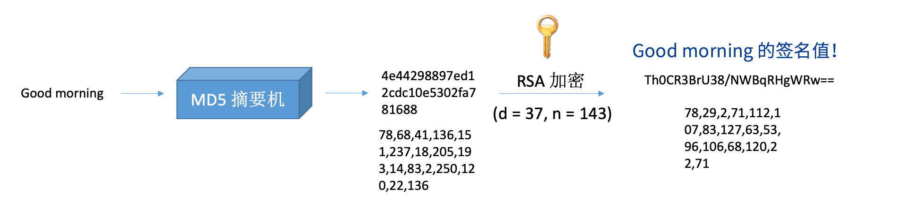
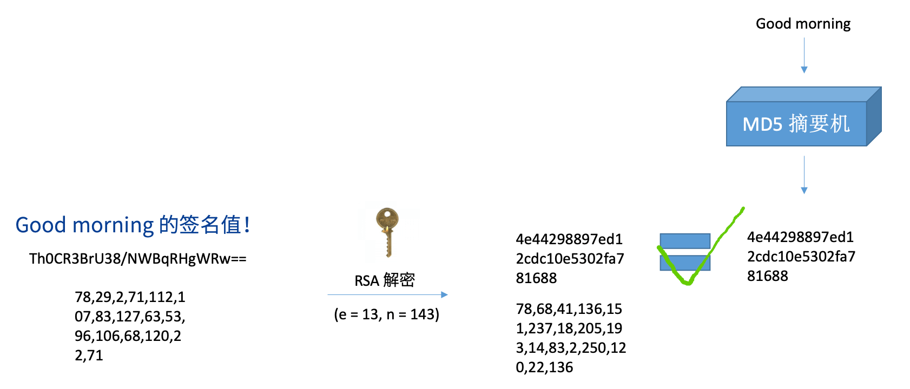

# 密码学基本概念

<LastUpdated/>

本文讲述密码学中的几个常见的概念：加密、解密、签名、验签、摘要、编码、公钥、私钥。

## 编码

对信息进行编码，**没有信息损失**，任何人都能通过编码方式对信息进行解码。例如 ASCII 码，base64 编码。

例如下面是 ASCII 编码表：

## 摘要

对信息计算摘要值，**有信息损失**，例如 md5 摘要，sha1 摘要。

## 加密

对信息进行加密使其无法被监听者获知内容，**没有信息损失**。例如：AES、DES、RSA。

## 公钥

公钥就是两个数字，e（e = 65537，e > 1 且与 ø(n) 互质，ø(n) 为欧拉函数），n（n = p \* q，p、q 为质数），用于验签或加密。一般不说用公钥解密，说用**公钥验签**。例如 RSA 公钥。

## 私钥

私钥就是两个数字，d（e 对于 ø(n) 的逆元，ø(n) 为欧拉函数）、n（n = p \* q，p、q 为质数），用于签名或解密。一般不说用私钥加密，说用**私钥签名**。

## 公钥与私钥的关系

在数学上没有区别，都是一对数字，取决于将哪一组数字公开。公钥加密的内容要使用私钥解密；私钥加密的内容要使用公钥解密。私钥要自己保护好，不得泄露；公钥可以公开在互联网上，任何人都可以用它来加密信息，当然加密内容只有私钥能够解出来。

## 签名

计算信息的摘要值，用私钥对摘要值进行签名，生成一个签名值，签名算法有 RS256 等。

## 验签

利用公钥对签名信息进行验证。拿到一段信息和它的签名值，需要先计算信息摘要值，用公钥解密签名值，和计算的信息摘要值进行比对。

