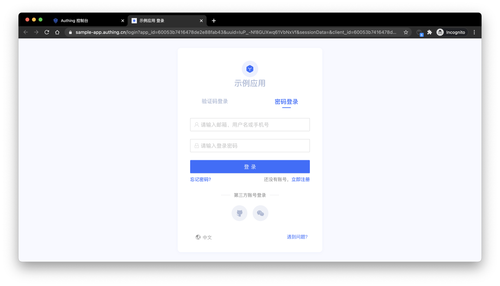

# 托管登录页 vs 可嵌入登录组件

<LastUpdated/>

在 {{$localeConfig.brandName}} 系统中提供了多种认证集成方式，其中最推荐和最常用的是「托管模式」和「组件嵌入」模式。Authing 所提供的这两种模式都易于实施，你可以分别阅读[托管登录页](/guides/basics/authenticate-first-user/use-hosted-login-page.md)和[可嵌入登录组件](/guides/basics/authenticate-first-user/use-embeded-login-component/)的接入流程。这两者的区别在于使用场景、自定义灵活程度以及维护管理成本。

## 托管登录页

Authing 托管模式被认为是最简单，最安全的集成方式。这是因为登录流程由 {{$localeConfig.brandName}} 维护，并由 {{$localeConfig.brandName}} 保持安全。对于大多数集成，建议使用 {{$localeConfig.brandName}} 托管的登录流程。你的业务系统将用户重定向到 {{$localeConfig.brandName}}，在此用户进行身份验证，然后重定向回在控制台配置的应用回调连接。此设计被认为是安全性最佳实践。在自定义配置方面，托管模式提供了中等程度的登录注册表单自定义配置，可通过控制台配置和 CSS 进行界面自定义。

接入详情请见[使用托管登录页完成认证](/guides/basics/authenticate-first-user/use-hosted-login-page.md)。

## 可嵌入登录组件

客户托管的登录组件（Guard）被认为是灵活性和集成之间的最佳平衡。如果集成需要更深入的自定义级别或一些前后端分离的场景中无法使用托管模式，则建议使用组件嵌入模式。客户嵌入组件通过提供开源的 Guard 连接嵌入页面。嵌入的登录组件由 Authing 构建和更新，使用行业最佳实践安全性设计，仅需要几行 JavaScript 代码就可以集成到你开发的项目中。它可以直接从 CDN 或 NPM 加载，也可以从源代码构建。{{$localeConfig.brandName}} 登录组件同时提供 Javascript 原生、React、Vue 和 Angular 的多种集成模式，在你的任何项目中都可以无缝集成并享有高度自定义灵活性。

接入详情请见[使用可嵌入登录组件完成认证](/guides/basics/authenticate-first-user/use-embeded-login-component/)。

## 大多数应该使用 {{$localeConfig.brandName}} 托管

- 易于维护，无需维护，无需更新。
- 由 {{$localeConfig.brandName}} 托管并保护。
- 没有 XSS（跨站点脚本）攻击以及其他潜在风险。
- 易于集成。
- 可通过控制台配置和 CSS 进行自定义。
- 需要访问源代码的复杂逻辑更改受到限制。
- 将用户重定向到应用程序之外，再重定向到 {{$localeConfig.brandName}}，然后再重定向。

## 组件嵌入呢？

- 可能需要适度的维护。如果使用 CDN，则维护工作将受到更多限制，因为 Authing 会将其保持在最新状态。NPM 打包了特定版本的登录组件，这意味着可能需要在项目中定期对其进行更新。
- 如果使用推荐的最佳实践实施，仍被认为非常安全。
- 与从头开始构建相比，源代码自定义控制功能强大，同时极大地简化了开发过程，并提高了安全性。
- 如果你是完全按照我们文档或相关教程进行集成开发的，是不会存在安全风险的。但是，需要注意，如果你集成实施的方案和我们推荐的方式有很大的偏差，比如没有有效的保管好安全凭证，是有可能有潜在的安全风险的。
- 可能容易受到 XSS（跨站点脚本）攻击。
- 与 {{$localeConfig.brandName}} 托管的登录流程相比，集成和维护工作量更高。
- 将用户保留在应用程序中，减少往返 {{$localeConfig.brandName}} 的重定向。
