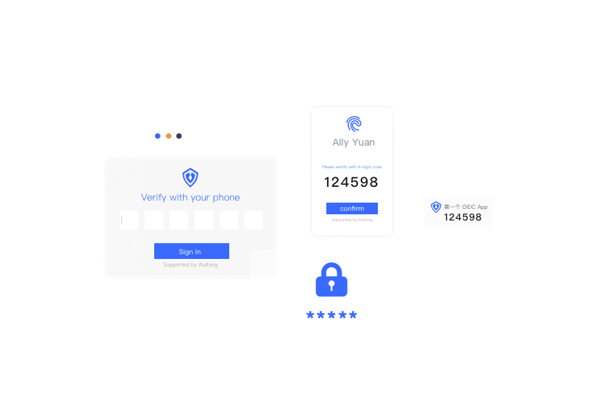
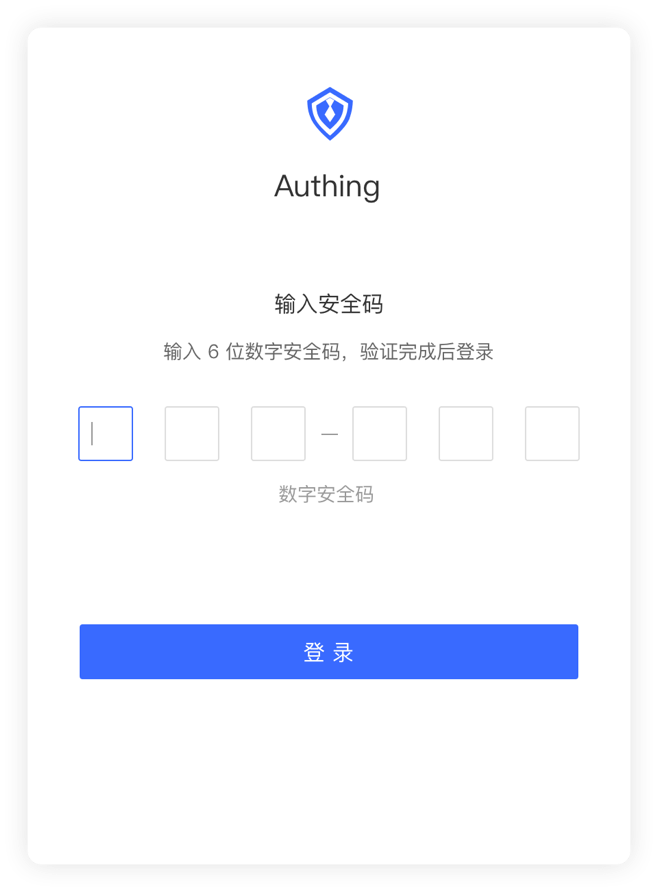
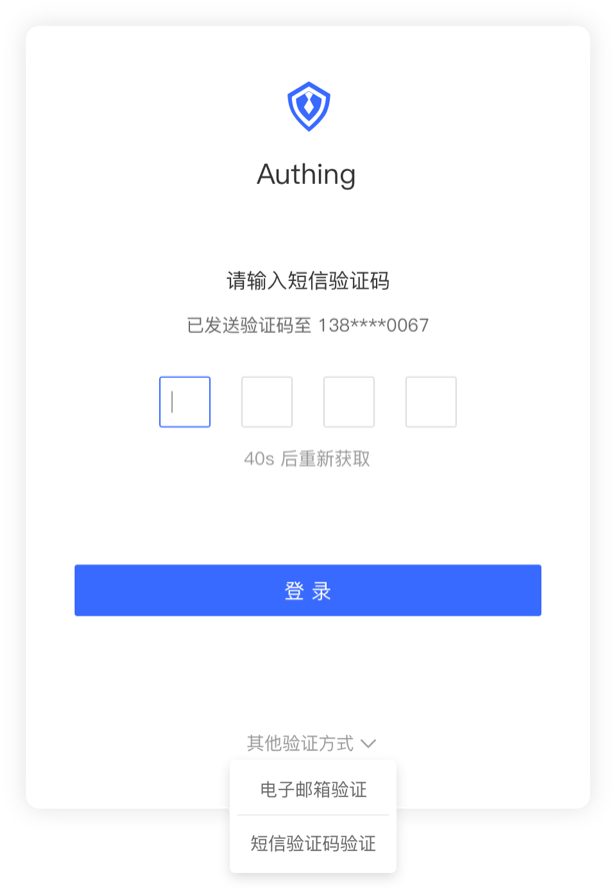
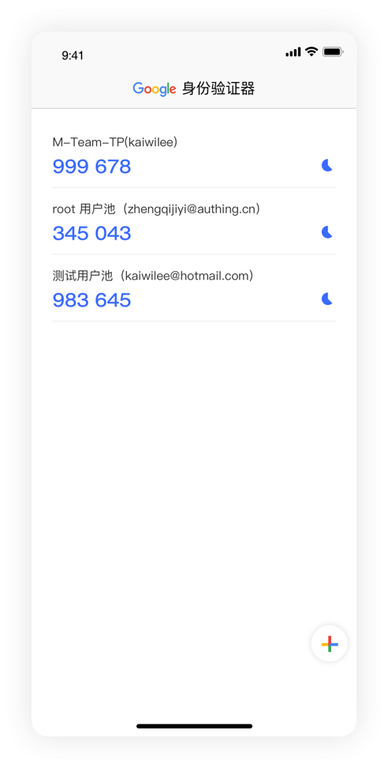
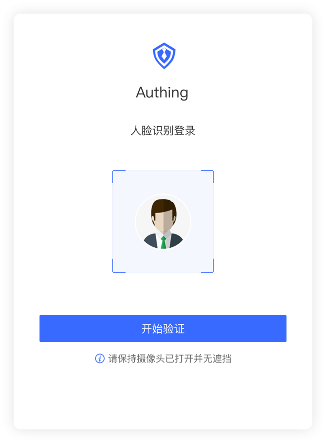
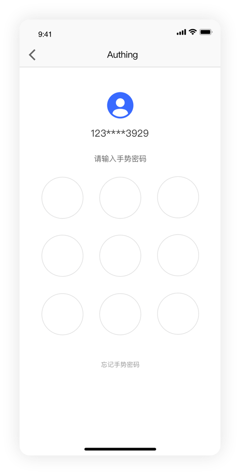

---
tags:
  - 轻型目录访问协议
---
# 什么是多因素认证

<LastUpdated/>

多因素认证（Multi Factor Authentication，简称 MFA）是一种非常简单的安全实践方法，它能够在用户名称和密码之外再额外增加一层保护。启用多因素认证后，用户进行操作时，除了需要提供用户名和密码外（第一次身份验证），还需要进行第二次身份验证，多因素身份认证结合起来将为你的帐号和资源提供更高的安全保护。

对企业来说，数据泄露的代价越发严重。一方面，企业会受到监管机构处罚，比如英国航空因数据泄露被英国信息专员办公室 (ICO) 罚款 2.04 亿欧元。另一方面，一旦发生数据泄露，不仅会让企业失去客户和用户的信任，而且影响公司长期发展。

因此，使用多因素认证（下文统称为 MFA），变成为企业防止数据泄露的基本手段。多因素认证要求用户使用至少两个因素对身份进行验证，验证通过后才能访问应用程序，这在企业中正快速普及。

去年底， LastPass 对 4.7 万个企业进行了一项调查，发现全球目前有 57％ 的企业正在使用多因素认证，比上一年增长了 12％。统计数据也证明了 MFA 的有效性。今年早些时候，微软报告称，其追踪的违规账户中有 99.9％ 没有使用多因素认证。

## Authing 多因素认证核心功能

- Authing 通过多种认证方式，保障业务安全；
- [认证流程自定义](/guides/pipeline/)，一键开启，操作简单；
- 支持设备环境数据上报，多维度分析安全级别；
- 支持配置策略，实现环境风险自适应；
- 同时适用于[应用内权限控制场景](/guides/access-control/)；
- 默认集成于[通用登录组件（Guard）](/reference/guard/v2/)；
- [用户数据管理、行为日志查询](/guides/audit/)；
- 提供 [SDK 与开放接口](/reference/)，助力开发者快速调用相关能力，并构建自定义的用户管理页面。

## 多因素认证方式

Authing 提供多种认证方式，提高企业身份安全性。

### 手机令牌

通过安全性强的动态 OTP 口令验证，帮助保护账户安全，避免恶意攻击。

### 短信/邮箱验证码

- 操作简单
- 方便快捷
- 提高登录安全性

### 兼容第三方身份验证器

兼容第三方身份验证器，包括但不限于：

- Google Authenticator
- Microsoft Authenticator

### 生物识别

指纹/人脸作为人体特征的关键因素，在安全认证领域被广泛应用。

### 图形锁

- 简单易上手；
- 可通过更复杂的图形增强安全性。

### 小程序认证

将 Authing 移动令牌验证器集成至微信小程序，免去安装 APP 的流程，快捷使用移动端验证器。

## Authing 多因素认证的优势

### 开发者友好

提供开箱即用的端 SDK，方便端上开发者快速实现 MFA。

- 支持多端：[Web](/reference/guard/v2/)、[iOS](/reference/sdk-for-swift.md)、[Android](/reference/sdk-for-android.md)；
- 内置多种多因素认证端组件，如 OTP、验证码、指纹解锁、面部识别、图形锁等；
- 仅需调用一个方法，就可唤起 MFA 认证组件，拿到认证结果，完成认证流程。

### 定制数据上报

定制数据上报，参与流程发起决策，覆盖更加复杂精细化场景。

- 支持在 [Authing SDK](/reference/) 初始化时数据上报；
- 支持定时数据上报；
- 支持应用运行时主动数据上报；

### 基于策略

多因素认证的触发条件基于自定义策略，策略系统简单、高效、完备、灵活。

- 简单：不想配复杂的策略，可以使用 默认安全策略 或预设好的 命中条件；
- 高效：毫秒级判断策略命中，多因素认证即刻唤起；基于有好的用户界面；
- 完备：策略基于函数表达式描述，开发者可以获取到足够多的信息（包括但不限于用户信息、设备、网络、位置、行为、自定义上报数据等）来书写策略命中逻辑；
- 灵活：可同时基于多种方式进行命中判断。

### 配置简单

基于友好的用户界面，快速配置具体应用的多因素认证。

- 一键开启/关闭多因素认证；
- 一键启用默认安全策略，不必理解策略配置，也能使应用安全性得到很大提高；
- 预设十几种重要且常用的策略命中条件，即选即生效，不是工程师也能使用。

## 自适应多因素认证

「自适应」多因素认证较于传统多因素认证，能够根据当前安全状况，选择应用不同的 MFA 方式，在保障安全的同时也兼顾用户体验。「自适应」多因素认证提供了更加灵活和智能的验证策略。

在用户进行认证流程时，「自适应」多因素认证对当前登录的用户生成的多种 「关键要素」：

- 用户属性: 例如用户名、密码、用户身份等用户自身的属性和信息；
- 位置感知: 位置感知分为虚拟位置（IP 地址）和物理位置（国家、地区等）；
- 请求来源: 对当前用户的请求来源进行判断，如：硬件设备信息、用户当前所在的系统等；
- 生物识别: 使用用户的生物信息进行识别，如：指纹信息、人脸识别等；
- 行为分析: 是否来自常用的登录地点、是否多次输入错误密码、用户之前的操作记录等一系列用户行为。

