<IntegrationDetailCard title="在 Windows Server 中部署 Active Directory Federation Services">

本文包含以下章节：
- **Active Directory Federation Services** 在 Windows Server 下的安装，部署，登录
- 安装 **AD FS**
- 配置 **AD FS**
- 登录 **AD FS**

### 安装 **AD FS**

进入 `Windows Server`， **打开** `服务器管理器`

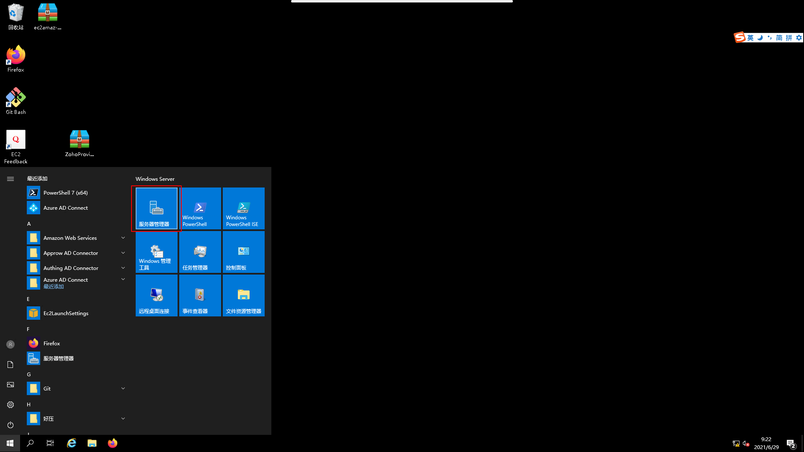

如图选择 **添加角色与功能**


选择 **安装类型**


进行 **服务器选择**

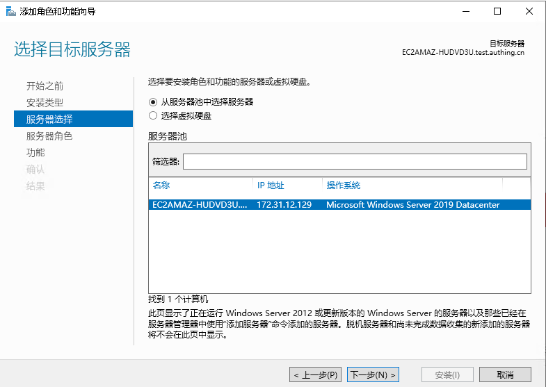

选择 **服务器角色**

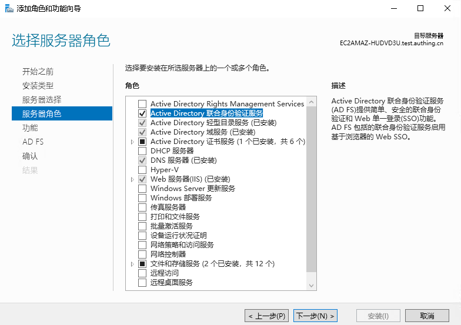

浏览相关 **功能**，根据需要进行删减


查看 **AD FS** 浏览页


进行相关 **确认**，根据实际情况选择是否自动重启

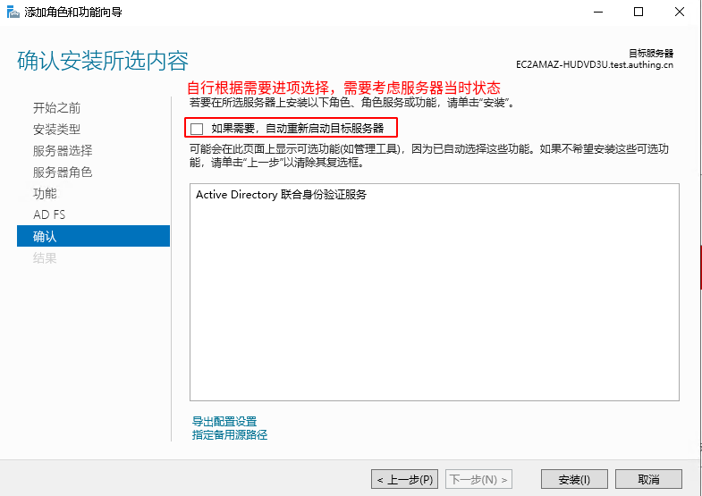

开始 **安装**

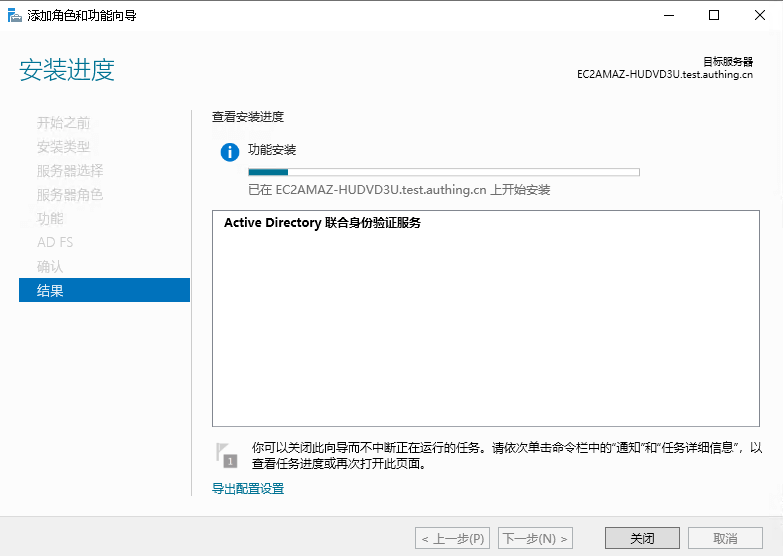

**安装完成**， 接下来进行 `配置 AD FS`


### 配置 **AD FS**

进入 **配置欢迎页**

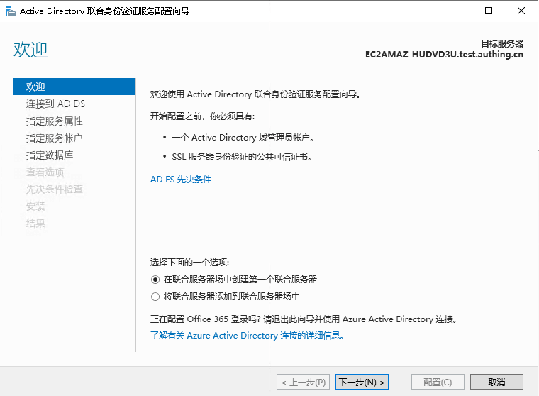

连接到 **AD DS**


指定 **服务器属性**


指定 **服务账户**

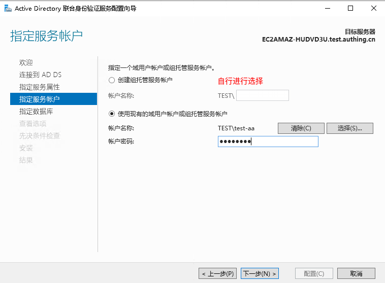

指定 **数据库**


查看 **选项**


**先决条件** 检查


准备 **安装**

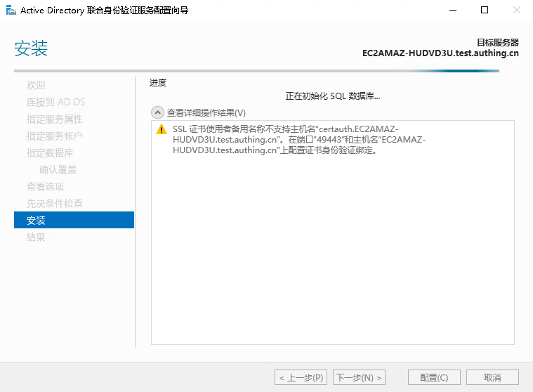

查看 **详细操作结果**，至此， **ADFS** 已经安装配置完成

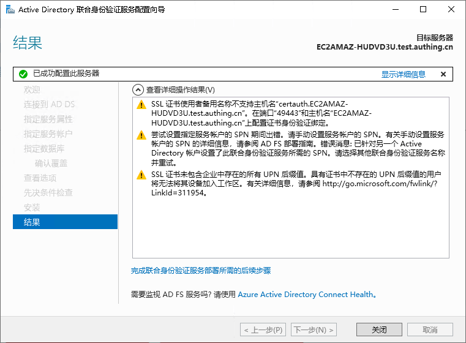

### 登录 **AD FS**

在浏览器中输入 **https://localhost/adfs/ls/idpinitiatedsignon**，访问 `ADFS` 登录页

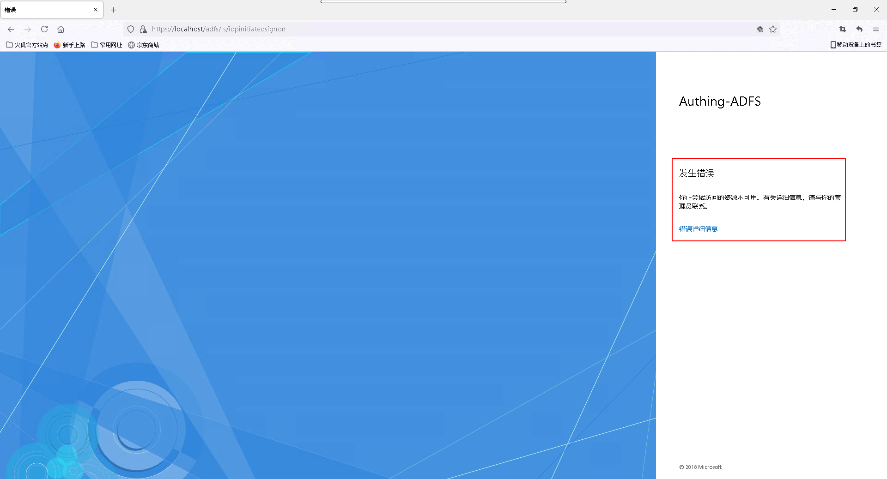

大多数情况，可能你的登录页会出现如上图所示 `错误`，此时以 **管理员** 启动 `powershell`，执行如下命令：

```powershell
Set-AdfsProperties -EnableIdpInitiatedSignonPage $true
```

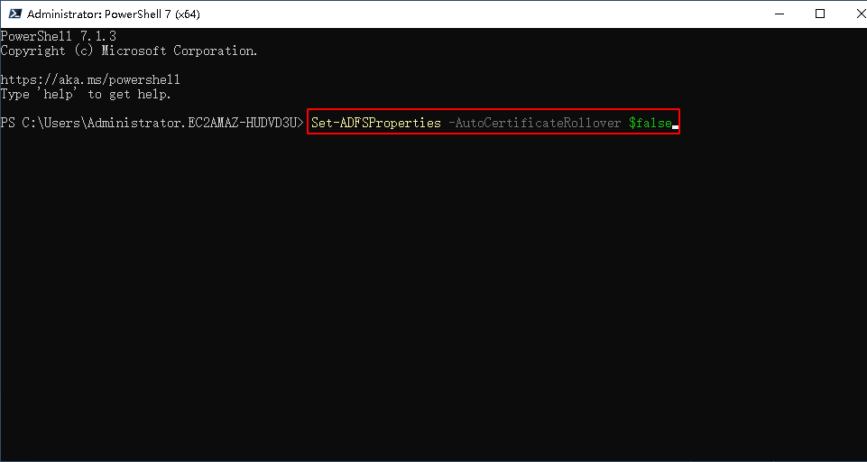

再次尝试 `ADFS` **登录**，此时异常消失


输入关联的 **AD** 域账户信息，尝试完成登录操作


**登录成功**


至此，ADFS 安装，部署以及登录校验已经完成。

</IntegrationDetailCard>