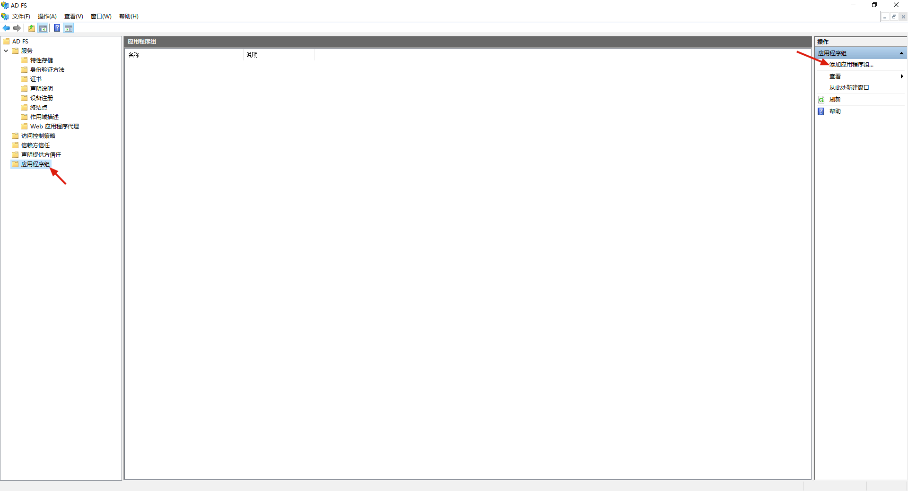
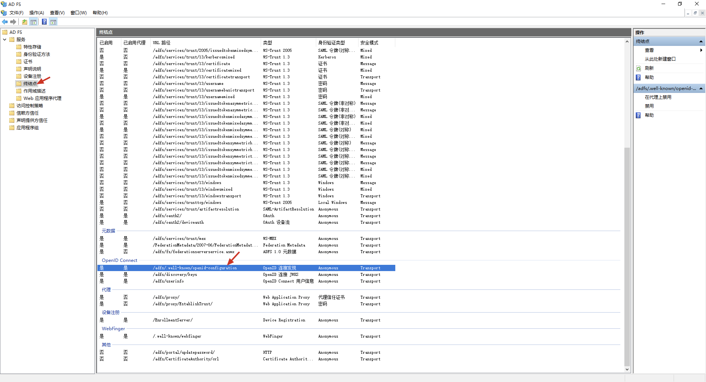

<IntegrationDetailCard :title="`在 ADFS 中配置 ${$localeConfig.brandName} 应用`">

这一步将在 ADFS 中进行 {{$localeConfig.brandName}} 接入所需的配置。连接到 ADFS 服务器，打开「AD FS 管理」程序。在左侧的树状目录中单击「应用程序组」，然后在右侧「操作」选项卡中单击「添加应用程序组」：



在打开的窗口中选择「访问 Web API 的 Web 浏览器」，输入应用名称，单击「下一步」：


复制「客户端标识符」中的内容，之后的配置将会用到。在「重定向 URI」中输入如下内容，然后单击「添加」按钮，最后单击「下一步」：

```
https://core.authing.cn/connections/oidc/callback
```


选择「允许所有人」，单击「下一步」：


单击「下一步」，最终单击「关闭」。接下来，在「AD FS 管理」主界面左侧单击「服务」-「终结点」，在中间找到「OpenID 连接发现」条目，复制「URL 路径」一栏中的内容，之后的配置将会用到：



至此，在 ADFS 端所需的配置已经全部完成了。

</IntegrationDetailCard>