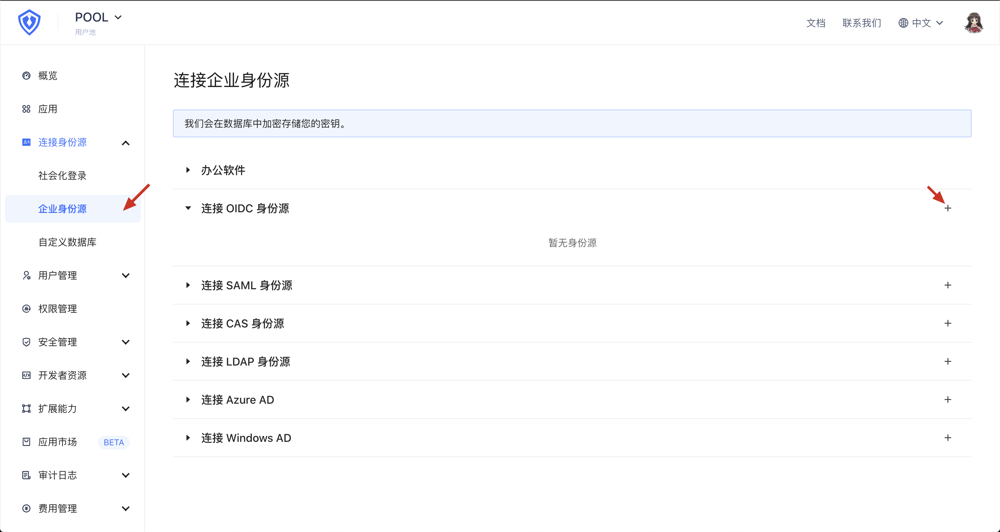
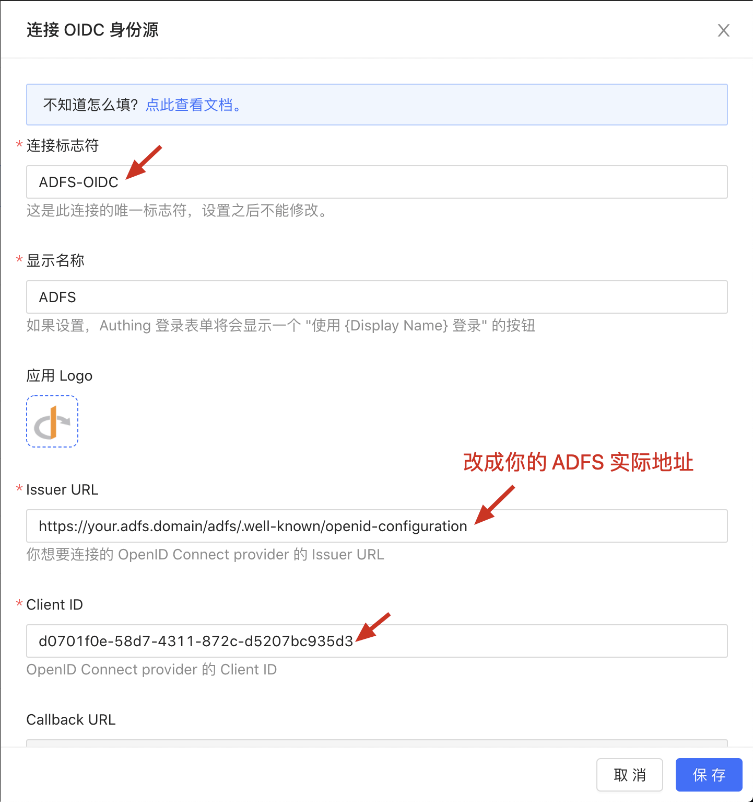

<IntegrationDetailCard :title="`在 ${$localeConfig.brandName} 中创建 ADFS OIDC 企业身份源`">

这一步将允许你的 {{$localeConfig.brandName}} 用户池内的所有应用使用 OIDC 协议从 ADFS 中获取身份信息。配置完成后，在应用的登录界面将显示一个「使用`XXX`登录」按钮，其中`XXX` 是之后将要配置的身份源显示名称。用户单击该按钮，即可跳转到 ADFS 的登录页面进行身份验证。如果验证成功，用户将携带 ADFS 的身份信息回到 {{$localeConfig.brandName}}，并自动完成 {{$localeConfig.brandName}} 的登录操作。

访问 {{$localeConfig.brandName}} 控制台，单击左侧菜单「连接身份源」-「企业身份源」项目，单击右侧「连接 OIDC 身份源」最右端的「+」号：

在展开的配置表单中，填入如下配置：

- `连接标志符`：此连接的唯一标志符，设置之后不能修改。
- `显示名称`：在登录界面按钮上显示的身份源名称 。
- `应用 Logo`：在登录界面按钮上显示的身份源 Logo 。
- `Issuer URL`：格式为 https:// + `ADFS 的 URL` + `端点路径`，不包括「+」号。其中`端点路径`为之前从 ADFS 获取到的「URL 路径」中的内容。
- `Client ID`：填入之前从 ADFS 获取到的「客户端标识符」中的内容。

完成后单击「保存」按钮。到此为止，所有配置都已完成，是时候体验一下登录流程了。

</IntegrationDetailCard>