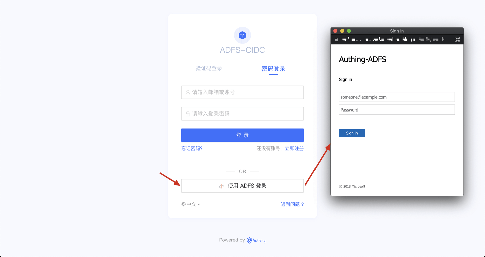

<IntegrationDetailCard title="体验登录">

应用创建完成后，单击右侧展开菜单中的「体验登录」：

在打开的登录页面中，单击「使用 `身份源名` 登录」按钮：

如果之前的配置正确，接下来浏览器将弹出 ADFS 的认证窗口。登录成功后，浏览器将回到 {{$localeConfig.brandName}} 并展示一个成功页面。

</IntegrationDetailCard>