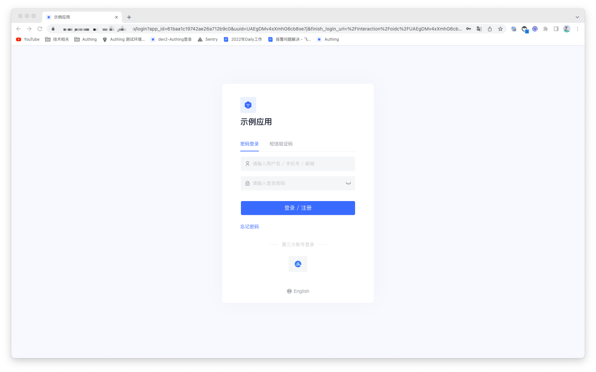
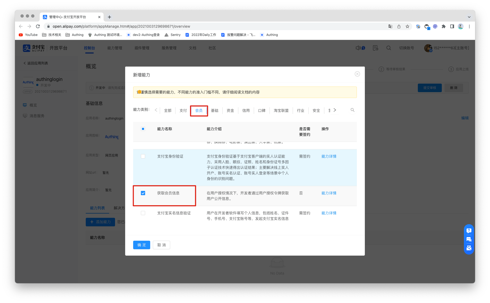
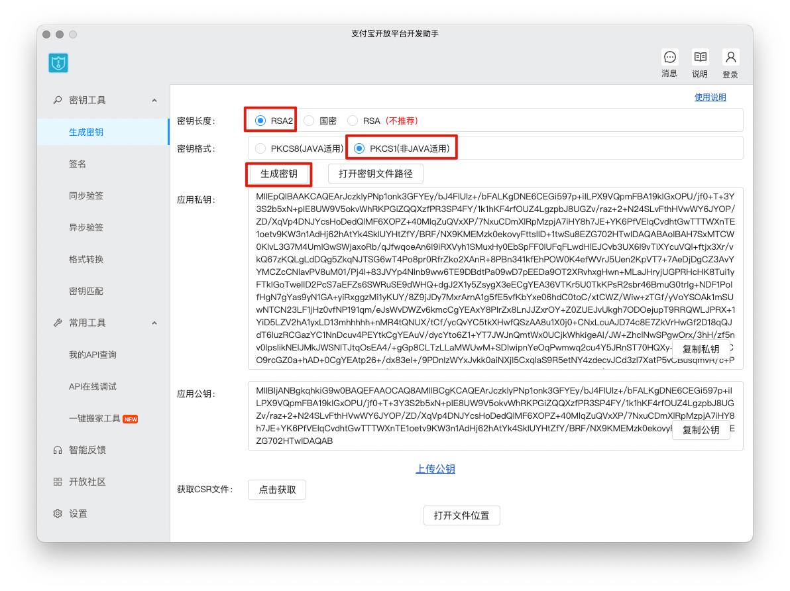
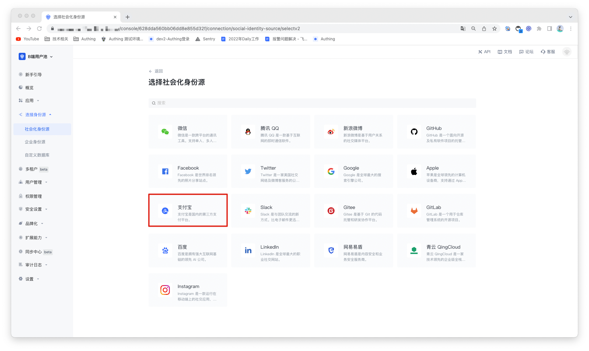
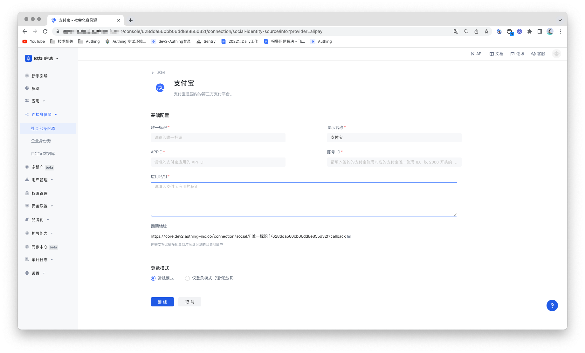
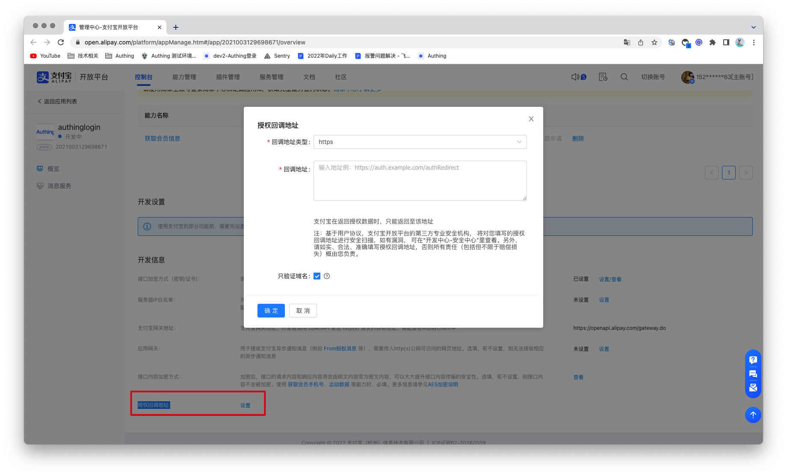

# 支付宝社会化登录

<LastUpdated/>

## 场景介绍

- **概述**：支付宝社会化登录是用户以支付宝为身份源安全登录第三方应用或者网站。在 Authing 中配置并开启支付宝的社会化登录，即可实现通过 Authing 快速获取支付宝基本开放的信息和帮助用户实现免密登录功能。
- **应用场景**：PC 网站
- **终端用户预览图**：

## 注意事项

1. 前往[支付宝开放平台](https://open.alipay.com/)注册一个支付宝开放账号；
2. 前往[开发者中心控制台](https://open.alipay.com/dev/workspace)按照指引创建一个**网站应用**。请确保你的应用获取了 **获取会员信息** 能力，否则将无法使用支付宝登录；
3. 如果你未开通 Authing 控制台账号，请先前往 [Authing Console 控制台](https://authing.cn/)注册开发者账号；

## 第一步：创建支付宝应用

1.1 登录支付宝开放平台，进入控制台，点击我的应用>网页&移动应用的**创建应用**按钮，创建新应用。

1.2 进入创建后应用的控制台，在能力列表下，添加能力，需要添加「获取会员信息」的能力。

1.3 配置该应用的开发设置，在开发设置下的开发信息，设置接口加签的方式(密钥/方式)。可以根据支付宝提供的[支付宝密钥生成器](https://docs.open.alipay.com/291/106097/)或[OpenSSL(第三方工具)](https://docs.open.alipay.com/291/106130)生成密钥。详细获取密钥的方式可以参考[支付宝密钥生成说明文档](https://opendocs.alipay.com/common/02khjo)。其中，密钥长度选择 RSA2 ，密钥格式一定要选择 PKCS1。

需要保存好应用私钥和应用公钥，将在支付宝中配置应用公钥，在 Authing 控制台的身份源中配置应用私钥。

接口加签的方式(密钥/方式)，选择加签名模式「公钥」，输入应用公钥并且保存，然后点击保存设置。

## 第二步：在 Authing 控制台配置支付宝

2.1 请在 Authing Console 控制台 的「社会化身份源」页面，点击「创建社会化身份源」按钮，进入「选择社会化身份源」页面。

2.2 请在 Authing Console 控制台 的「社会化身份源」-「选择社会化身份源」页面，点击「支付宝」身份源按钮，进入 「支付宝登录模式」页面。

2.3 请在 Authing  控制台 的「社会化身份源」-「支付宝」页面，配置相关的字段信息。

| 编号  | 字段/功能 | 描述                                                         |
| ----- | --------- | ------------------------------------------------------------ |
| 2.3.1 | 唯一标识  | a.唯一标识由小写字母、数字、- 组成，且长度小于 32 位。b.这是此连接的唯一标识，设置之后不能修改。 |
| 2.3.2 | 显示名称  | 这个名称会显示在终端用户的登录界面的按钮上。                 |
| 2.3.3 | APPID     | APPID，支付宝应用 ID。                                       |
| 2.3.4 | 账号 ID   | 账号 ID，支付宝主账号 ID，一般为 2088 开头的数字。           |
| 2.3.5 | 应用私钥  | 应用私钥，在支付宝应用接口加签设置时生成应用私钥。           |
| 2.3.5 | 回调地址  | 支付宝有效 OAuth 跳转 URI。需要将此 URL 配置到支付宝应用授权回调地址。 |
| 2.3.6 | 登录模式  | 开启「仅登录模式」后，只能登录既有账号，不能创建新账号，请谨慎选择。 |

配置完成后，点击「创建」或者「保存」按钮完成创建。

2.4 最一步在 Authing 控制台上创建完支付宝身份源后，需要将回调地址配置到支付宝的开放平台上的应用的授权回调地址上。

## 第三步：开发接入

- **推荐开发接入方式**：使用托管登录页
- **优劣势描述**：运维简单，由 Authing 负责运维。每个用户池有一个独立的二级域名;如果需要嵌入到你的应用，需要使用弹窗模式登录，即：点击登录按钮后，会弹出一个窗口，内容是 Authing 托管的登录页面，或者将浏览器重定向到 Authing 托管的登录页。
- **详细接入方法**：

3.1 在 Authing 控制台创建一个应用，详情查看：[如何在 Authing 创建一个应用](/guides/app-new/create-app/create-app.md)。

3.2 在已创建好的支付宝身份源连接详情页面，开启并关联一个在 Authing 控制台创建的应用。

3.3 在登录页面体验支付宝第三方登录。

