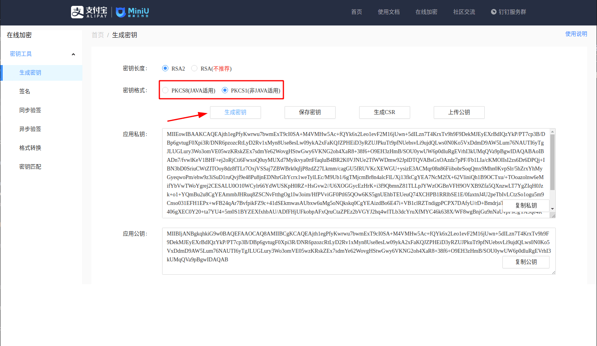
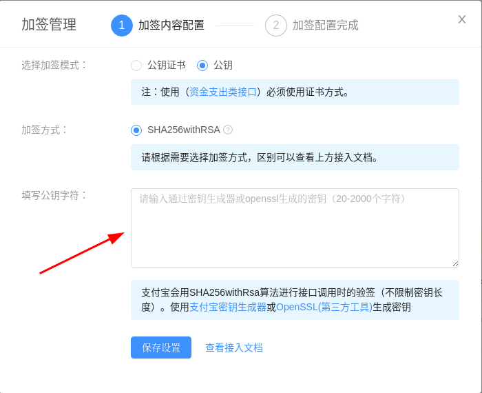

<IntegrationDetailCard title="在支付宝开放平台创建一个移动应用">

1. 前往[支付宝开放平台](https://open.alipay.com/) 注册一个支付宝开放账号；
2. 前往[开发者中心控制台](https://open.alipay.com/platform/developerIndex.htm)按照指引创建一个**移动应用**。

> 请确保你的应用获取了 **获取会员信息** 能力，否则将无法使用支付宝登录。

3. 创建应用之后，你需要获取以下应用信息：

- AppID（应用 ID）：在 [管理中心 - 我的应用列表](https://openhome.alipay.com/platform/appManage.htm#/apps) 可以获取到。
- AlipayPID（支付宝主账号 ID，一般为 2088 开头的数字）：在 [账号中心 - 主账号管理](https://openhome.alipay.com/dev/workspace/account-center/main-account-manage) 页面可以获取到。
- AppPrivateKey（应用私钥）：你可以在 [支付宝在线密钥生成器](https://miniu.alipay.com/keytool/create) 生成一对应用公钥和私钥：

> 密钥格式一定要选择 PKCS1。

生成后，将『应用公钥』填入你的支付宝应用的『接口加签方式』配置中。保存好『应用私钥』，留待下一步使用。

</IntegrationDetailCard>