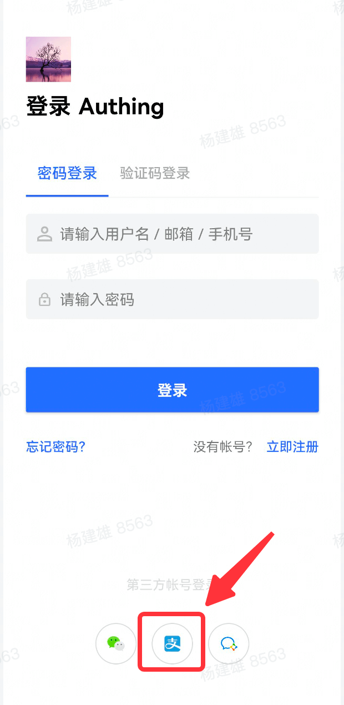

<IntegrationDetailCard title="开始开发接入">

#### 移动端集成

通过我们提供的 SDK，开发者只需要一行代码就能集成一键登录功能，请参考：

- [Android 集成指导](https://github.com/Authing/guard-android/blob/master/doc/social/alipay.md)

- [iOS 集成指导](https://github.com/Authing/guard-ios/blob/main/doc/social/alipay.md)

成功集成后效果如下：

</IntegrationDetailCard>
