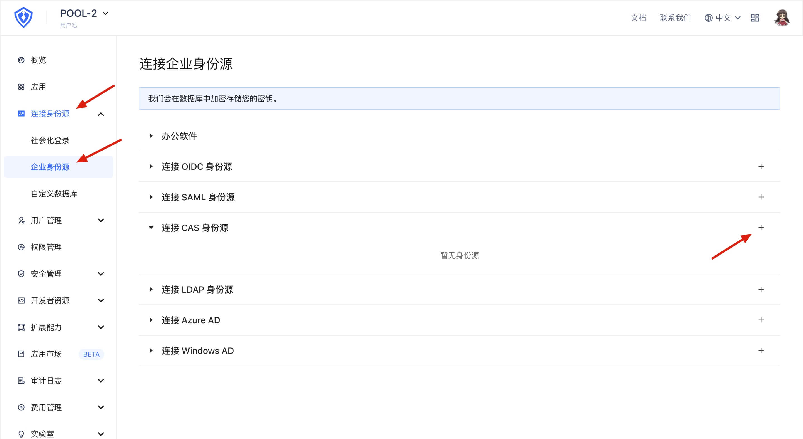
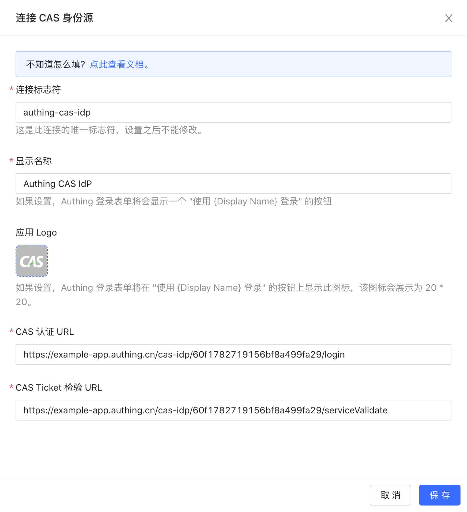
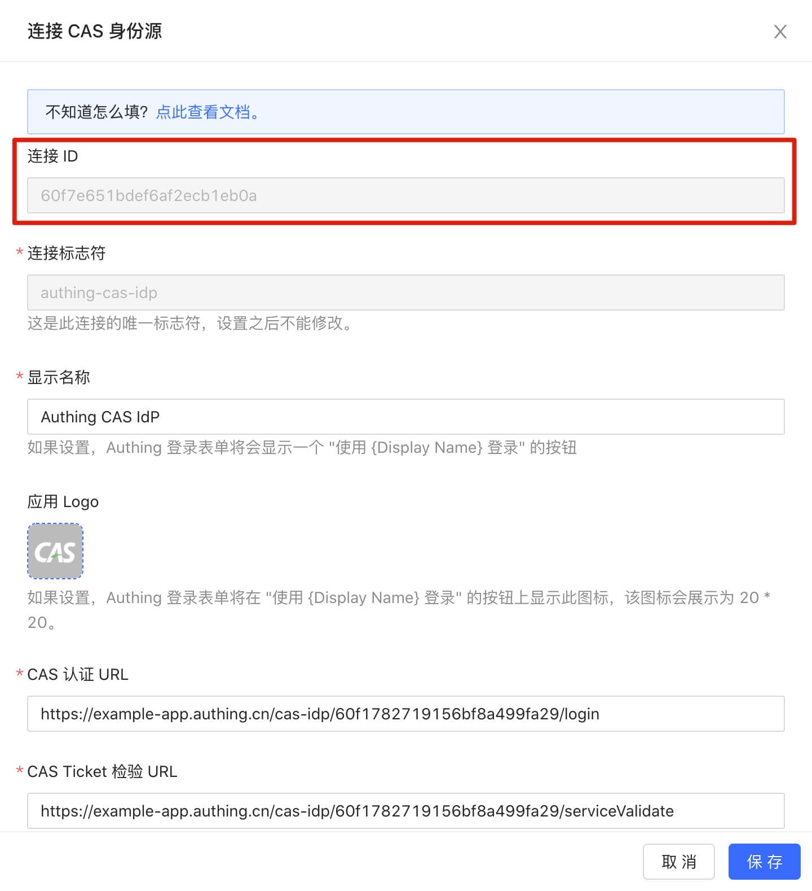
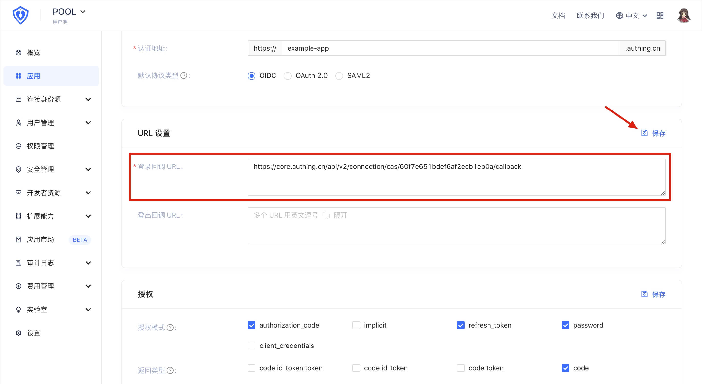

<IntegrationDetailCard :title="`在 ${$localeConfig.brandName} 中连接 CAS IdP`">

接下来，在**另一用户池**中连接刚才创建的 {{$localeConfig.brandName}} CAS IdP。

打开 **{{$localeConfig.brandName}} 控制台**，进入想要连接 CAS 身份源的用户池，这里称其为 **「用户池 B」**。在左侧菜单中选择 「连接身份源」 > 「企业身份源」，在右侧面板找到「连接 CAS 身份源」，单击右侧的「+」号。

> 连接 CAS 身份源的用户池和作为 CAS 身份源的用户池不能是同一个。

在弹出的配置窗口中配置以下选项：
- `连接标志符`：此连接的唯一标志符，设置之后不能修改。
- `显示名称`：在登录界面按钮上显示的身份源名称 。
- `应用 Logo`：在登录界面按钮上显示的身份源 Logo 。
- `CAS 认证 URL`：用来向 CAS IdP 发起认证请求的 URL。填入之前记录的「登录端点」。
- `CAS Ticket 检验 URL`：用来从 CAS IdP 处获取身份信息的 URL。填入之前记录的「service ticket 检验端点（CAS 2.0」。

单击「保存」按钮完成配置。随后，找到刚刚创建的 CAS 连接，单击右侧的「配置」按钮，记录下「连接 ID」一项的内容。

接下来，回到一开始配置的 **「用户池 A」**，找到之前启用了 CAS IdP 的应用，进入应用配置页面。找到「应用配置」选项卡下的「URL 设置」面板，将 `https://core.authing.cn/api/v2/connection/cas/<连接 ID>/callback` 填入到 「登录回调 URL」框中，其中 `<连接 ID>` 部分改成刚才记录的「连接 ID」。

最后，单击「保存」按钮保存配置。

到此为止，配置过程已经全部完成，接下来可以创建一个示例应用并测试连接了。

</IntegrationDetailCard>