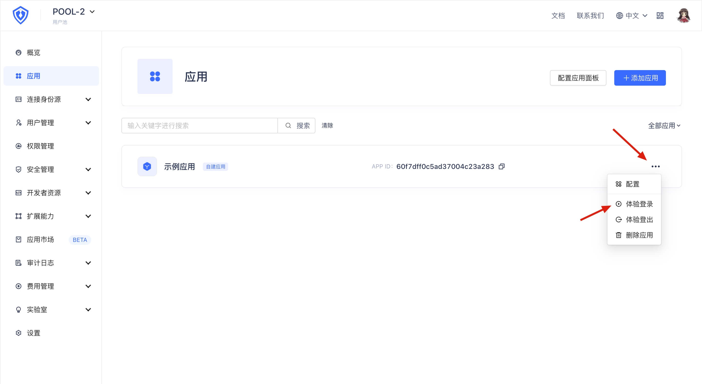
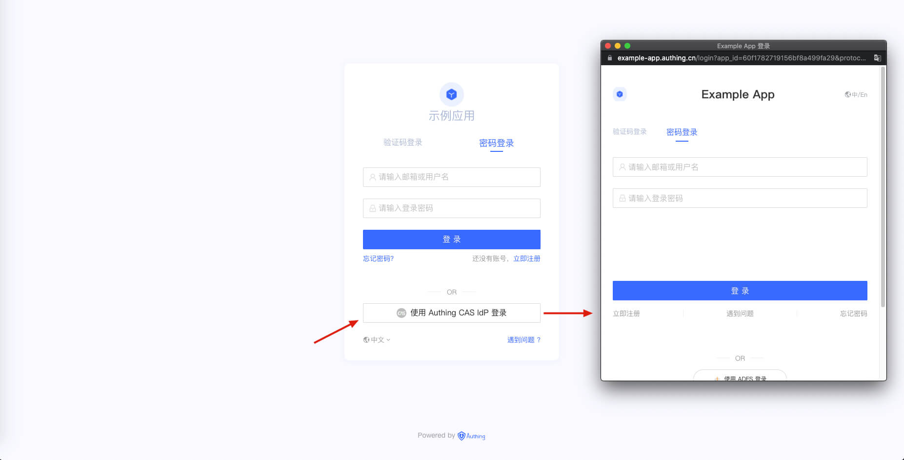

<IntegrationDetailCard :title="`使用 CAS IdP 登录 ${$localeConfig.brandName}`">

打开 **{{$localeConfig.brandName}} 控制台**，进入 **「用户池 B」**。在「应用」面板找到你刚才创建的应用，单击右侧展开菜单中的「体验登录」。

在登录页面，单击「使用 `连接名` 登录」按钮，其中 `连接名` 是之前在 {{$localeConfig.brandName}} 中配置的连接显示名称，身份源用户池的登录框将会弹出。

在弹出的登录框中输入用户在 **「用户池 A」** 中的用户名和密码，即可利用 **「用户池 A」** 中的身份信息登录到 **「用户池 B」**。

</IntegrationDetailCard>