# Facebook 社会化登录

<LastUpdated/>

## 场景介绍

- **概述**：Facebook 社会化登录是用户以 Facebook 为身份源安全登录第三方应用或者网站。在 Authing 中配置并开启 Facebook 的社会化登录，即可实现通过 Authing 快速获取 Facebook 基本开放的信息和帮助用户实现免密登录功能。
- **应用场景**：PC 网站
- **终端用户预览图**：

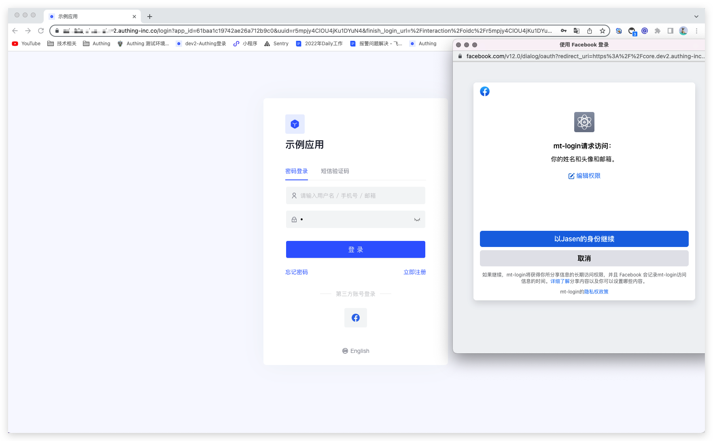

## 注意事项

- 如果你未开通 Facebook 开放平台账号，请先前往 [Facebook 开放平台](https://developers.facebook.com/) 注册开发者账号。
- 如果你未开通 Authing 控制台账号，请先前往 [Authing Console 控制台](https://authing.cn/) 注册开发者账号。

## 第一步：创建 Facebook 应用

前往 [developers.facebook.com](https://developers.facebook.com/)，点击**我的应用**，然后创建新应用并选择**消费者**或**无应用类型**，填写应用名称。

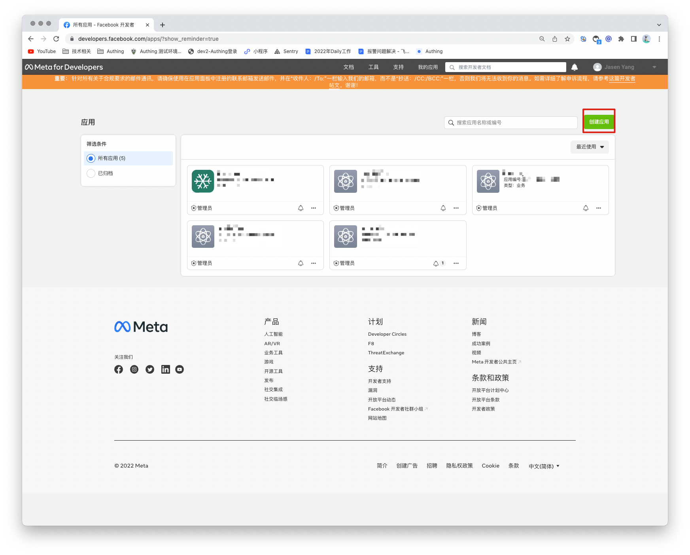

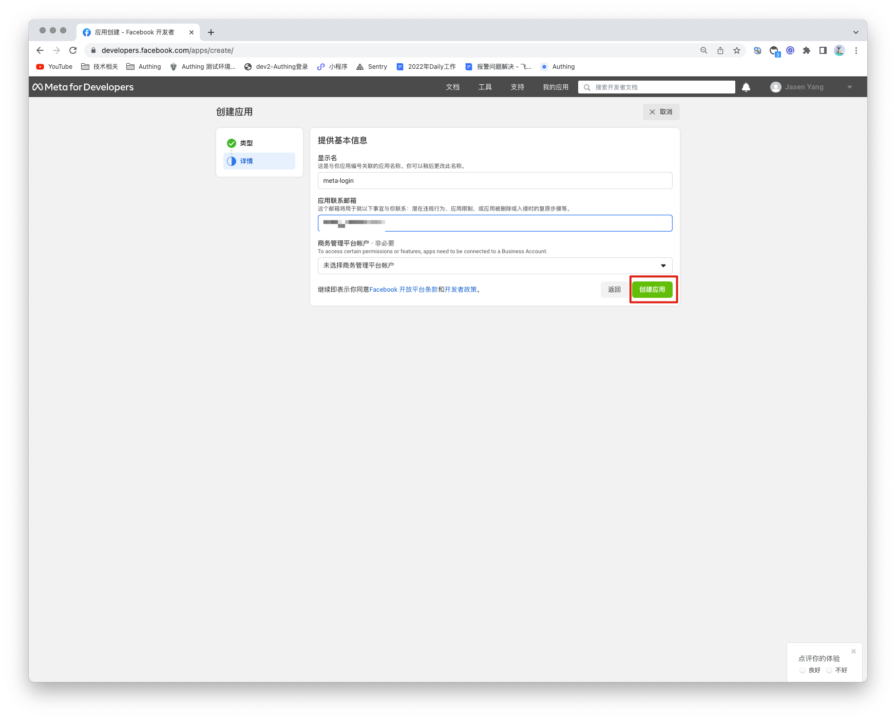

在控制面板中，找到 **Facebook 登录** 产品，然后点击设置，将其添加至你的应用。之后在左侧的菜单中设置>基本中找到该应用编号和应用密钥，并记录下。

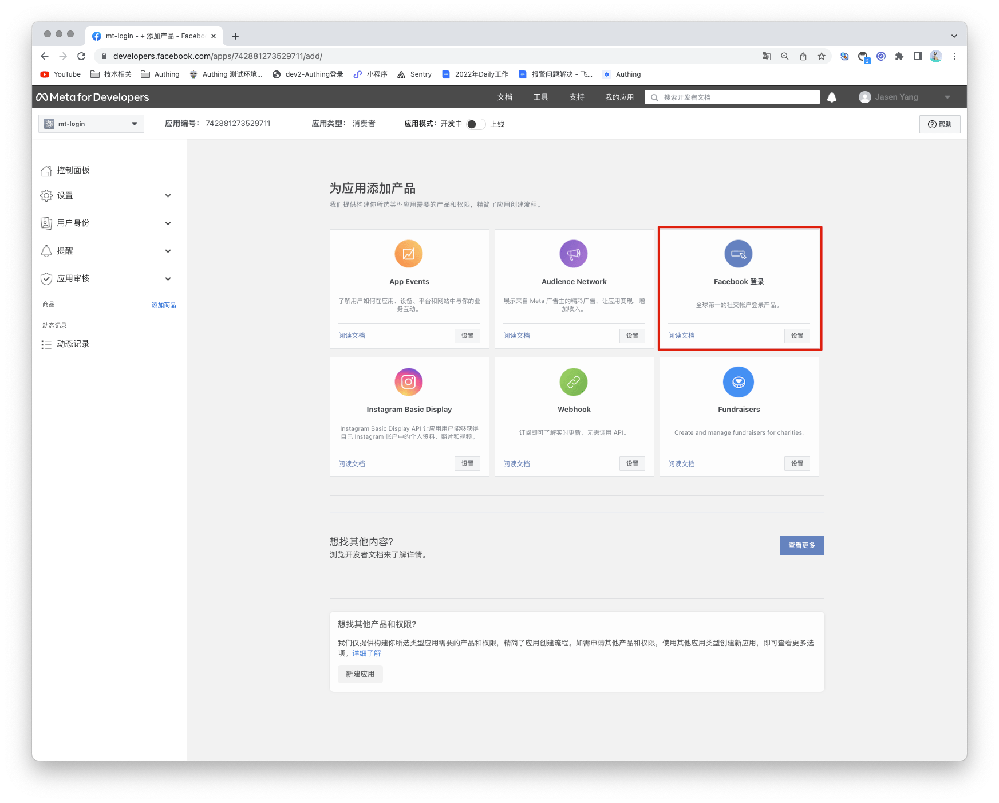

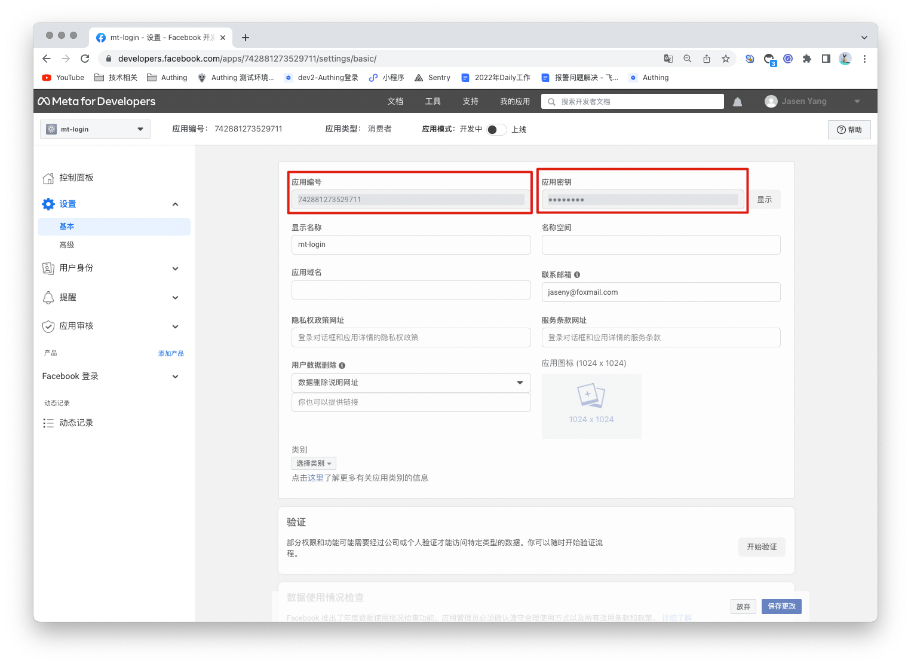

## 步骤2: 在 Authing 控制台配置 Facebook

2.1 请在 Authing Console 控制台 的「社会化身份源」页面，点击「创建社会化身份源」按钮，进入「选择社会化身份源」页面。

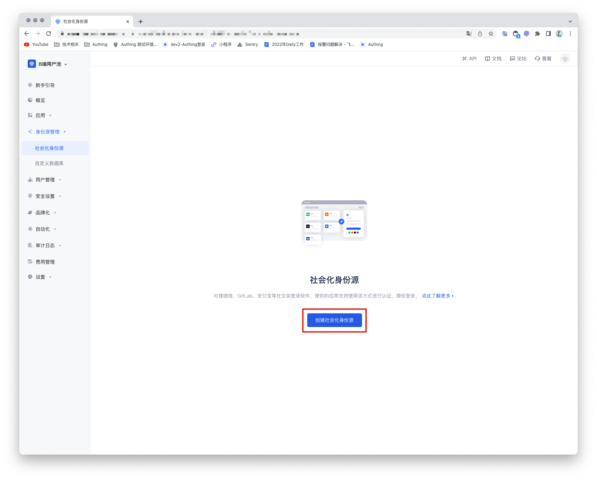

2.2 请在 Authing  控制台 的「社会化身份源」-「选择社会化身份源」页面，点击「Facebook」身份源按钮，进入 「Facebook 登录模式」页面。

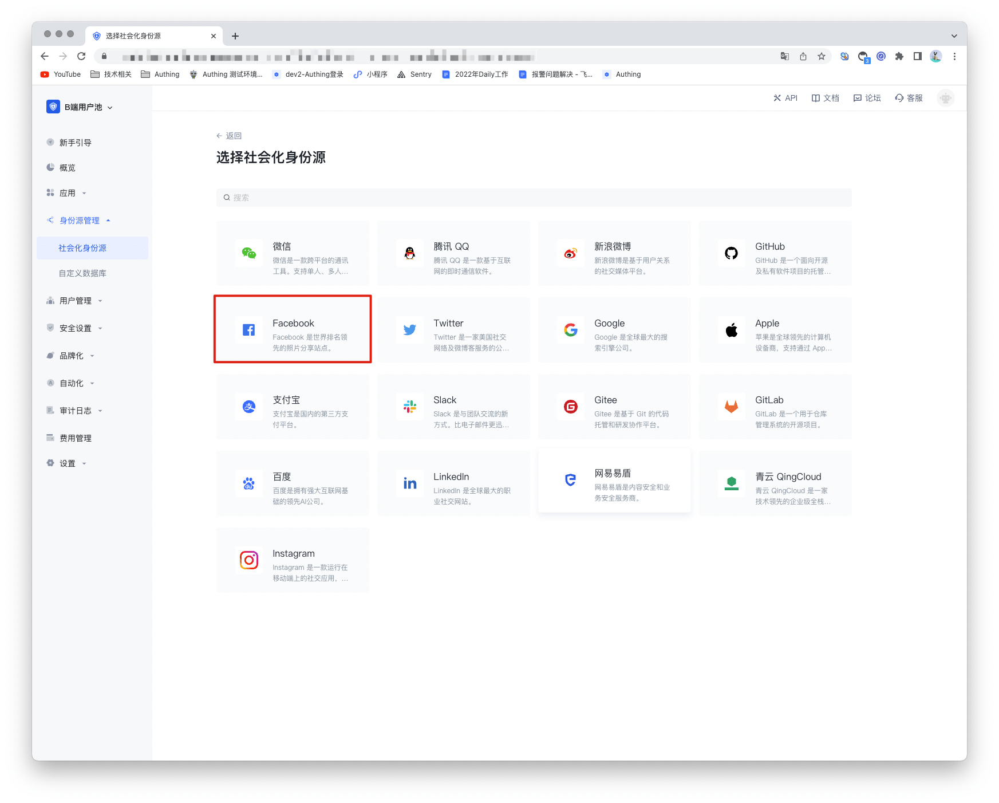

2.3 请在 Authing  控制台 的「社会化身份源」-「Facebook」页面，配置相关的字段信息。

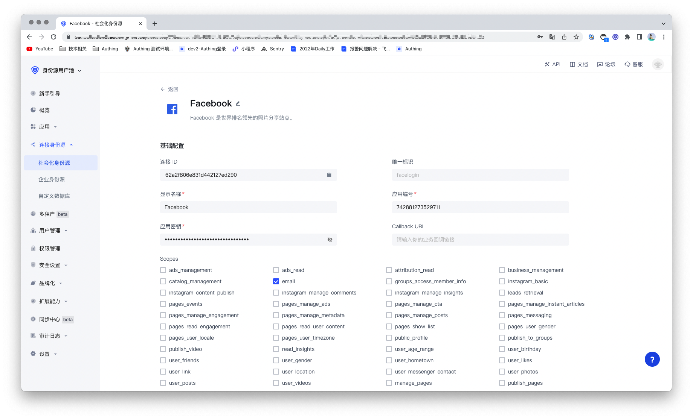

| 编号  | 字段/功能    | 描述                                                         |
| ----- | ------------ | ------------------------------------------------------------ |
| 2.3.1 | 唯一标识     | a.唯一标识由小写字母、数字、- 组成，且长度小于 32 位。b.这是此连接的唯一标识，设置之后不能修改。 |
| 2.3.2 | 显示名称     | 这个名称会显示在终端用户的登录界面的按钮上。                 |
| 2.3.3 | 应用编号     | 应用编号，需要在 Facebook 开放平台上获取。                   |
| 2.3.4 | 应用密钥     | 应用编号，需要在 Facebook 开放平台上获取。                   |
| 2.3.5 | Scopes       | Scopes，数据权限需要在 Facebook 开放平台上申请               |
| 2.3.6 | 回调地址     | Facebook 有效 OAuth 跳转 URI。需要将此 URL 配置到 Facebook 开放平台上。 |
| 2.3.7 | 登录模式     | 开启「仅登录模式」后，只能登录既有账号，不能创建新账号，请谨慎选择。 |
| 2.3.8 | 账号身份关联 | 不开启「账号身份关联」时，用户通过身份源登录时默认创建新用户。开启「账号身份关联」后，可以允许用户通过「字段匹配」或「询问绑定」的方式直接登录到已有的账号。 |

配置完成后，点击「创建」或者「保存」按钮完成创建。 

在 Authing 控制台上创建完 Facebook 身份源后，需要将回调地址配置到 Facebook 的开放平台上的 Facebook 应用中**OAuth 客户端授权设置**。

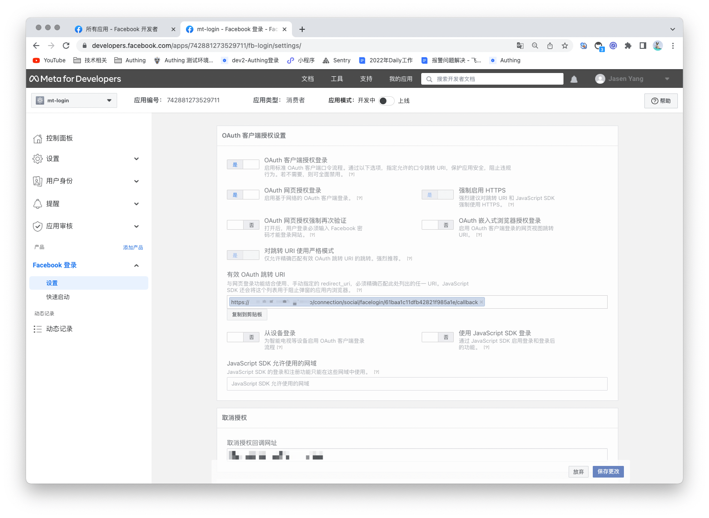

## 第三步：开发接入

- **推荐开发接入方式**：使用托管登录页

- **优劣势描述**：运维简单，由 Authing 负责运维。每个用户池有一个独立的二级域名;如果需要嵌入到你的应用，需要使用弹窗模式登录，即：点击登录按钮后，会弹出一个窗口，内容是 Authing 托管的登录页面，或者将浏览器重定向到 Authing 托管的登录页。

- **详细接入方法**：

3.1 在 Authing 控制台创建一个应用，详情查看：[如何在 Authing 创建一个应用](/guides/app-new/create-app/create-app.md)

3.2 在已创建好的 Facebook 身份源连接详情页面，开启并关联一个在 Authing 控制台创建的应用。

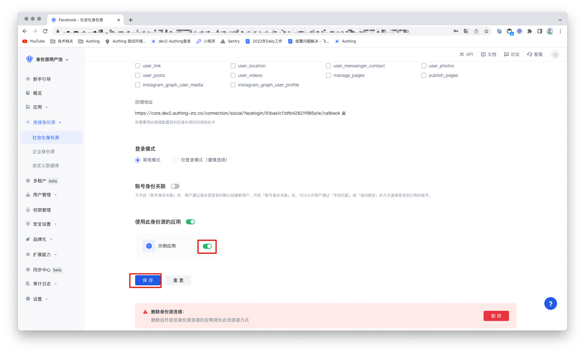

3.3 在登录页面体验 Facebook 第三方登录

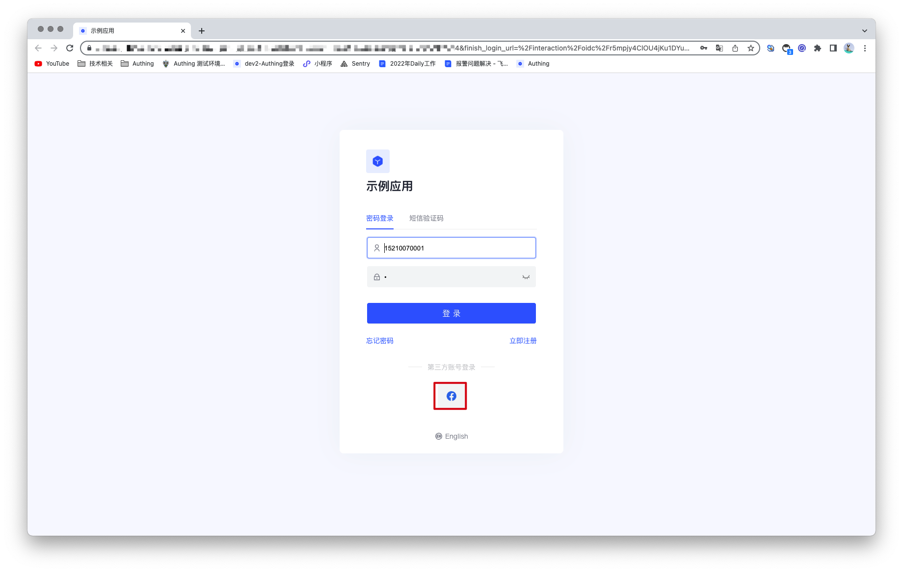

