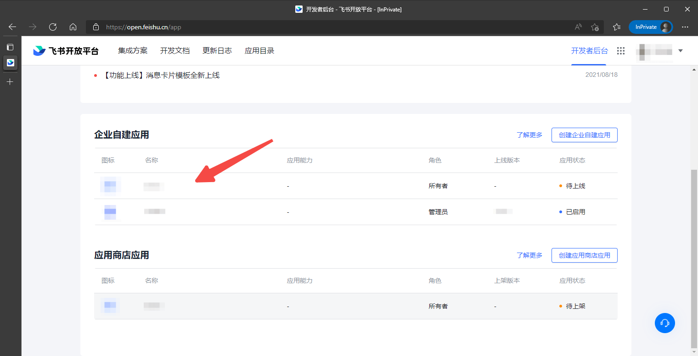
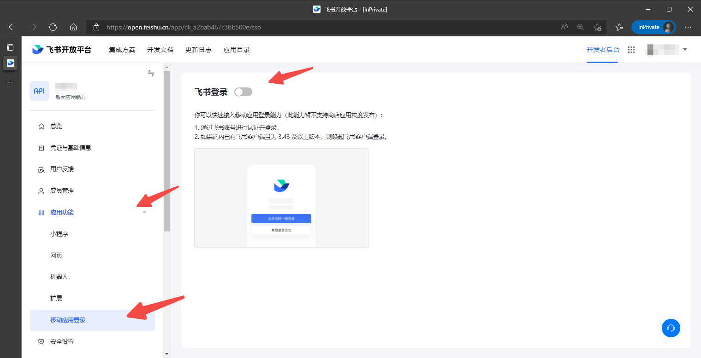
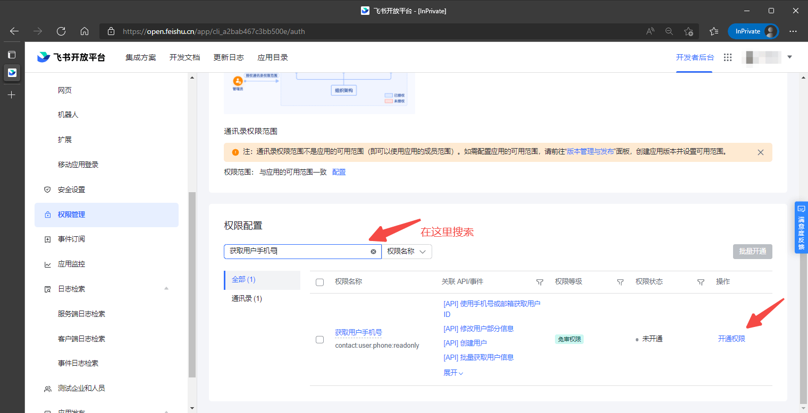
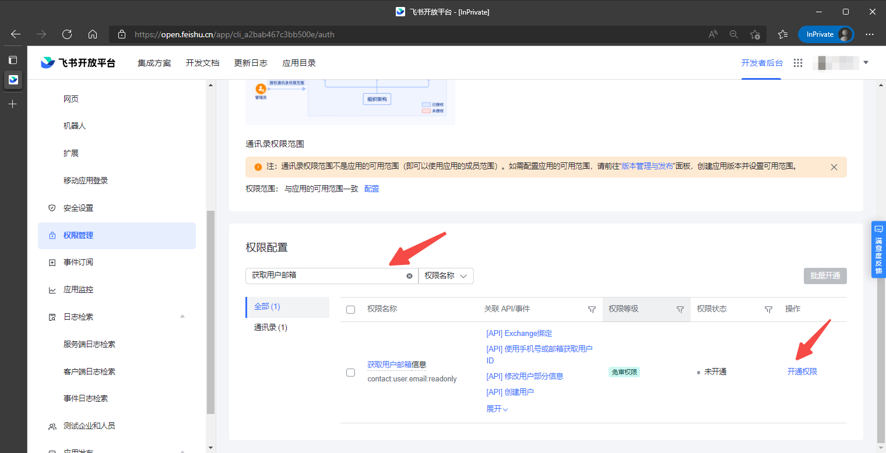

<IntegrationDetailCard title="开启飞书移动应用登录功能">

1. 在[飞书开发者后台](https://open.feishu.cn/app)，点击需要开启移动登录功能的应用，进入应用详情页面：

2. 在飞书应用详情的**应用功能**选项中选择**移动应用登录**，点击按钮开启功能；

3. 开启后填写下方的飞书登录配置，填写完成后保存；

</IntegrationDetailCard>

<IntegrationDetailCard title="开启邮箱/手机号账号身份关联功能">

1. 在飞书应用详情的**权限管理**页面，搜索“获取用户手机号”，点击开通权限

2. 在飞书应用详情的**权限管理**页面，搜索“获取用户邮箱信息”，点击开通权限

3. 设置权限之后，你需要发布最新版本。

</IntegrationDetailCard>
