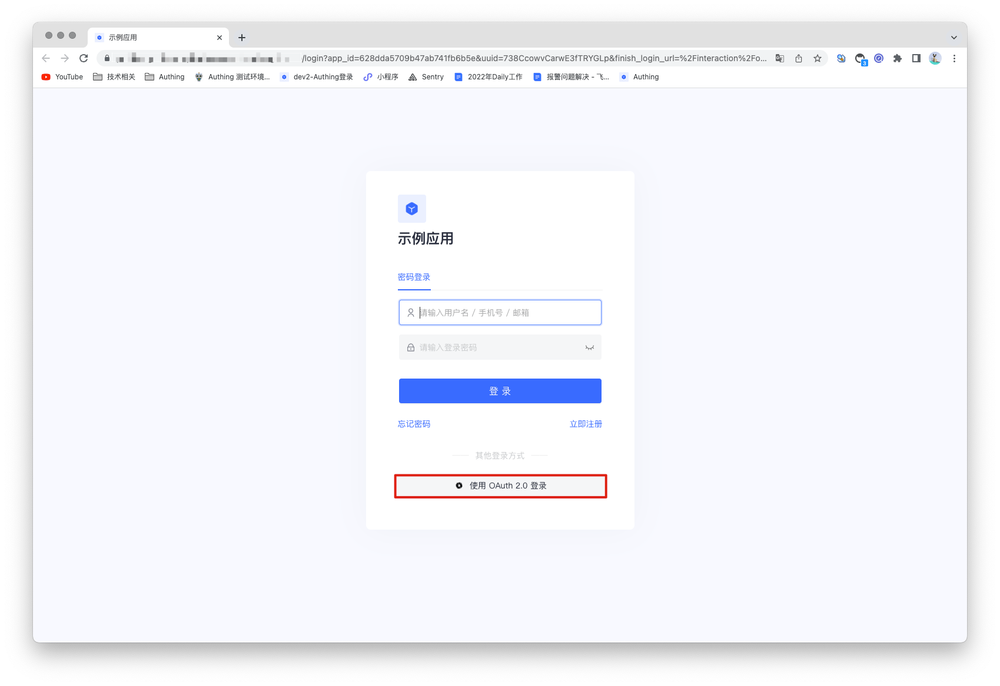
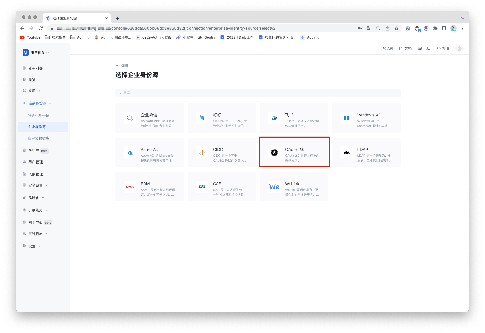
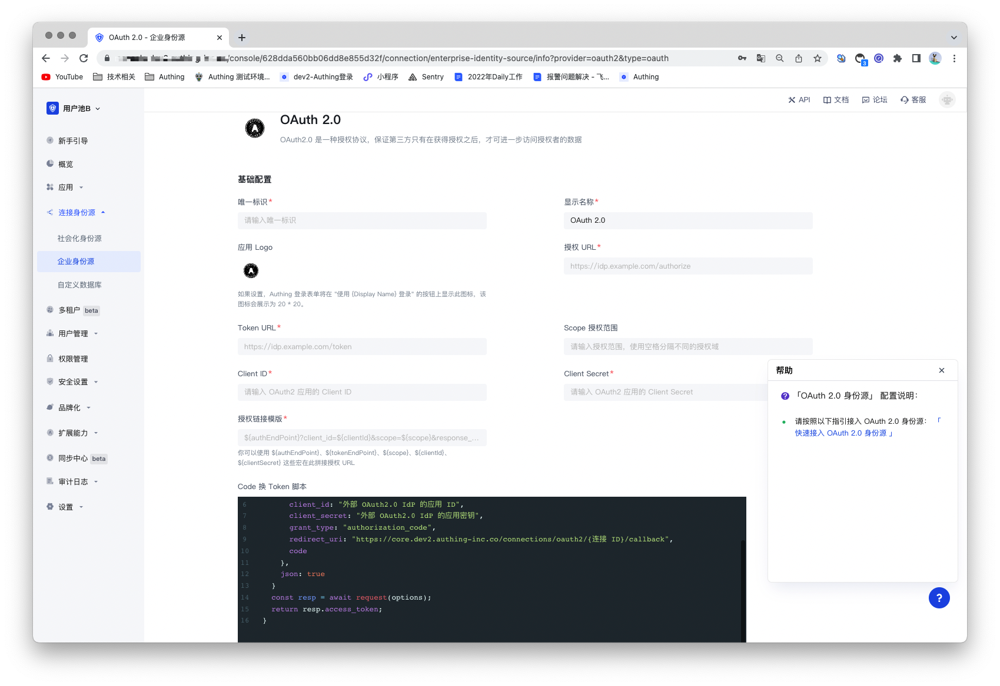
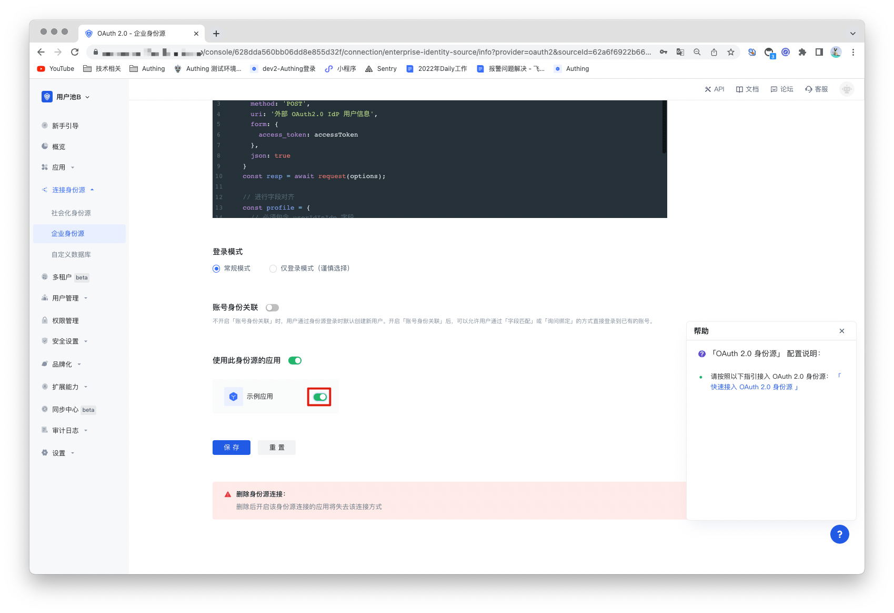

# OAuth2.0 身份源

<LastUpdated/>

## 场景介绍

- **概述**：OAuth2.0 是一个授权标准协议。 用户登录第三方应用时，可以通过使用 OAuth2.0 协议将数据安全的授权给调用方，通过验证后就可以完成免密登录第三方应用。它允许用户访问多个应用程序，同时仅向中央 CAS 服务器应用程序提供一次凭据（例如用户 ID 和密码）。Authing 支持 OAuth2.0 协议的认证能力，用户仅需提供  OAuth2.0认证服务。通过配置 OAuth2.0 身份源后就可以使用其完成单点登录和登出功能。
- **应用场景**：PC 网站
- **终端用户预览图**：

## 注意事项

- 需要一个支持 OAuth2.0 协议能力的服务；
- 如果您未开通 Authing 控制台账号，请先前往 [Authing Console 控制台](https://authing.cn/)注册开发者账号；

## 步骤1：创建 OAuth2.0 身份源

现有很多网站提供的第三方登录都遵循 OAuth2.0 标准协议，可能很多网站处理细节不一致也可以基于 OAuth2.0 协议进行扩展，但整体授权认证流程都是一样的。所以可以使用支持 OAuth2.0 认证的第三方登录应用作为身份源。

如果没有可使用的身份源，也可以让 Authing 成为 OAuth2.0 身份源，其他系统可以通过 OAuth2.0 协议接入 Authing 作为身份提供商。详细可以参考：[成为 OAuth2.0 身份源](https://docs.authing.cn/v2/guides/federation/oauth.html)。

## 步骤2：在 Authing 控制台配置 OAuth2.0 身份源

2.1 打开 **Authing 控制台**，进入想要连接 OAuth2.0 身份源的用户池，这里称其为 **「用户池 B」**。在左侧菜单中选择 「连接身份源」 > 「企业身份源」，在右侧面板选择「创建企业身份源」。

2.2 在右侧面板找到「 OAuth2.0」，点击进去。

2.3 根据 OAuth2.0 的配置要求，填入  OAuth2.0 协议所要求的配置内容。

| 编号   | 字段/功能            | 描述                                                         |
| ------ | -------------------- | ------------------------------------------------------------ |
| 2.3.1  | 唯一标识             | a.唯一标识由小写字母、数字、- 组成，且长度小于 32 位。b.这是此连接的唯一标识，设置之后不能修改。 |
| 2.3.2  | 显示名称             | 这个名称会显示在终端用户的登录界面的按钮上。                 |
| 2.3.3  | 应用 Logo            | 在登录界面按钮上显示的身份源 Logo 。                         |
| 2.3.4  | 授权 URL             | 用来向 CAS IdP 发起认证请求的 URL。填入之前记录的「登录端点」。 |
| 2.3.5  | Token URL            | 用来从 CAS IdP 处获取身份信息的 URL。填入之前记录的「service ticket 检验端点（CAS 2.0」。 |
| 2.3.6  | Scope 授权范围       | 授权请求时携带的授权范围。                                   |
| 2.3.7  | Client ID            | 你的 OpenID Connect provider 的 Client ID。                  |
| 2.3.8  | Client Secret        | 你的 OpenID Connect provider 的 Client Secret。              |
| 2.3.9  | 授权链接模版         | 拼接授权 URL用于请求自动生成授权请求链接。                   |
| 2.3.10 | Code 换 Token 脚本   | 授权过程中需要的 Code 换取 Token 的脚本。                    |
| 2.3.11 | Token 换用户信息脚本 | 授权过程中需要的 token 换取用户信息的脚本。                  |
| 2.3.12 | 登录模式             | 开启「仅登录模式」后，只能登录既有账号，不能创建新账号，请谨慎选择。 |
| 2.3.13 | 账号身份关联         | 不开启「账号身份关联」时，用户通过身份源登录时默认创建新用户。开启「账号身份关联」后，可以允许用户通过「字段匹配」或「询问绑定」的方式直接登录到已有的账号。 |

配置完成后，点击「保存」按钮完成创建。

## 步骤3: 开发接入

- **推荐开发接入方式**：使用托管登录页

- **优劣势描述**：运维简单，由 Authing 负责运维。每个用户池有一个独立的二级域名;如果需要嵌入到你的应用，需要使用弹窗模式登录，即：点击登录按钮后，会弹出一个窗口，内容是 Authing 托管的登录页面，或者将浏览器重定向到 Authing 托管的登录页。

- **详细接入方法**：

3.1 在 Authing 控制台创建一个应用，详情查看：[如何在 Authing 创建一个应用](https://docs.authing.cn/v2/guides/app/create-app.html)。

3.2 在已创建好的 OAuth2.0 身份源连接详情页面，开启并关联一个在 Authing 控制台创建的应用。

3.3 在登录页面体验 OAuth2.0  的企业化登录

