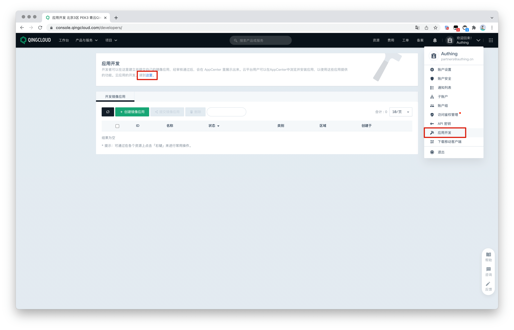
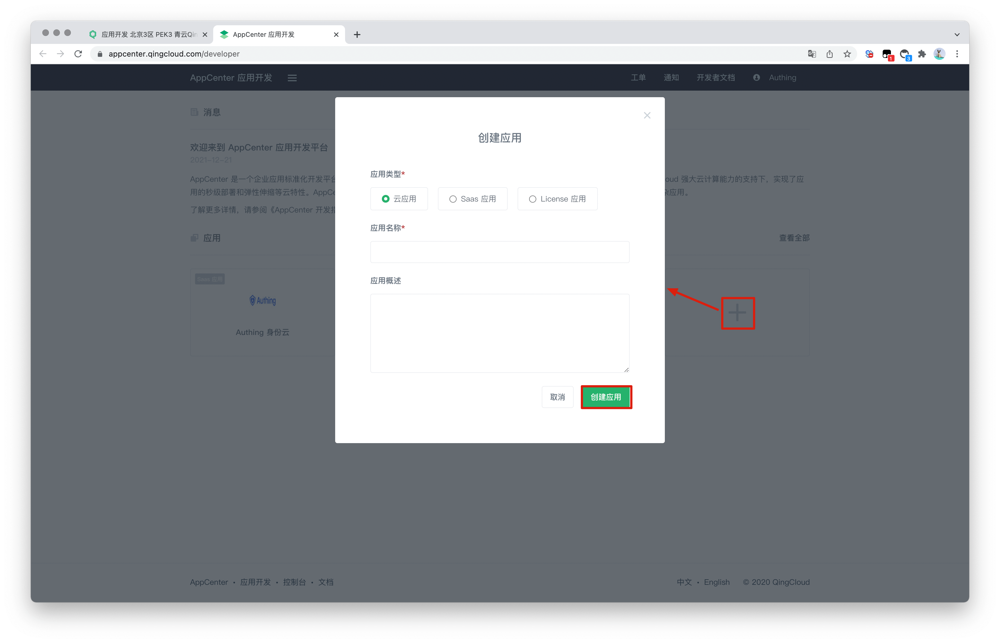
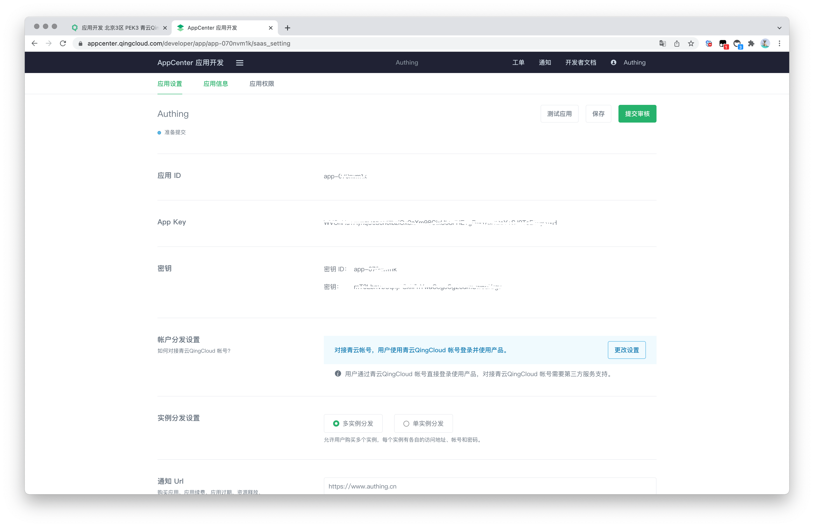

<IntegrationDetailCard title="在青云开发者平台创建应用">

请按照 [QingCloud 文档](https://docsv3.qingcloud.com/appcenter/dev-platform/saas-developer-guide/release/#%E5%88%9B%E5%BB%BA%E5%BA%94%E7%94%A8)指引创建一个应用，你需要记录下该应用的 **App ID** 和 **App Secret**，后面需要用到。可以参考以下流程。

进入控制台，点击右上角的头像，点击应用开发，在应用开发下点击这「这里」进入应用列表。

在应用列表内点击「+」 号即可进行创建应用。选择应用类型，填入应用名称，点击「创建应用」。

记录下 QingCloud 应用的 密钥 ID （即应用 ID）和 密钥。

创建应用过程中，需要配置允许的回调地址，请使用以下设置：

| Field                     |                              值                              |
| ------------------------- | :----------------------------------------------------------: |
| Valid OAuth Redirect URIs | `https://core.authing.cn/connection/social/qingcloud/<YOUR_USERPOOL_ID>/callback` |

> 将其中的 <YOUR_USERPOOL_ID> 替换为你的用户池 ID。

</IntegrationDetailCard>

