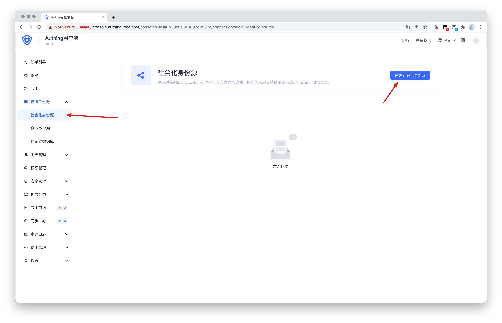
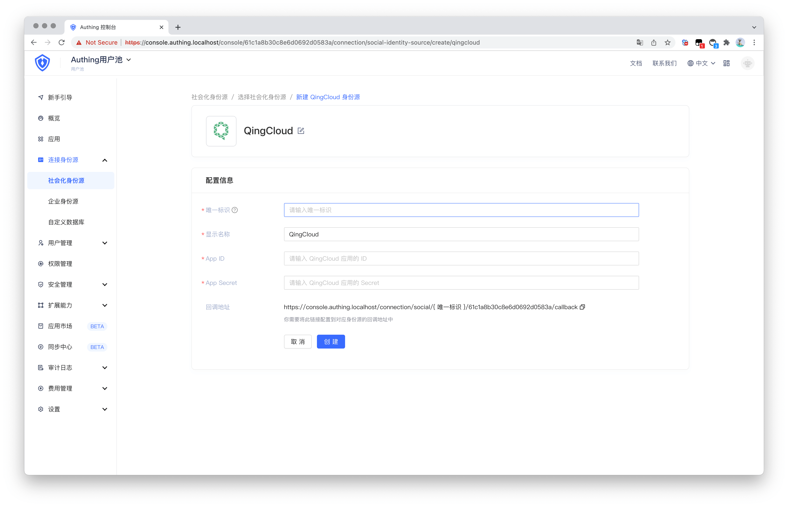

<IntegrationDetailCard :title="`在 ${$localeConfig.brandName} 填入 QingCloud 应用配置`">

你需要在 Authing 中添加你在上一步创建的应用的配置：

1. 在 [Authing 控制台](https://console.authing.cn/)中，进入「社会化身份源」配置页面，点击「创建社会化身份源」开始选择与创建。

2. 在所有社交身份源图标中，找到并进入 **QingCloud** 社会化登录。根据配置填写相关信息。

   - `App ID`: QingCloud 密钥 ID；

   - `App Secret`: QingCloud 密钥；

3. 配置完成后，点击「创建」按钮完成创建。

</IntegrationDetailCard>

