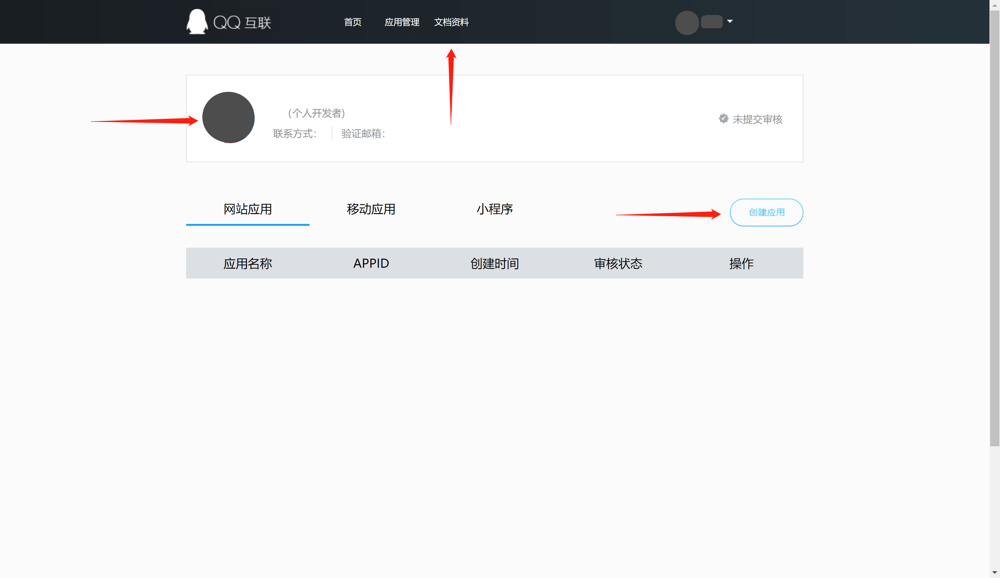

<IntegrationDetailCard title="在 QQ 开放平台创建一个网站应用">

前往 [QQ 互联中心](https://connect.qq.com/manage.html#/) 创建一个网站应用：  
点击页面左上方的个人 QQ 头像完成注册并发起审核，然后依次点击「网站应用」和「创建应用」来创建一个使用 QQ 登录的网站应用。过程中如遇到任何问题，请参考页面上方的 QQ 官方「文档资料」。

创建应用过程中，需要配置允许的回调地址，请使用以下设置：
`https://core.authing.cn/connection/social/qq/:userPoolId/callback`

> 请将 `:userPoolId` 替换为你的用户池 ID

</IntegrationDetailCard>