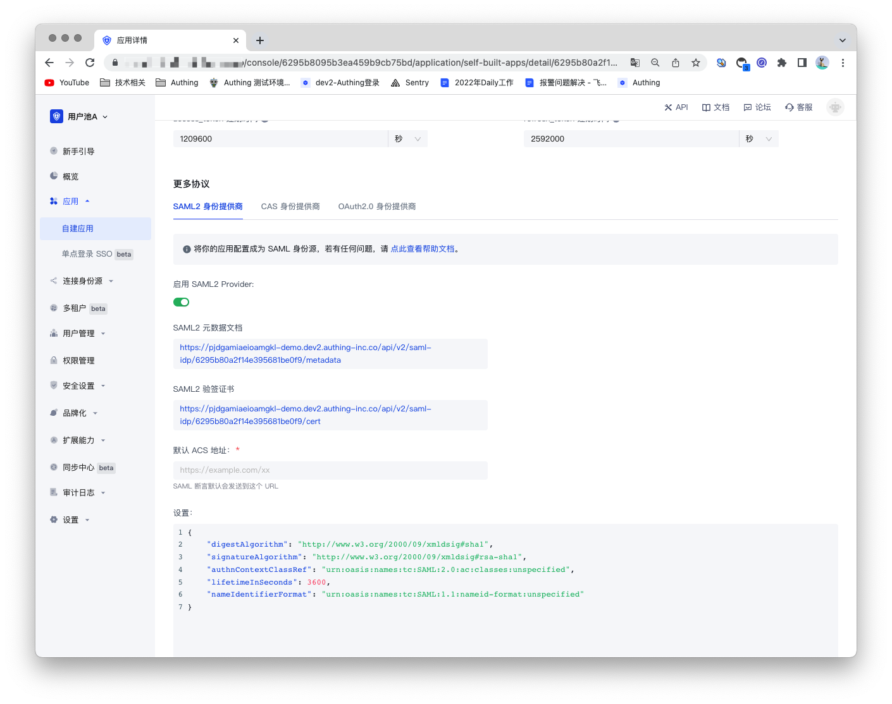
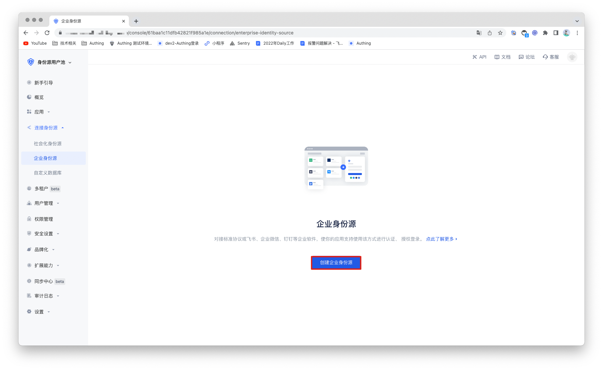
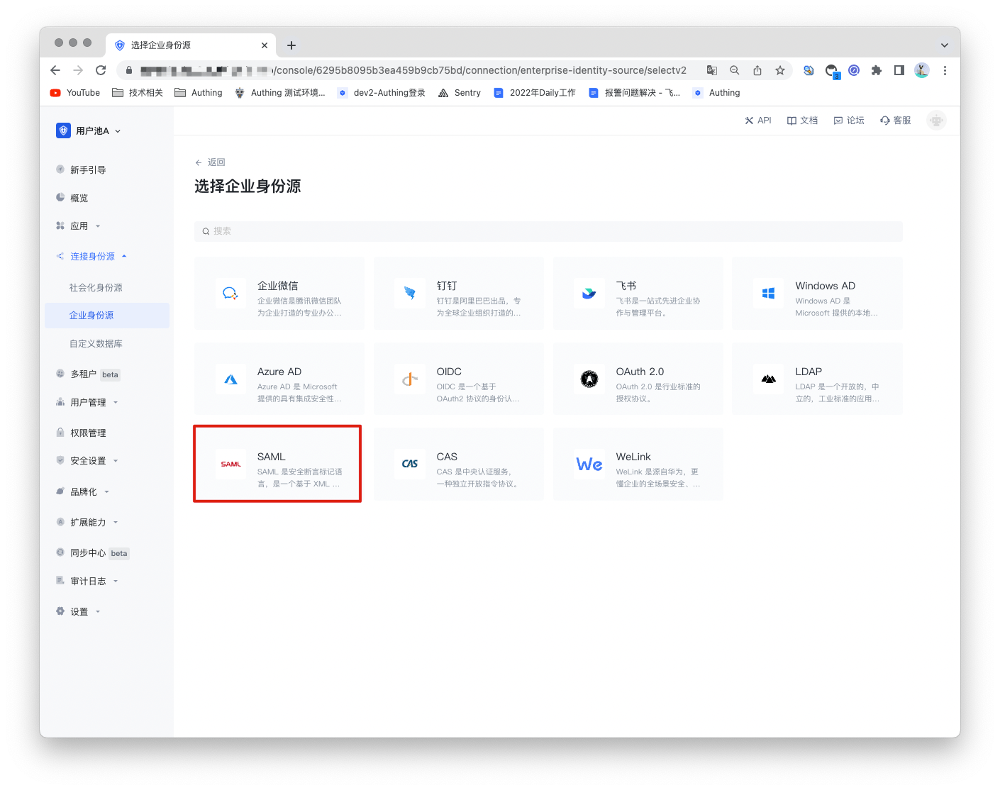
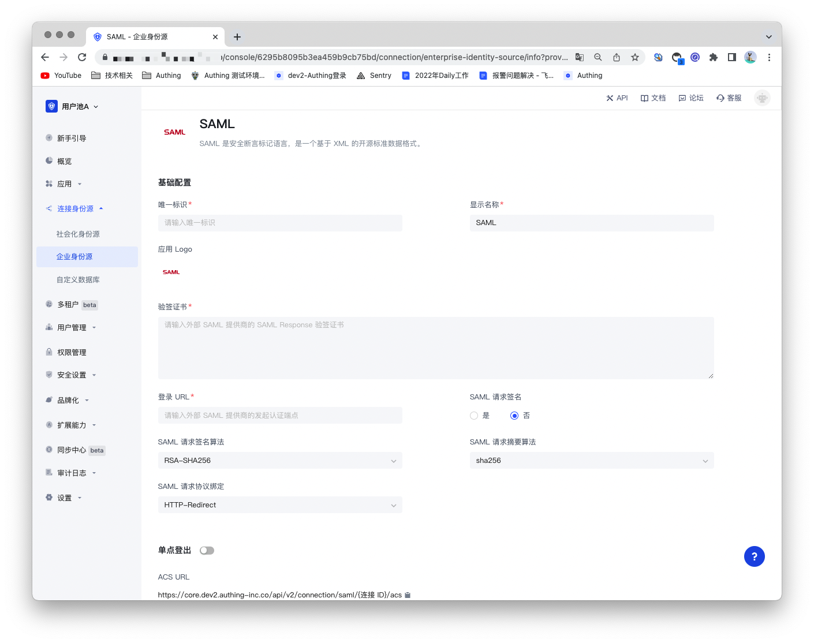
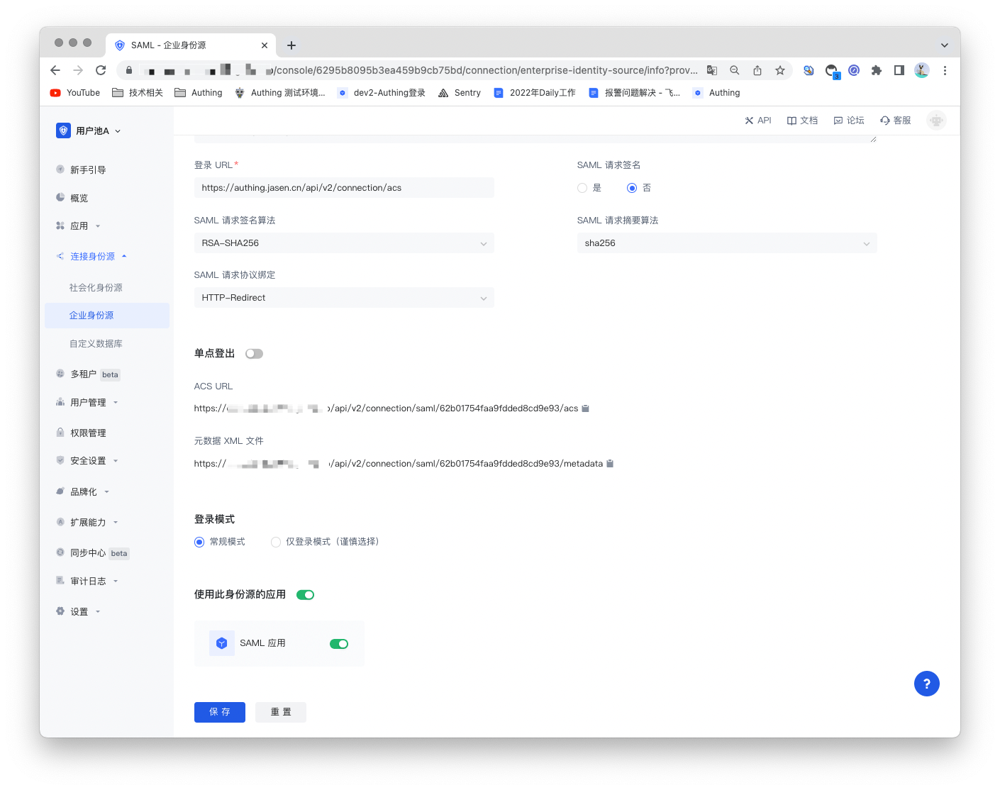

# SAML 身份源

<LastUpdated/>

## 场景介绍

- **概述**：安全断言标记语言（英语：Security Assertion Markup Language，简称 SAML，发音 sam-el）是一个基于 **XML** 的开源标准数据格式，它在当事方之间交换身份验证和授权数据，尤其是在身份提供者和服务提供者之间交换。SAML2.0 可以实现基于网络跨域的单点登录（SSO）， 以便于减少向一个用户分发多个身份验证令牌的管理开销。
- **应用场景**：PC 网站
- **终端用户预览图**：

## 注意事项

- 需要一个支持 SAML 协议能力的服务；
- 如果您未开通 Authing 控制台账号，请先前往 [Authing 控制台](https://authing.cn/)注册开发者账号；

## 步骤1：创建 SAML 身份源

在 Authing 开启 SAML2 身份提供商，为其他服务商提供**身份断言**。让 Authing 成为 SAML 身份源，其他系统可以通过 SAML 协议接入 Authing 作为身份提供商。详细可以参考：[成为 SAML 身份源](https://docs.authing.cn/v2/guides/federation/saml.html)。

## 步骤2：在 Authing 控制台配置 SAML 身份源

2.1 打开 **Authing 控制台**，进入想要连接 SAML 身份源的用户池，这里称其为 **「用户池 B」**。在左侧菜单中选择 「连接身份源」 > 「企业身份源」，在右侧面板选择「创建企业身份源」。

2.2 在右侧面板找到「 SAML」，点击进去。

2.3 根据 SAML 的配置要求，填入  SAML 协议所要求的配置内容。

| 编号   | 字段/功能         | 描述                                                         |
| ------ | ----------------- | ------------------------------------------------------------ |
| 2.3.1  | 唯一标识          | a.唯一标识由小写字母、数字、- 组成，且长度小于 32 位。b.这是此连接的唯一标识，设置之后不能修改。 |
| 2.3.2  | 显示名称          | 这个名称会显示在终端用户的登录界面的按钮上。                 |
| 2.3.3  | 应用 Logo         | 在登录界面按钮上显示的身份源 Logo 。                         |
| 2.3.4  | 验签证书          | SAML Identity Provider 的验签证书。                          |
| 2.3.5  | 登录 URL          | SAML Identity Provider 的登录 URL。                          |
| 2.3.6  | SAML 请求签名     | 是否加密 SAML 请求。                                         |
| 2.3.7  | SAML 请求签名算法 | 默认为 rsa-sha256。                                          |
| 2.3.8  | SAML 请求摘要算法 | 默认为 sha256。                                              |
| 2.3.9  | SAML 请求协议绑定 | 默认为 HTTP-Redirect。                                       |
| 2.3.10 | ACS URL           | 断言消费地址。                                               |
| 2.3.11 | 元数据 XML 文件   | SAML Identity Provider 元数据的地址。                        |
| 2.3.12 | 登录模式          | 开启「仅登录模式」后，只能登录既有账号，不能创建新账号，请谨慎选择。 |

配置完成后，点击「保存」按钮完成创建。

## 步骤3: 开发接入

- **推荐开发接入方式**：使用托管登录页

- **优劣势描述**：运维简单，由 Authing 负责运维。每个用户池有一个独立的二级域名;如果需要嵌入到你的应用，需要使用弹窗模式登录，即：点击登录按钮后，会弹出一个窗口，内容是 Authing 托管的登录页面，或者将浏览器重定向到 Authing 托管的登录页。

- **详细接入方法**：

3.1 在 Authing 控制台创建一个应用，详情查看：[如何在 Authing 创建一个应用](https://docs.authing.cn/v2/guides/app/create-app.html)。

3.2 在已创建好的 SAML 身份源连接详情页面，开启并关联一个在 Authing 控制台创建的应用。

3.3 在登录页面体验 SAML 的企业化登录

