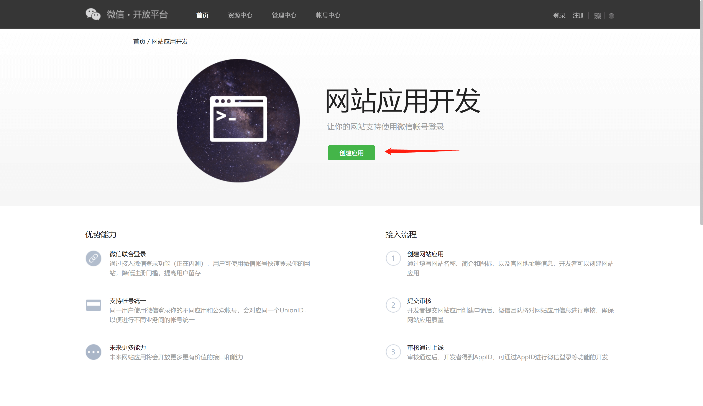

<IntegrationDetailCard title="在微信开放平台创建一个网站应用">

请在 [微信开放平台](https://open.weixin.qq.com/cgi-bin/frame?t=home/web_tmpl&lang=zh_CN) 注册并登录，然后点击「创建应用」开始创建你的网站应用。
你需要记录下该应用的 **App ID** 和 **App Secret**，后面需要用到。

请确保该应用获取到了**微信登录**的权限。

请将授权回调域设置为 `core.authing.cn`:

</IntegrationDetailCard>