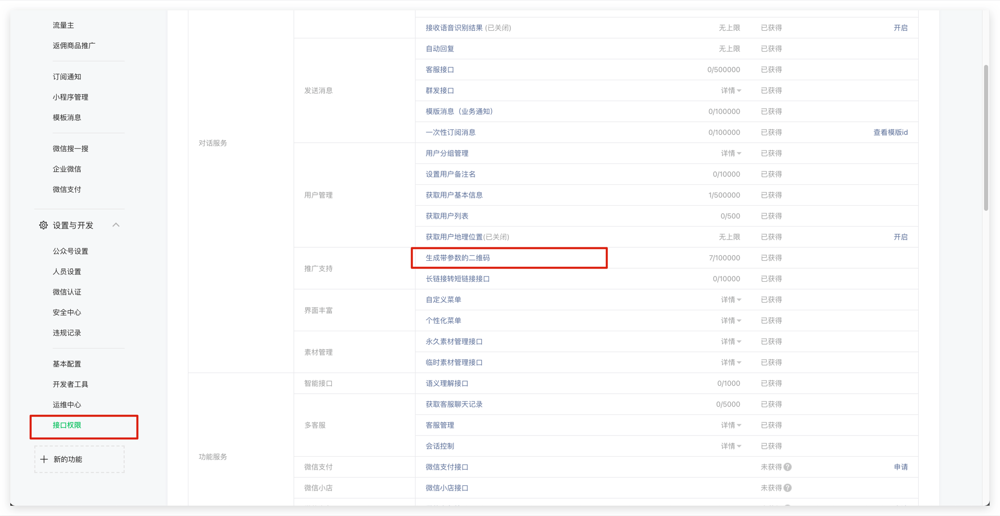

<IntegrationDetailCard title="开发前注意">

受微信平台要求限制，只有**服务号**具备[生成带参数的二维码](https://developers.weixin.qq.com/doc/offiaccount/Account_Management/Generating_a_Parametric_QR_Code.html) API 能力，请确保你的公众号是**服务号**类型。

</IntegrationDetailCard>

<IntegrationDetailCard title="获取公众号开发信息">

你可以在微信公众平台后台的 **开发** -> **基本配置** 页面获取**开发者 ID(AppID)** 和**开发者密码(AppSecret)**。

</IntegrationDetailCard>

<IntegrationDetailCard title="设置 IP 白名单">

你需要将 Authing 服务器的 IP 加入到微信公众号的 **IP 白名单**中，你可以[点击此处](https://core.authing.cn/api/v2/system/public-ips)获取 Authing 服务器对外的 IP 列表。

</IntegrationDetailCard>

<IntegrationDetailCard title="添加 API 权限">

你需要在微信公众号平台的**设置与开发**-**接口权限**页面添加[生成带参数的二维码](https://developers.weixin.qq.com/doc/offiaccount/Account_Management/Generating_a_Parametric_QR_Code.html)接口权限：

</IntegrationDetailCard>

<IntegrationDetailCard title="选择服务器配置模式">

你可以在微信公众平台后台的 **开发** -> **基本配置** 页面，开启服务器配置，当用户扫描公众号二维码、关注公众号之后，Authing 就可以接收到用户扫码和关注事件，从而完成登录。

由于微信服务器配置只能设置一个，所以你需要根据自己的具体场景选择两种不同模式：

- **模式一**：设置服务器地址为 Authing 服务器端点，这种模式最为简单，但是微信公众号的所有事件都会推送到 Authing 服务器，你会丢失掉除扫码和关注之外的其他事件。

- **模式二**：设置服务器地址为自己的服务器，然后将扫码和关注事件转发至 Authing 服务器端点，这种模式需要进行一定开发工作，但是不会丢失事件，且利于之后基于公众号事件做更多扩展。

</IntegrationDetailCard>

<IntegrationDetailCard title="模式一：设置服务器地址为 Authing 服务器端点">

- **URL**: 设置为 `https://core.authing.cn/connections/social/<identifier>/<USERPOOL_ID>/events`（将其中的 \<identifier\> 替换为你在 Authing 控制台配置区输入的唯一标识，并将其中的 \<USERPOOL_ID\> 替换为你的[用户池 ID](/guides/faqs/get-userpool-id-and-secret.md))；
- **Token**: 你可以在微信公众号内设置 Token 为任意字符串，必须为英文或数字，长度为 3-32 字符，并确保你在 Authing 控制台配置的 token 和所需接入的公众号提供的 token 一致。
- **EncodingAESKey**: 消息加密密钥由43位字符组成，可随机修改，字符范围为A-Z，a-z，0-9；
- **消息加解密方式**: 请根据业务需要选择，推荐使用**安全模式**；

暂时先不要点击保存，你需要将上述配置及 AppID 和 AppSecret 填入 Authing 控制台中。在 **连接身份源** - **社会化登录** 中选择 **微信**，连接方式选择**微信公众号扫码关注登录**，填入上述配置：

最后点击提交，你应该能够看到成功提示。

最后别忘了启用此服务器配置：

</IntegrationDetailCard>

<IntegrationDetailCard title="模式二：设置服务器地址为自己的服务器，然后将扫码和关注事件转发至 Authing 服务器端点">

配置流程和模式一完全一致，只需要将 URL 设置为你自己的服务器地址即可。你需要在自己配置的服务器端点完成接口验证、消息转发操作。

具体流程和示例代码，请见此 Demo：[https://github.com/Authing/authing-wechat-official-account](https://github.com/Authing/authing-wechat-official-account)。

</IntegrationDetailCard>