<IntegrationDetailCard title="在创建代开发模板之前，需要成为企业微信服务商">

进入企业微信[服务商官网](https://open.work.weixin.qq.com)，点击成为企业微信服务商

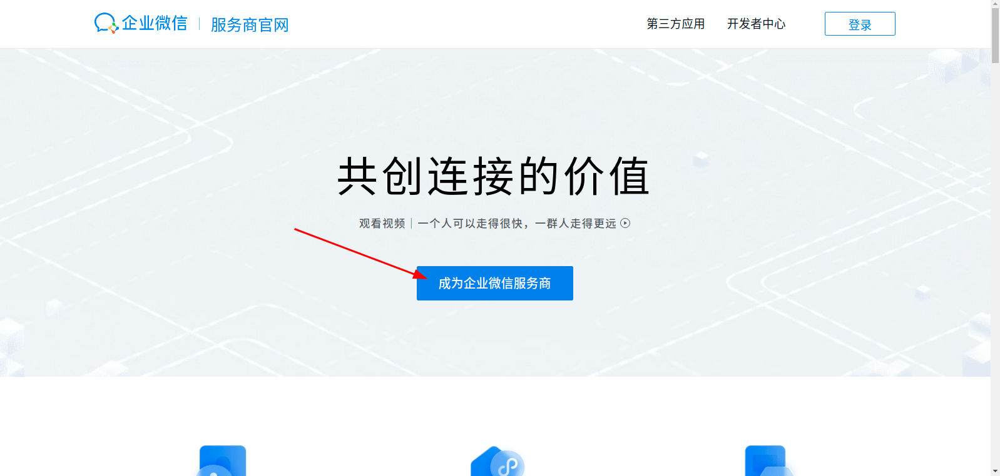

企业微信管理员扫码，确认成为企业微信服务商

进入企业[微信服务商后台](https://open.work.weixin.qq.com/wwopen/login)

</IntegrationDetailCard>

<IntegrationDetailCard title="创建代开发模板">

进入顶部的应用管理，点击应用代开发，点击创建代开发应用模板

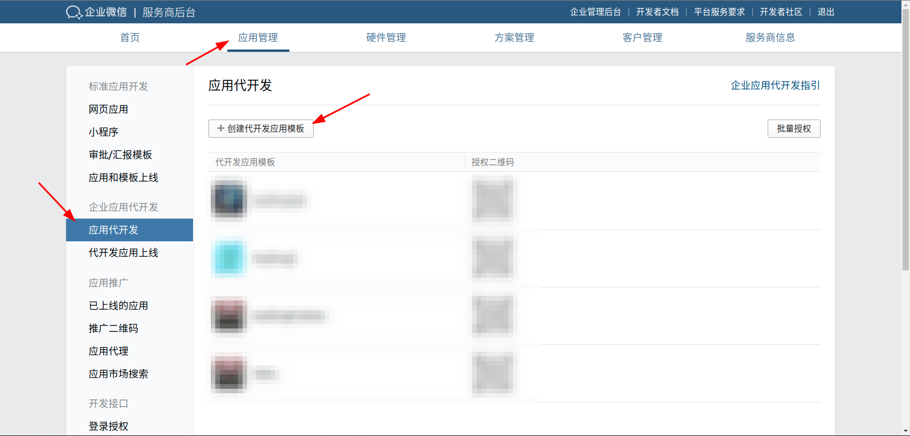

配置代开发应用模板基础信息

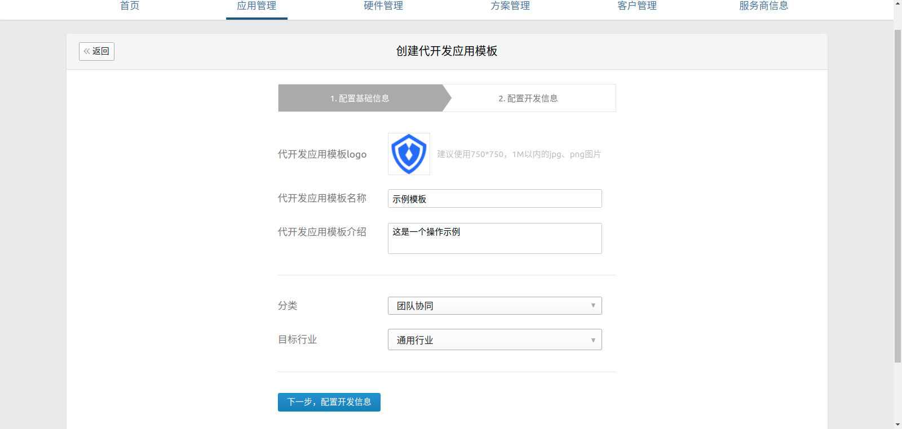

配置开发信息

1. 在 {{$localeConfig.brandName}} 填写**唯一标识**和**显示名称**

   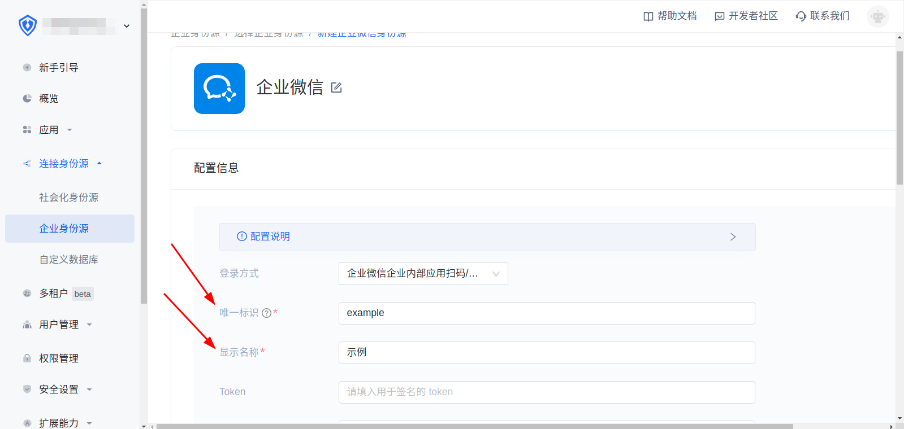

2. 将 {{$localeConfig.brandName}} 中的**事件地址**复制到**代开发模板回调URL**

   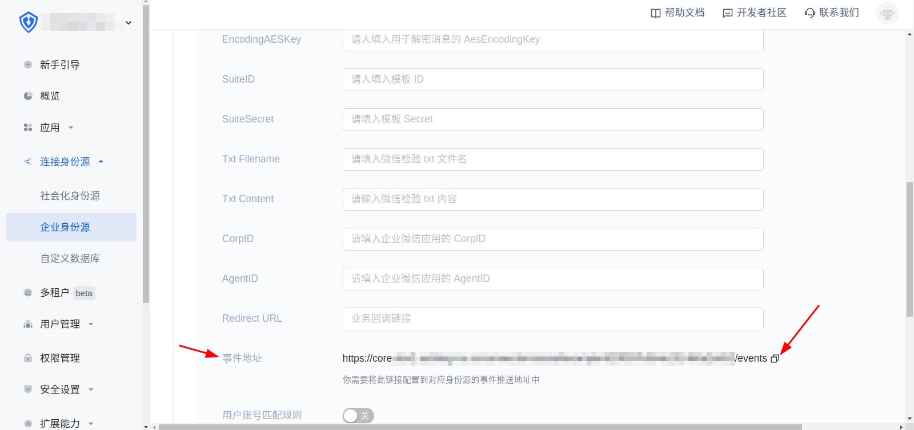

   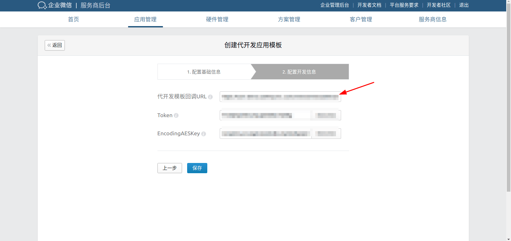

3. 随机获取 **Token** 和 **EncodingAESKey** 并将生成的 **Token** 和 **EncodingAES** 填入 {{$localeConfig.brandName}} 中的 **Token** 和 **EncodingAESKey**，最后点击创建

   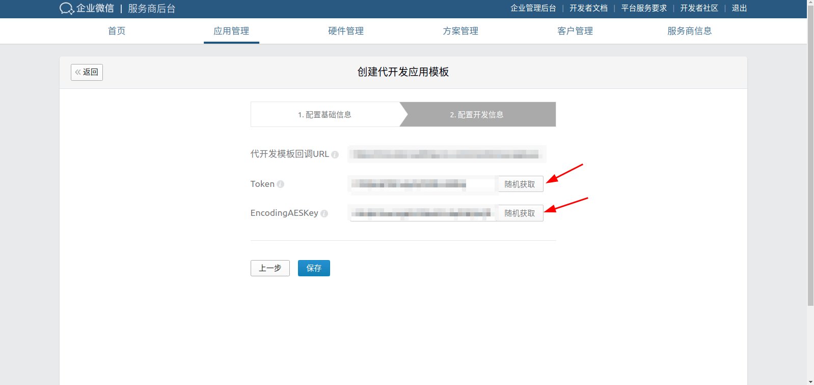

   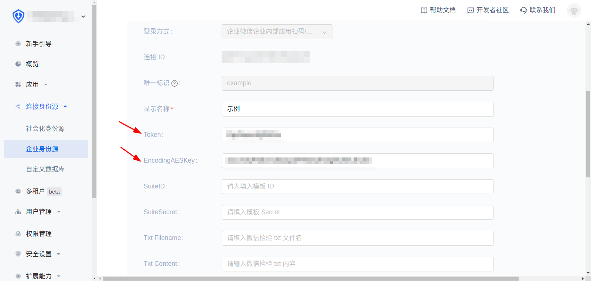

   点击创建

   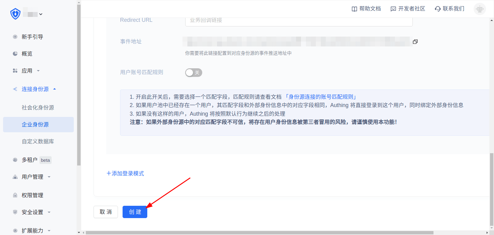

4. 点击保存

   

**这个过程中企业微信后台会验证代开发模板回调是否可用，请严格按照顺序操作**

</IntegrationDetailCard>

<IntegrationDetailCard title="上线代开发模板">

在应用管理下，点击代开发应用上线，提交上线

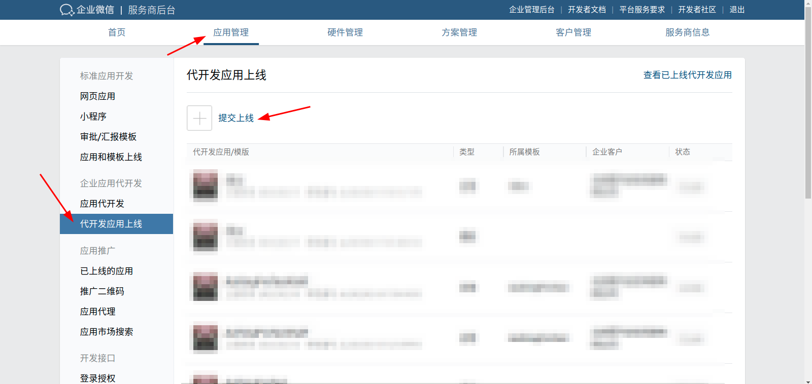

选择刚才创建的代开发应用模板，点击确定

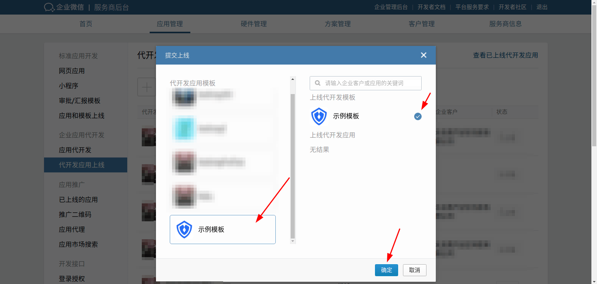

审核通过后，点击刚才提交审核的代开发应用模板，点击提交上线

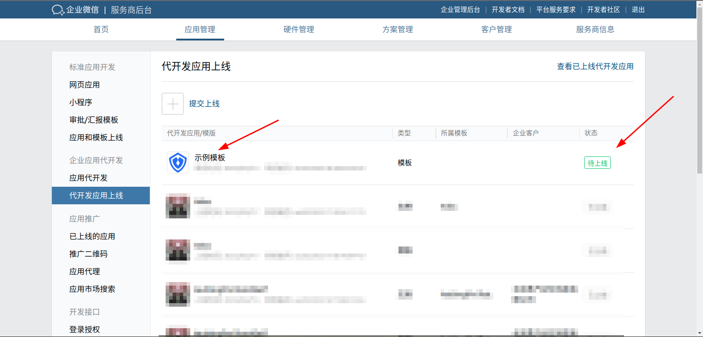

</IntegrationDetailCard>
