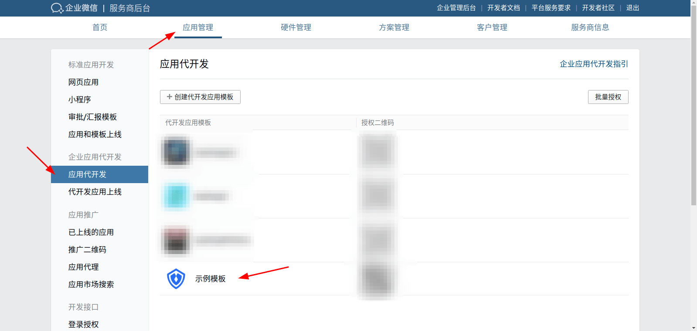
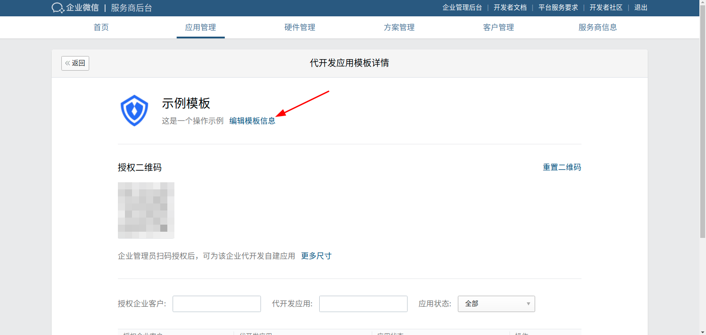
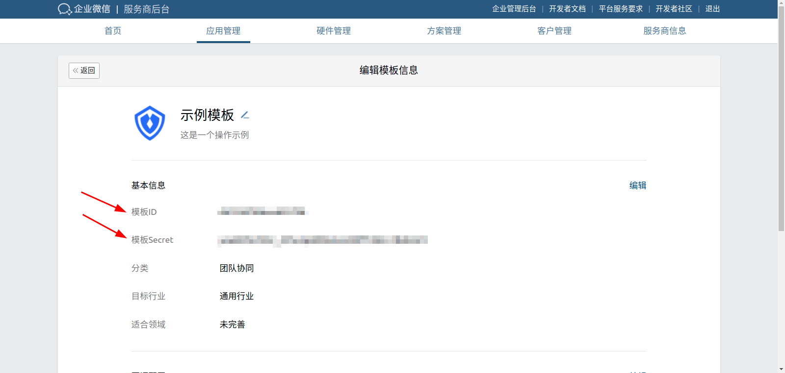
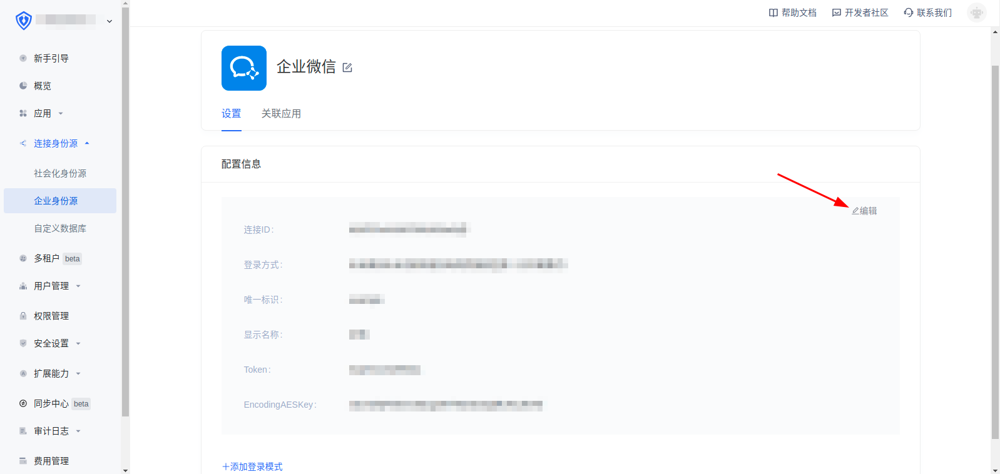
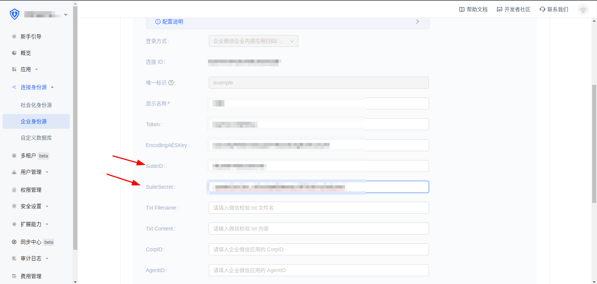

<IntegrationDetailCard :title="填入代开发应用模板信息">

进入在服务商后台，应用管理中，应用代开发，点击刚才创建的应用代开发模板

点击编辑模板信息

将模板 ID 和 模板 Secret 填入 {{$localeConfig.brandName}} 中的 SuiteID 和 SuiteSecret，并保存

</IntegrationDetailCard>
