<IntegrationDetailCard title="配置并上线代开发应用">

重新进入代开发应用

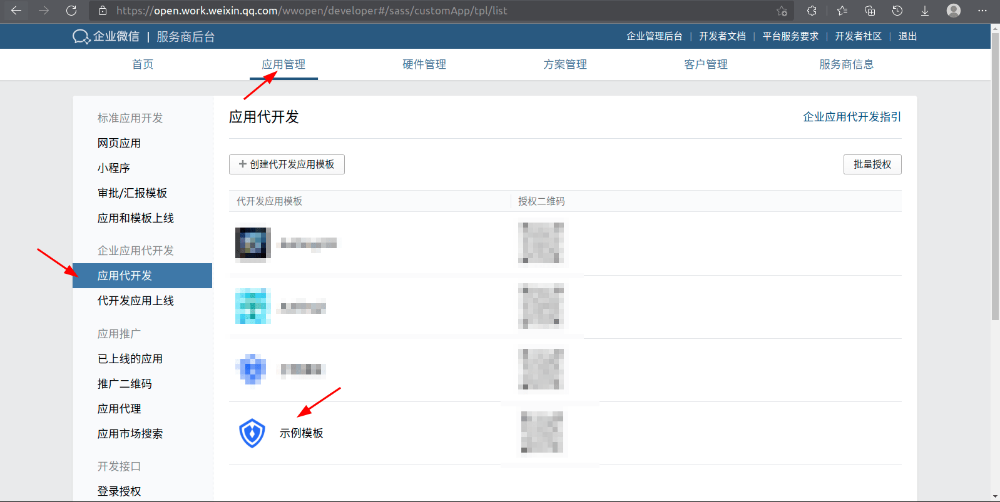

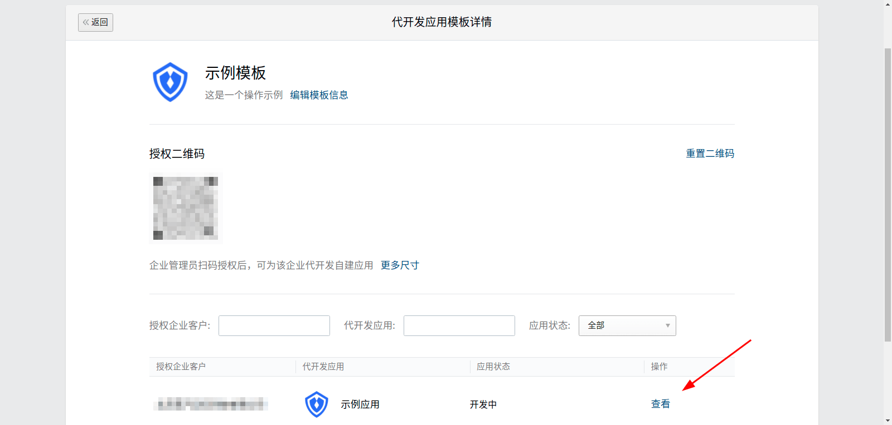

编辑使用配置

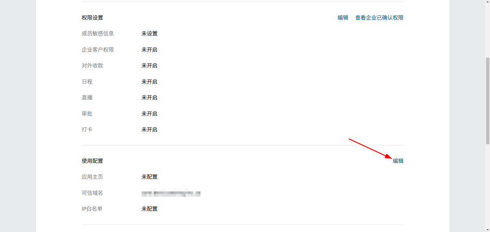

点击校验可信域名归属

下载文件

将文件名和内容填入 {{$localeConfig.brandName}} 的 FileTxt 和 FileContent 中，点击保存

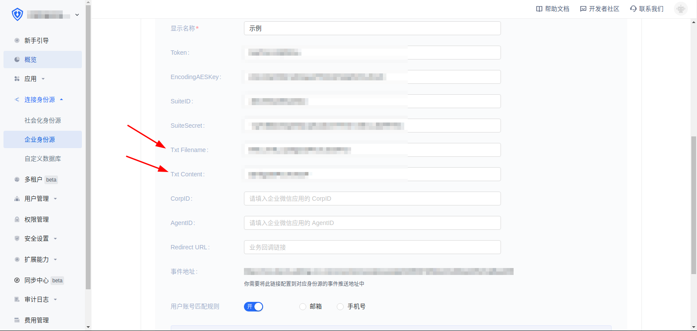

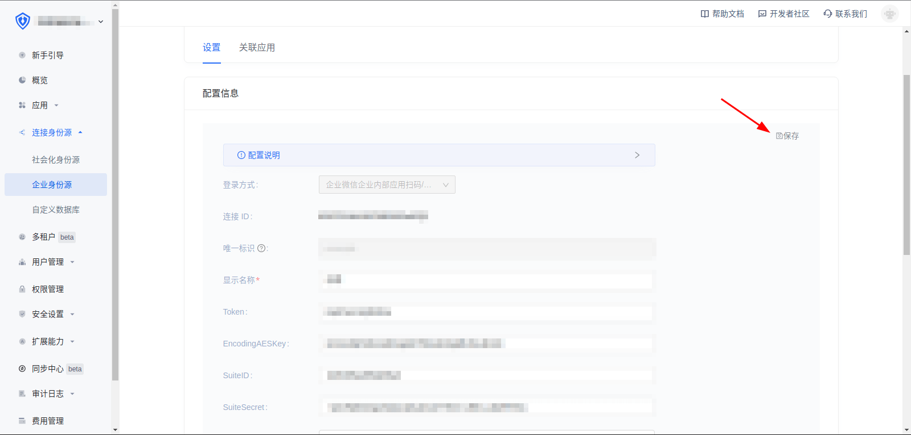

保存企业微信中代开发应用的配置

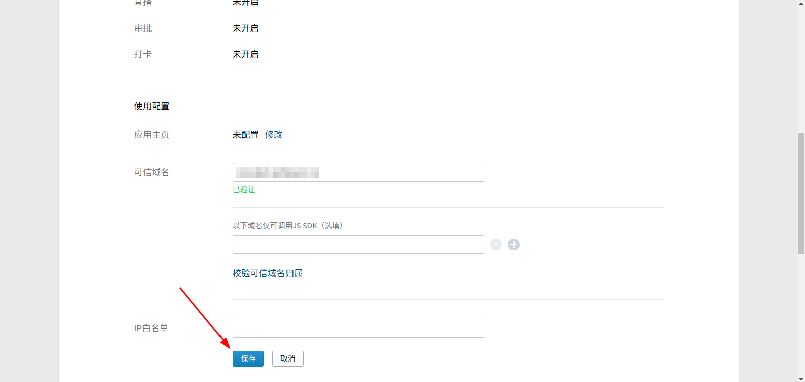

设置企业微信授权登录

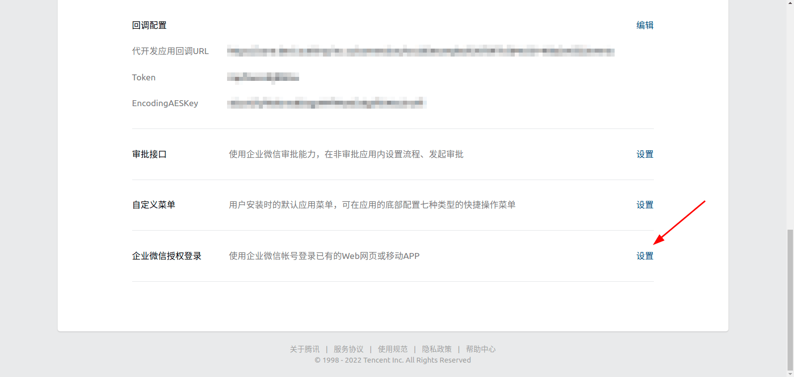

在 Web 网页中的授权回调域中填写core.authing.cn

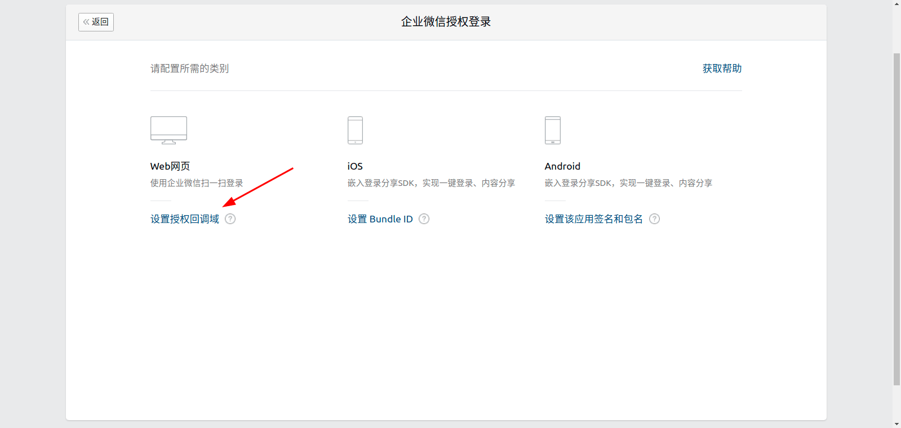

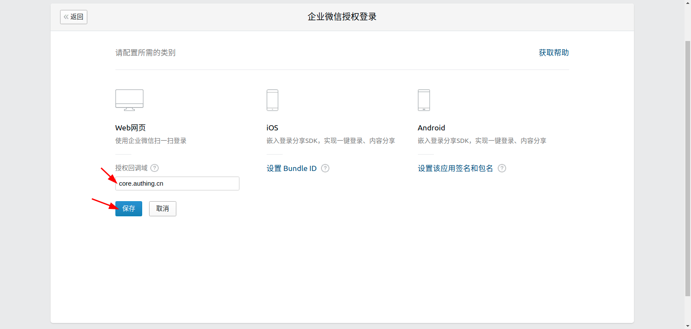

配置完成后可提交审核

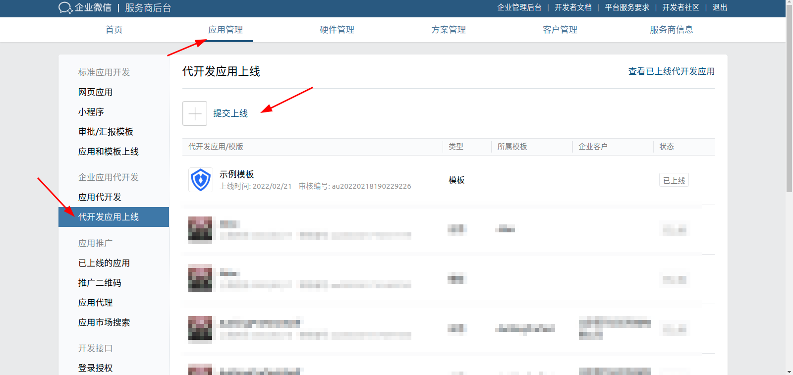

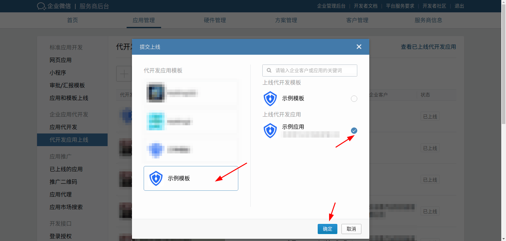

审核通过后，代开发应用状态变更为待上线

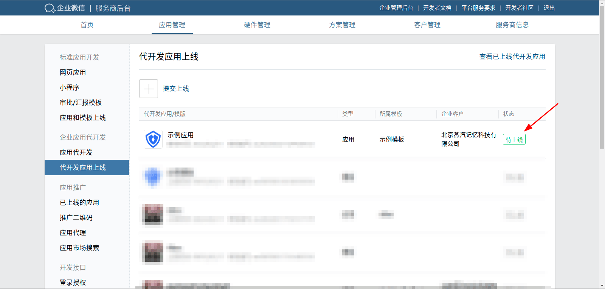

点击进入待上线的应用，提交上线

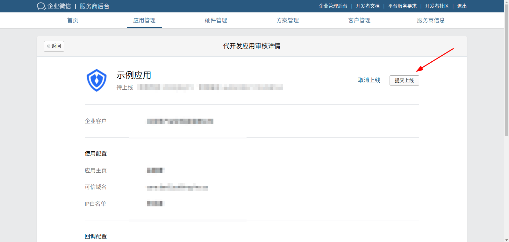

</IntegrationDetailCard>
