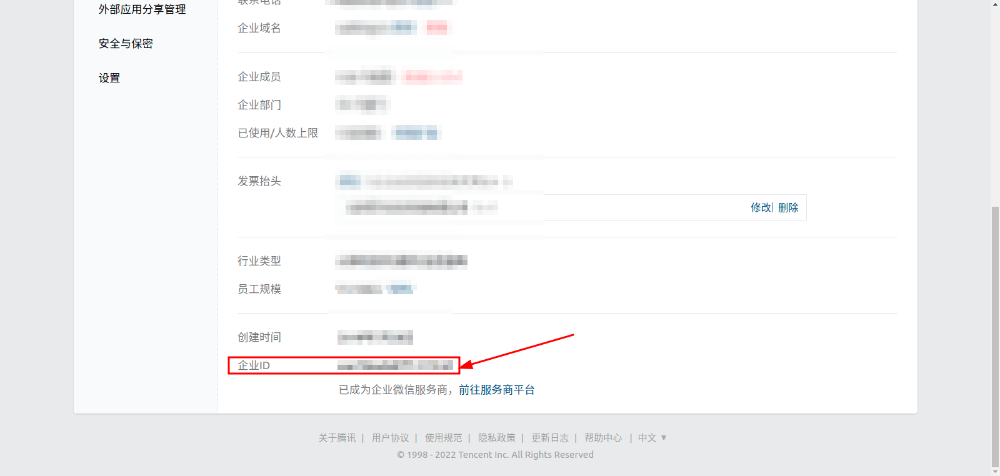
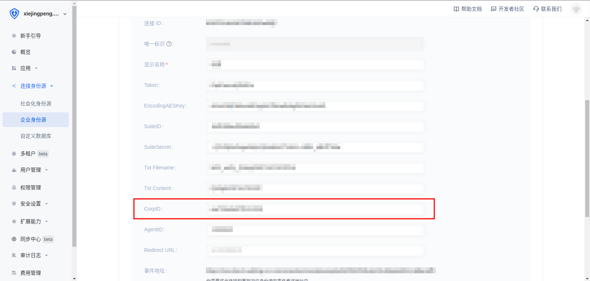
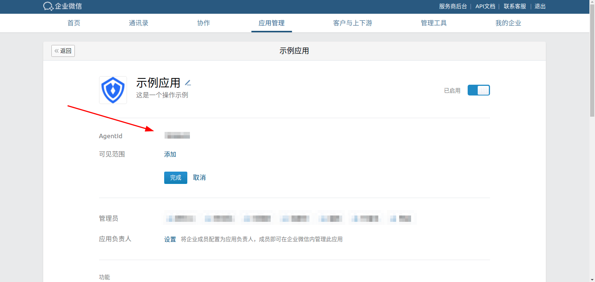
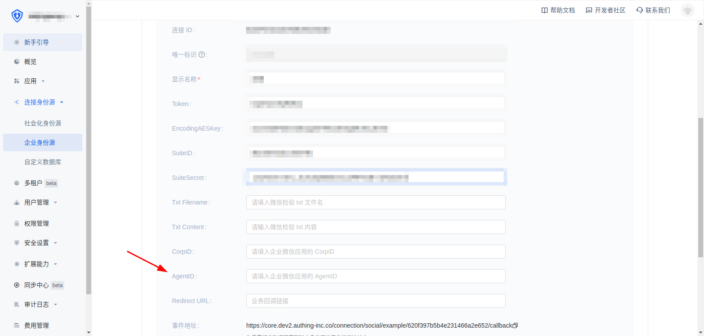
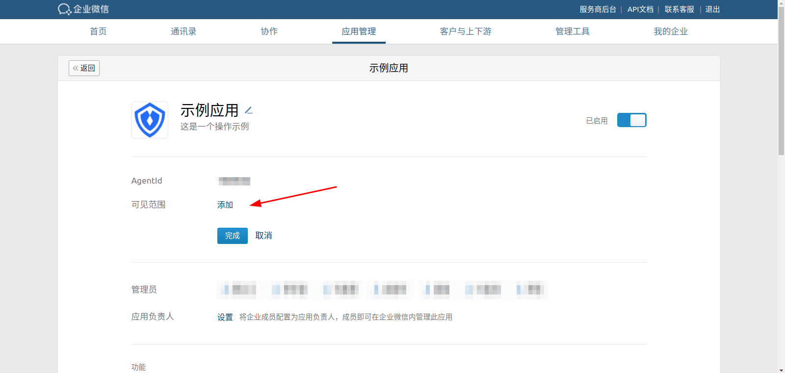
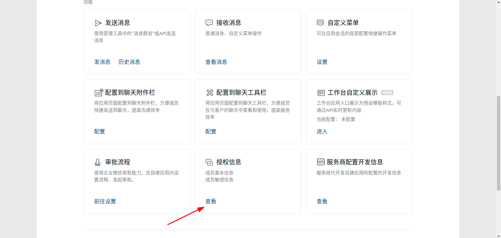
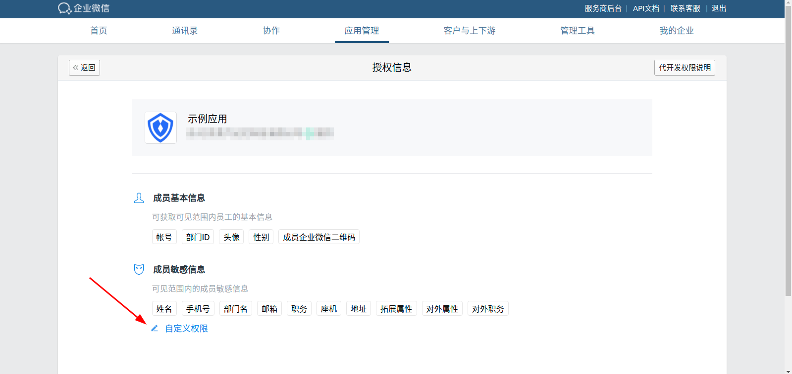
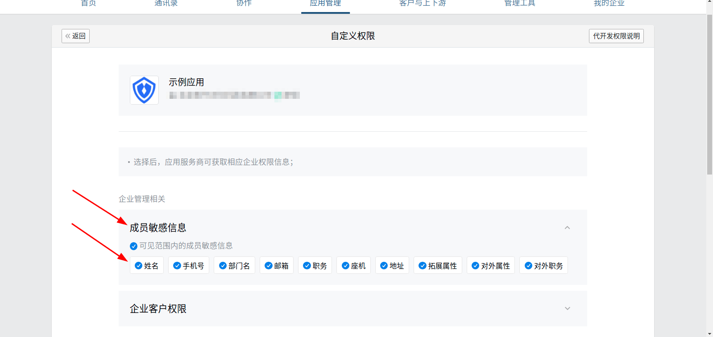

<IntegrationDetailCard title="配置并上线代开发应用 AgentId">

在企业管理后台，**我的企业** 查看**企业ID**

在 {{$localeConfig.brandName}} 中的 **CorpID** 填入**企业ID**

</IntegrationDetailCard>

<IntegrationDetailCard title="配置并上线代开发应用 AgentId">

在企业管理后台的自建应用中 将 AgentId 填入 {{$localeConfig.brandName}} 的 AgentId 中

点击可见范围，自行选择可见范围，只有选择的组织成员可使用  {{$localeConfig.brandName}} 进行登录

点击授权信息

选择允许的成员敏感信息

</IntegrationDetailCard>
