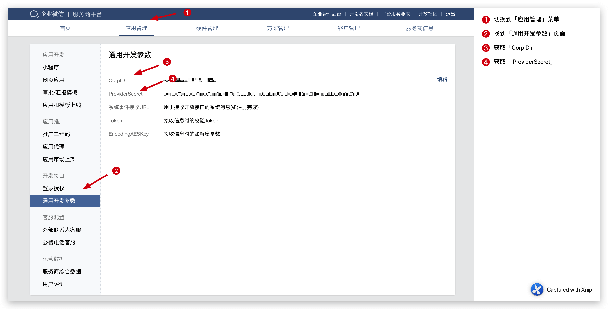

<IntegrationDetailCard title="在企业微信服务商平台获取配置参数">

### 添加 IP 白名单

请将下面这几个 IP 添加到白名单：

```js
52.80.250.250 , 140.179.19.50
```

你可在 [服务商信息 - 基本信息](https://open.work.weixin.qq.com/wwopen/developer#/profile/basic) 页面进行配置。


### 获取服务商基础配置

你需要提供 CorpID 和 ProviderSecret，可在 [应用管理 - 通用开发参数 ](https://open.work.weixin.qq.com/wwopen/developer#/sass/power/inter)页面获取：



之后填入上文提示的表单。

### 添加登录授权发起域名

如果你要使用 Guard 登录，请将你在 {{$localeConfig.brandName}} 的二级域名加入登录授权发起域名列表：


</IntegrationDetailCard>