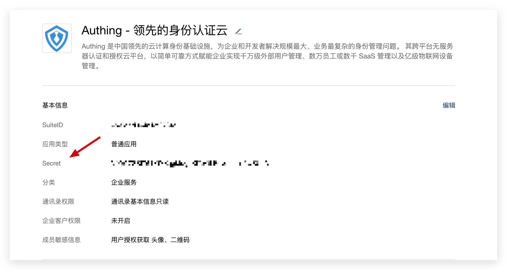
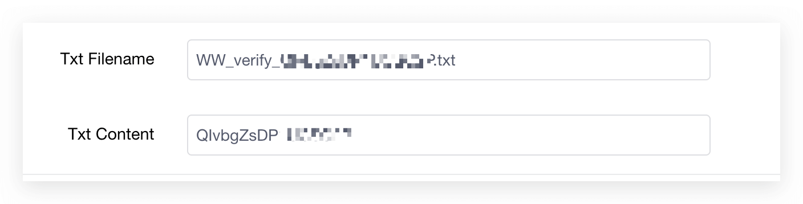
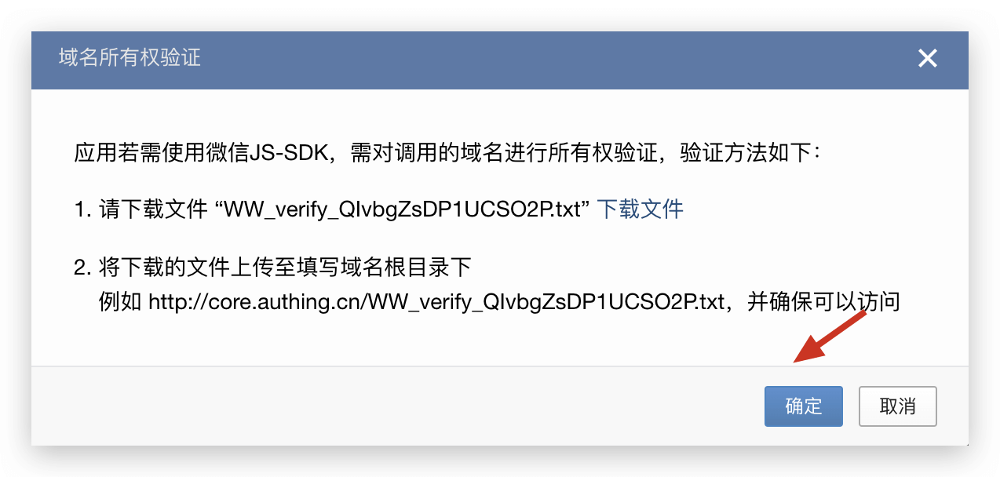

<IntegrationDetailCard title="在企业微信服务商平台创建一个网页应用">

### 获取企业微信应用配置

你需要提供应用的 SuiteID、应用的 Secret 和微信企业的 CorpID：

获取 SuiteID 和 Secret ：在 [应用管理 - 网页应用 - 应用详情](https://open.work.weixin.qq.com/wwopen/developer#/sass/apps/list) 处可以获取到。



获取 CorpID ：在 [服务商信息 - 基本信息](https://open.work.weixin.qq.com/wwopen/developer#/profile/basic) 处可以获取到


之后请将这三个数据填入上文提到的表单。

### 添加 IP 白名单

请将下面这几个 IP 添加到白名单：

```js
52.80.250.250 , 140.179.19.50
```

你可在 [服务商信息 - 基本信息](https://open.work.weixin.qq.com/wwopen/developer#/profile/basic) 页面进行配置。


### 配置可信域名

将 `core.authing.cn` 设置为可信域名。


点击「检验可信域名归属」，在弹出的 Modal 中，你需要下载一个 Txt 文件：


并将 **Txt 文件名**和 **Txt 文件内容**填入上文显示的表单。

- Txt Filename 一般为 WW_verify\_ 开头，**请注意保留 .txt 文件后缀**！
- Txt Content: 文件内容，一般为 10-20 位随机字符串。



点击「确定」按钮：



你应该可以看到可信域名验证成功了：

::: hint-info
如果你遇到任何问题，可以在这里联系到我们：[https://forum.authing.cn/](https://forum.authing.cn/)
:::

### 配置企业微信回调链接

一共配置两个回调链接：


- 数据回调 URL。链接格式为:

```
https://core.authing.cn/oauth/wechatwork/:userPoolId/redirect/data
```

假设你的用户池 ID 为 5e4cdd055df3df65dc58b97d，则数据回调链接为：

```
https://core.authing.cn/oauth/wechatwork/5e4cdd055df3df65dc58b97d/redirect/data
```

- 指令回调 URL。链接格式为：

```
https://core.authing.cn/oauth/wechatwork/:userPoolId/redirect/command
```

假设你的用户池 ID 为 5e4cdd055df3df65dc58b97d，则指令回调链接为：

```
https://core.authing.cn/oauth/wechatwork/5e4cdd055df3df65dc58b97d/redirect/command
```

请将 Token 和 EncodingAESKey 填入上文提到的表单，之后点击申请检验：


你应该能够获取到成功提示。

</IntegrationDetailCard>
