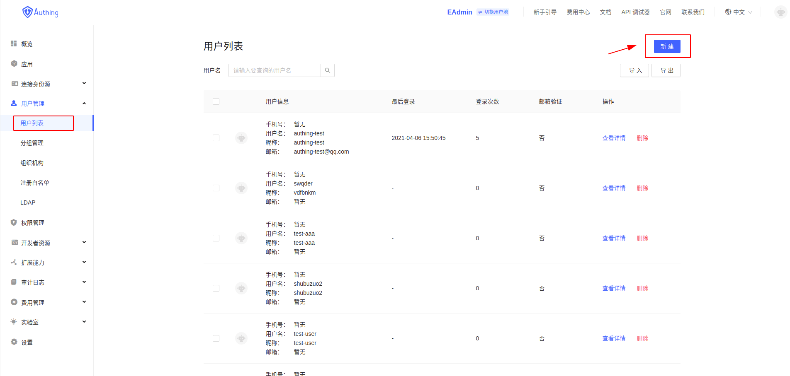
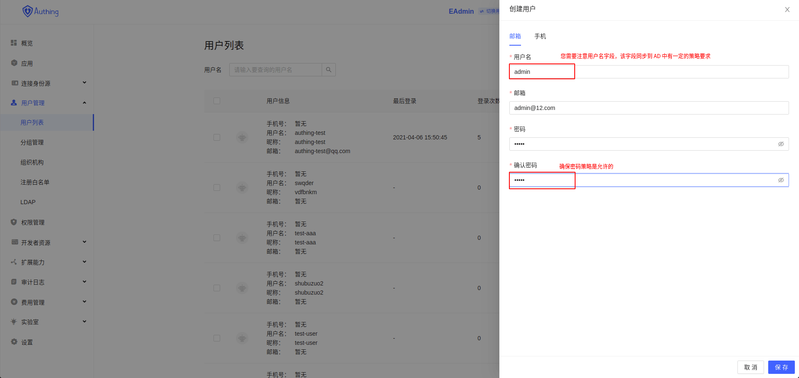
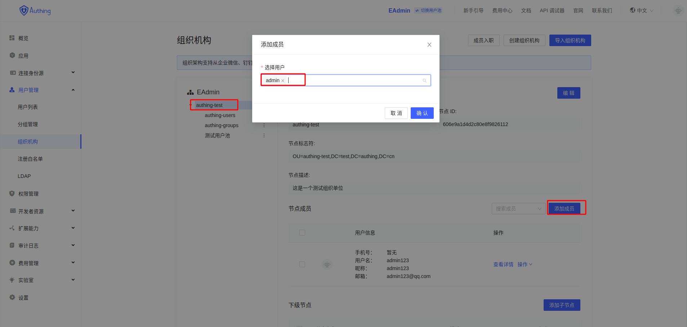

<IntegrationDetailCard title="Windows Active Directory 用户目录双向同步">
本文包含以下章节：
- **`AD 双向同步`** 的开启时间
- **`AD 双向同步`** 的功能点
- **`AD 同步到 Authing`**
- **`Authing 同步到 AD`**
- **`用户验证相关同步`**
- **`一个完整的双向同步过程`**
<!-- - **`未来展望`** -->

### **`AD 双向同步`** 的开启时间

配置好之后，你可以选择对应的导入方式导入组织机构。
> 默认情况下，当您使用 AD 导入组织机构的之后， 并且您已经完成前面相关步骤， 此时 AD 的双向同步已经开启

### **`AD 双向同步`** 的功能点
1. 从 AD 同步到 Authing
  - 新增用户信息
  - 改动用户信息
  - 删除用户信息
  - 增加组织节点
  - 变更组织节点信息
  - 增加组织成员
  - 删除组织成员
  - 删除组织节点
2. 从 Authing 同步到 AD
  - 用户新增（增加组织成员）
  - 用户更改
  - 用户删除
  - 增加组织成员
  - 删除组织成员
  - 组织节点删除
  - 组织节点信息变更
  - 组织节点新增
3. 用户认证
  - AD 用户导入
  - Authing 用户同步到 AD

### 初始化测试环境

1. 进入 `AD 根节点`， 新建一个 **组织单位**

2. 创建 `authing-test` **组织单位**

3. 查看该 `组织单位` 的 `属性`

4. 进入 `属性编辑器`

5. 复制 `该组织单位` 的 `DN`

6. 填写 `AD-Connector` 相关配置

### **`AD 同步到 Authing`**
#### 新增用户信息
#### 改动用户信息
#### 删除用户信息
#### 增加组织节点
#### 变更组织节点信息
#### 增加组织成员
#### 删除组织成员
#### 删除组织节点

### **`Authing 同步到 AD`**
#### 用户新增（增加组织成员）

1. 在 Authing 中新增一个 `用户`

2. 新增 `用户信息`

3. 确保存在 `来自 AD` 导入的 `组织机构`

4. 将新增的 `用户` 导入到对应的 `组织机构`

5. `用户导入` 之前的 `AD 数据状态`

6. `用户导入` 之后的 `AD 数据状态`

#### 用户更改

1. `修改` 该用户的信息

<!--  -->

2. `修改` 之前的 `AD 数据状态`

<!--  -->

3. `修改` 之后的 `AD 数据状态`

<!--  -->

#### 用户删除

1. `删除` 该用户的信息

<!--  -->

2. `删除` 之前的 `AD 数据状态`

<!--  -->

3. `删除` 之后的 `AD 数据状态`

<!--  -->

#### 增加组织成员

> `等同于` 用户新增（增加组织成员）

#### 删除组织成员

1. `删除` 一个 `组织节点` 的 **成员**

2. `删除组织成员` 之前的 `AD 数据状态`

3. `删除组织成员` 之后的 `AD 数据状态`

#### 组织节点新增

1. `新增` 一个组织节点

2. `新增组织节点` 之前的 `AD 数据状态`

3. `新增组织节点` 之后的 `AD 数据状态`

#### 组织节点信息变更

1. `变更` 组织节点 `信息`

2. `变更` 之前的 `AD 数据状态`

3. `变更` 之后的 `AD 数据状态`

#### 组织节点删除

1. `删除` 组织节点

2. `删除` 之前的 `AD 数据状态`

3. `删除` 之后的 `AD 数据状态`

### **用户认证**
#### AD 用户导入
#### Authing 用户同步到 AD
</IntegrationDetailCard>
