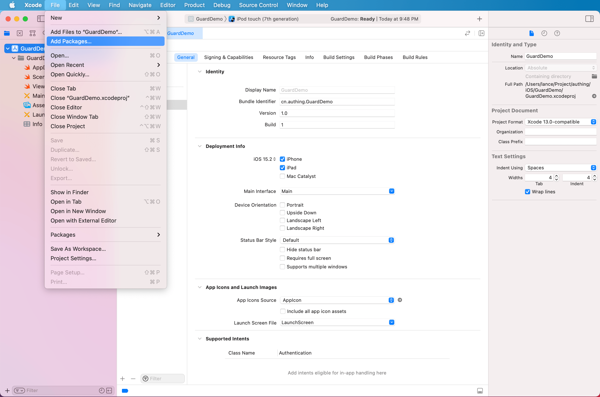
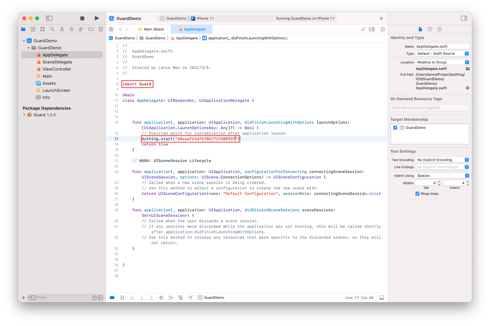

# iOS 

<LastUpdated/>

本下指南将逐步引导你如何使用 Authing iOS SDK 为你提供的基础认证能力。

<AppDetailSiderBar />

## 安装


<br>

### 第一步：添加依赖

在 swift package 搜索栏输入：https://github.com/Authing/guard-ios

依赖规则选择 Up to Next Major Version 1.0.0




### 第二步：初始化

红色部分是需要改动的地方



<br>

## 认证你的用户

<LastUpdated/>

### OIDC 协议账号密码登陆

通过 OIDC 账号密码登录，返回的 UserInfo 里面包含 access token , id token 和 refresh token。

```swift
public func loginByAccount(account: String, password: String, completion: @escaping(Int, String?, UserInfo?) -> Void)
```

**参数**

* *account* 账号
* *password* 密码

**示例**

```swift
OIDCClient().loginByAccount(account: account, password: password) { code,  message,  userInfo in
    print("\(userInfo?.accessToken ?? "")")
    print("\(userInfo?.idToken ?? "")")
    print("\(userInfo?.refreshToken ?? "")")
}
```

<br>

### 获取用户信息

通过 access token 获取用户信息。返回的 userInfo 对像和参数传入的是同一个 userInfo 对象

```swift
public func getUserInfoByAccessToken(userInfo: UserInfo?, completion: @escaping(Int, String?, UserInfo?) -> Void)
```

**参数**

* *userInfo* 包含 access token 的用户信息

**示例**

```swift
OIDCClient().getUserInfoByAccessToken(userInfo: userInfo) { code, message, data in
    if (code == 200) {
        // data 为更新了用户信息的 UserInfo 对象，和参数是同一个对象
    }
}
```

<br>

## 错误处理

当 code 不为 200 时，错误信息将通过 message 返回

```swift
OIDCClient().loginByAccount(account: "account", password: "password") { code,  message,  userInfo in
    if (code == 200) {
        
    } else {
        // error
        print(code)
        print(message)
    }
}
```
