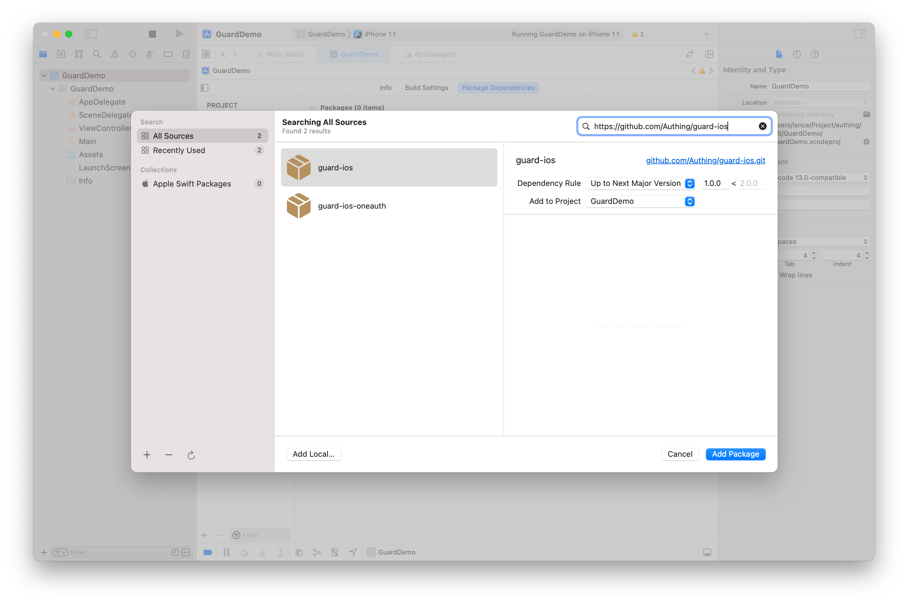
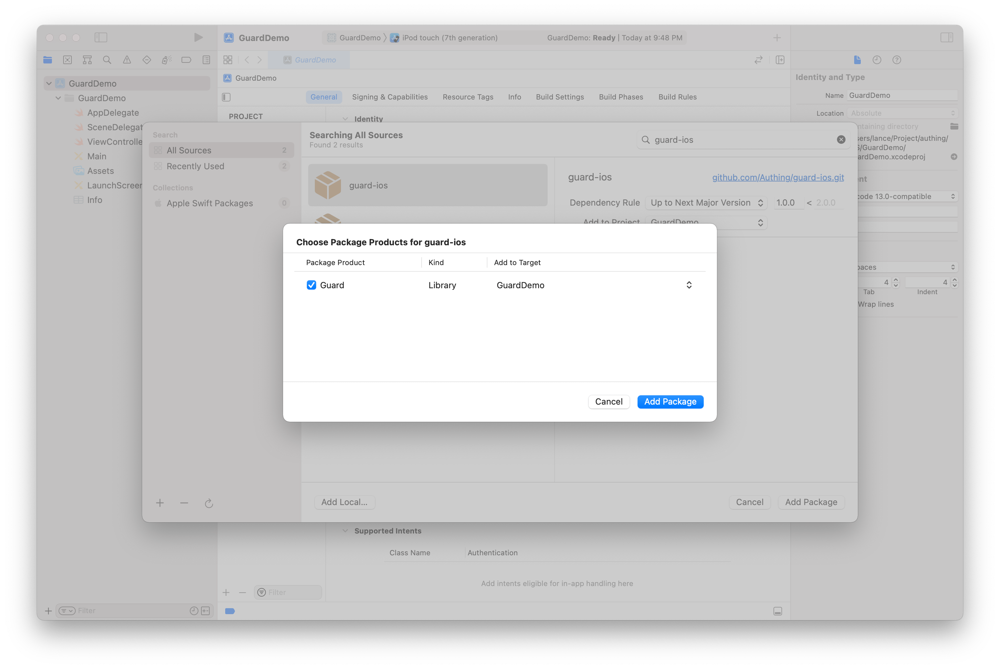

# iOS 

本指南将从 Authing iOS SDK 的安装开始逐步引导你如何快速为你已有或新开发的应用添加用户认证能力。

<AppDetailSiderBar />

## 安装

### 代码地址

| 条目     | 说明                                        |
| -------- | ------------------------------------------- |
| 支持版本 | iOS 11.0 +  
| 仓库地址 | [https://github.com/Authing/guard-ios](https://github.com/Authing/guard-ios) |

<br>

### 添加依赖

在 swift package 搜索栏输入：https://github.com/Authing/guard-ios

依赖规则选择 Up to Next Major Version 1.0.0





### 初始化

App 启动时，初始化 Authing iOS SDK

```swift
import Guard
class AppDelegate: UIResponder, UIApplicationDelegate {
    func application(_ application: UIApplication, didFinishLaunchingWithOptions launchOptions: [UIApplication.LaunchOptionsKey: Any]?) -> Bool {
        Authing.start(<#APPID#>);
    }
}
```
 `APPID` 为 Authing 控制台应用 ID

<br>

## 认证你的用户


### 邮箱密码注册

使用 OIDC 邮箱注册帐号，邮箱不区分大小写且用户池内唯一。此接口不要求用户对邮箱进行验证，用户注册之后 emailVerified 字段会为 false 。

```swift
func registerByEmail(email: String, password: String, completion: @escaping(Int, String?, UserInfo?) -> Void)
```

**参数**

* *email* 邮箱
* *password* 明文密码

**示例**

```swift
OIDCClient().registerByEmail(email: "me@gmail.com", password: "strong") { code, message, userInfo in
    if (code == 200) {
        // userInfo：用户信息
    }
}
```

**错误码**

* 2003 非法邮箱地址
* 2026 邮箱已注册

<br>

### 账号密码登录

通过 OIDC 账号密码登录，返回的 UserInfo 里面包含用户信息以及 access token 、 id token 和 refresh token。

```swift
public func loginByAccount(account: String, password: String, completion: @escaping(Int, String?, UserInfo?) -> Void)
```

**参数**

* *account* 账号
* *password* 密码

**示例**

```swift
OIDCClient().loginByAccount(account: account, password: password) { code,  message,  userInfo in
    print("\(userInfo?.accessToken ?? "")")
    print("\(userInfo?.idToken ?? "")")
    print("\(userInfo?.refreshToken ?? "")")
}
```

<br>

### 通过 refresh token 获取新的 access token 和 id token

access token 的有效期通常较短，比如几个小时或者一天。当 access token 过期后，App 不能频繁的弹出登录界面让用户认证，那样体验比较糟糕。所以通常的做法是通过代码，用一个有效期比较长的 refresh token 去刷新 access token，从而保持登录状态。只有当 refresh token 过期才弹出登录界面。

```swift
func getNewAccessTokenByRefreshToken(userInfo: UserInfo?, completion: @escaping(Int, String?, UserInfo?) -> Void)
```

**参数**

refreshToken 刷新凭证

**示例**

```swift
OIDCClient().getNewAccessTokenByRefreshToken(userInfo: userInfo) { code, message, userInfo in
    print("\(userInfo?.accessToken ?? "")")
    print("\(userInfo?.idToken ?? "")")
    print("\(userInfo?.refreshToken ?? "")")
}
```

<br>

## 错误处理

当 code 不为 200 时，错误信息将通过 message 返回

```swift
OIDCClient().loginByAccount(account: "account", password: "password") { code,  message,  userInfo in
    if (code == 200) {
        
    } else {
        // error
        print(code)
        print(message)
    }
}
```
