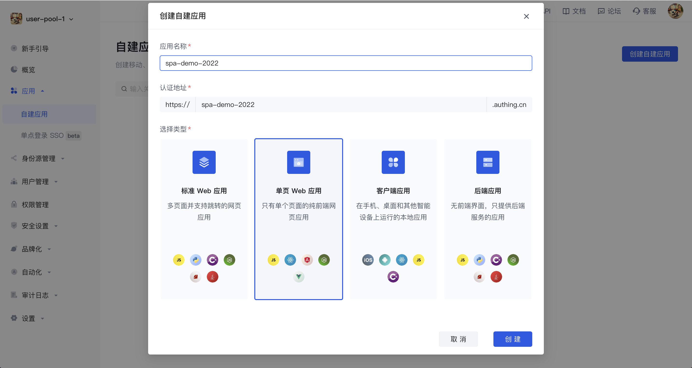
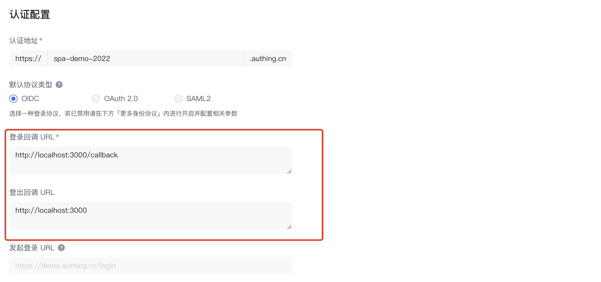

# React

本指南将从 Authing 的配置开始逐步引导你如何快速使用 SDK 为你已有或新开发的 React 应用添加登录、登出、展示用户信息、发起认证授权等一系列认证能力。

系统要求：React >= 18.0.0

<AppDetailSiderBar />

## 配置 Authing

第一步：使用 Authing 创建一个应用：

- 进入控制台
- 选择`应用`菜单
- 点击右上角`创建自建应用`按钮
- 填写`应用名称`和`认证地址`、选择`单页 Web 应用`
- 点击创建



第二步：在`认证配置`处填写`登录回调 URL`和`登出回调 URL`



第三步：保存当前配置。

## 集成 Authing SDK

我们在原有 SDK 基础上封装了 `enhancedLogin`、`enhancedLogout`、`enchancedLoginCallback` 等方法，只需一行代码即可实现`登录`、`登出`、`处理登录成功后的回调` 等能力。

### 安装 SDK

```shell
npm install --save authing-js-sdk
```

### 初始化 SDK

参考 [React demo](https://github.com/Authing/spa-demo-react/tree/feat-refactor)，修改以下配置为你的应用配置：

```jsx
import { AuthingProvider } from "@/enhance-authing-sdk";

const root = createRoot(document.getElementById("root"));

root.render(
  <AuthingProvider
    // appId：控制台 -> 端点信息 -> App ID
    appId='AUTHING_APP_ID'
    // appHost：应用认证地址，控制台 -> 应用详情 -> 认证配置 -> 认证地址
    appHost='AUTHING_DOMAIN'
    // redirectUri：应用回调地址，在 Authing 完成认证后跳回的地址。控制台 -> 应用详情 -> 认证配置 -> 登录回调 URL
    redirectUri='AUTHING_REDIRECTURI'
    // 默认
    tokenEndPointAuthMethod="none"
    // 默认
    introspectionEndPointAuthMethod="none"
  >
    <App />
  </AuthingProvider>
);
```

## 使用 Authing SDK 相关能力

### 登录、登出

调用 SDK 登录方法 `enhancedLogin`，让用户在 Authing 托管的登录页完成认证。登录成功后，Authing 会将用户重定向回你的应用。

调用 SDK 登出方法 `enhancedLogout`，默认将重定向到您当前应用的 Host 首页，你也可以传入参数来自定义重定向地址。

```jsx
import React, { useState, useEffect } from "react";
import { useAuthing } from "@/enhance-authing-sdk";

export default function Login() {
  const [userInfo, setUserInfo] = useState("");
  const authing = useAuthing();

  const getCurrentUser = async () => {
    const _userInfo = await authing.getCurrentUser();
    setUserInfo((_userInfo && JSON.stringify(_userInfo, null, 2)) || "");
  };

  useEffect(() => {
    getCurrentUser();
  }, []);

  const onLogin = () => authing.enhancedLogin();
  const onLogout = () => authing.enhancedLogout();

  return (
    <div>
      <div>This is Login page</div>
      {userInfo ? (
        <button onClick={onLogout}>登出</button>
      ) : (
        <button onClick={onLogin}>登录</button>
      )}
      {userInfo && (
        <div>
          <div>用户信息：</div>
          <textarea cols="100" rows="30" defaultValue={userInfo}></textarea>
        </div>
      )}
    </div>
  );
}
```

### 处理登录成功后的回调

用户在 Authing 完成认证后跳转到业务应用。本来需要做以下几步操作：

- 从 query 中取出 code
- 从 localStorage 中取出发起登录时的 code_verifier
- 调用 getAccessTokenByCode 函数，获取 Access token
- 使用 Access token 调用 getUserInfoByAccessToken 函数
- 获取用户信息。

现在你只需要调用 `enchancedLoginCallback` 即可：

```jsx
import React, { useEffect } from "react";
import { useHistory } from "react-router-dom";

import { useAuthing } from "@/enhance-authing-sdk";

export default function Callback() {
  const history = useHistory();
  const authing = useAuthing();

  const handleCallback = async () => {
    await authing.enchancedLoginCallback();
    // callback 页面只临时作为中间页，路由跳转建议用 replace 方法
    history.replace("/personal");
  };

  useEffect(() => {
    handleCallback();
  }, []);

  return <div>This is Callback page</div>;
}
```

### 展示用户信息

我们可以使用 SDK 提供的 getCurrentUser 方法获取用户信息。

```jsx
import React, { useState, useEffect } from "react";
import { useAuthing } from "@/enhance-authing-sdk";

export default function FunctionComponent() {
  const [userInfo, setUserInfo] = useState("");
  const authing = useAuthing();

  const getCurrentUser = async () => {
    const _userInfo = await authing.getCurrentUser();
    setUserInfo((_userInfo && JSON.stringify(_userInfo, null, 2)) || "");
  };

  useEffect(() => {
    getCurrentUser();
  }, []);

  return <textarea cols="100" rows="30" defaultValue={userInfo}></textarea>;
}
```

