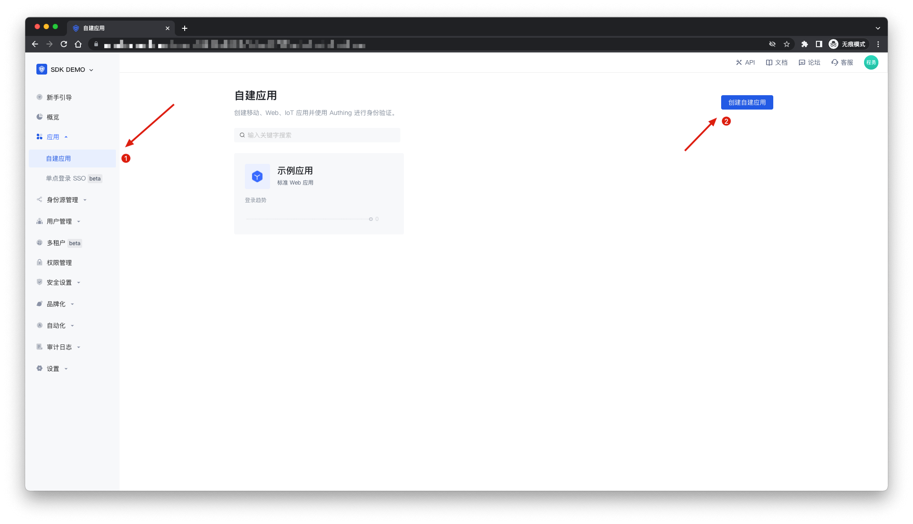
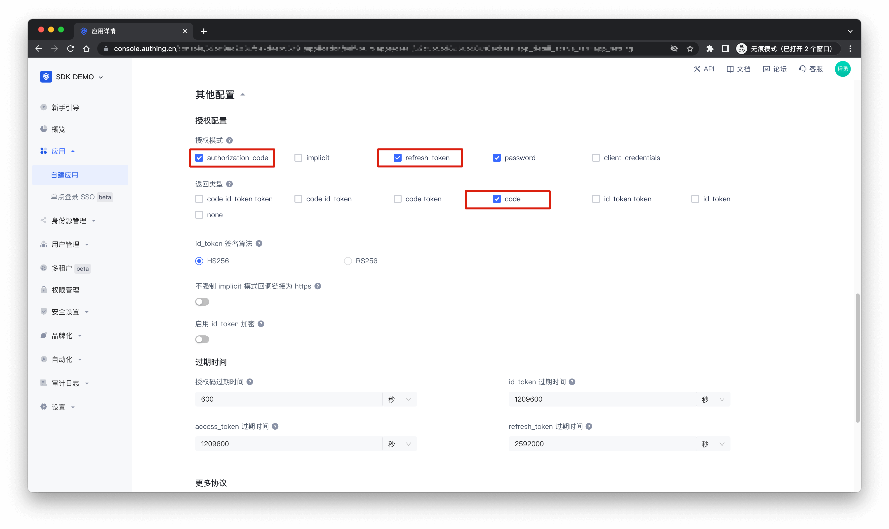
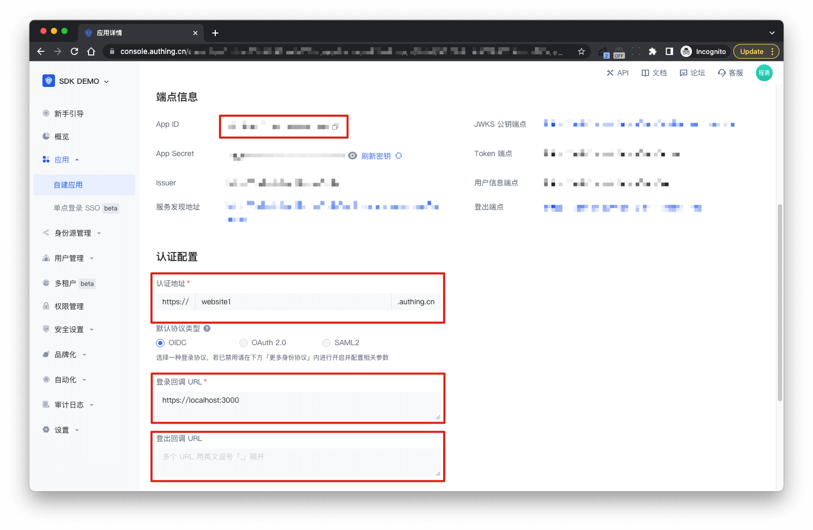

# Vue 

你可以使用 Authing 快速为新开发的或已有的 Vue 应用集成**认证能力**。本教程讲述如何使用 Authing Browser SDK 为你的 Vue 应用添加认证能力。


## 配置 Authing

### 创建自建应用

> 也可以使用现有应用

在控制台的「自建应用」页面，点击「创建自建应用」，应用类型选择「单页 Web 应用」，并填入以下信息：

- 应用名称：你的应用名称；
- 认证地址：选择一个二级域名，必须为合法的域名格式，例如 `my-spa-app`；




### 配置应用

在「自建应用」列表中，找到上一步创建好的应用，点击应用卡片进入「应用配置」页面，修改如下配置项并保存：

- **认证配置**：配置 `登录回调 URL`
- **授权配置**：`授权模式`开启 `authorization_code`、`refresh_token`
- **授权配置**：`返回类型`开启 `code`




至此，配置完成。


### 记录应用信息

为了下面方便顺利地使用 Authing Browser SDK，你需要记下该应用的这几个信息：

- App ID
- 认证地址
- 登录回调 URL




## 集成 Authing

Authing Browser SDK 支持通过包管理器安装、script 标签引入的方式的方式集成到你的前端业务软件。

### 安装 SDK

#### 使用 NPM 安装

```bash
$ npm install @authing/browser
```

#### 使用 Yarn 安装

```bash
$ yarn add @authing/browser
```

#### 使用 script 标签直接引入

```html
<head>
  <script src="//cdn.jsdelivr.net/npm/@authing/browser"></script>
</head>
```

### 初始化 SDK

可以根据上面步骤中记录的 `App ID`、`认证地址`、`登录回调 URL` 等信息，进行 SDK 的初始化，如下示例：

```js
import { Authing } from '@authing/browser';

const sdk = new Authing({
  // 应用的认证地址，例如：https://domain.authing.cn
  domain: 'AUTHING_DOMAIN',
  appId: 'AUTHING_APP_ID',
  // 登录回调地址，需要在控制台『应用配置 - 登录回调 URL』中指定
  redirectUri: 'AUTHING_REDIRECTURI',
});
```


## 使用 Authing Browser SDK 相关能力

### 发起登录

Authing Browser SDK 可以向 Authing 发起认证授权请求，目前支持下面两种登录方式：

- 在当前窗口转到 Authing 托管的登录页
- 弹出一个窗口，在弹出的窗口中加载 Authing 托管的登录页

#### 跳转登录

:::: tabs :options="{ useUrlFragment: false }"
::: tab Vue2
```html{56-61}
<template>
  <div id="app">
    <p>
      <button @click="login">loginWithRedirect</button>
    </p>
    <p v-if="loginState">
      <textarea
        cols="100"
        rows="20"
        readOnly
        :value="JSON.stringify(loginState, null, 2)"
      ></textarea>
    </p>
  </div>
</template>

<script>
import { Authing } from '@authing/browser';

export default {
  name: 'App',
  data() {
    return {
      sdk: null,
      loginState: null,
    };
  },
  created() {
    this.sdk = new Authing({
      // 应用的认证地址，例如：https://domain.authing.cn
      domain: 'AUTHING_DOMAIN',
      appId: 'AUTHING_APP_ID',
      // 登录回调地址，需要在控制台『应用配置 - 登录回调 URL』中指定
      redirectUri: 'AUTHING_REDIRECTURI',
    });
  },
  mounted() {
    // 判断当前 URL 是否为 Authing 登录回调 URL
    if (this.sdk.isRedirectCallback()) {
      console.log('redirect');

      /**
       * 以跳转方式打开 Authing 托管的登录页，认证成功后，
       * 需要配合 handleRedirectCallback 方法，在回调端点处理 Authing 发送
       * 的授权码或 token，获取用户登录态
       */
      this.sdk.handleRedirectCallback().then((res) => {
        this.loginState = res;
        window.location.replace('/');
      });
    } else {
      this.getLoginState();
    }
  },
  methods: {
    /**
     * 以跳转方式打开 Authing 托管的登录页
     */
    login() {
      this.sdk.loginWithRedirect();
    },
    /**
     * 获取用户的登录状态
     */
    async getLoginState() {
      const state = await this.sdk.getLoginState();
      this.loginState = state;
    },
  },
};
</script>
```
:::

::: tab Vue3
```html{43-50}
<template>
  <div>
    <p>
      <button @click="login">loginWithRedirect</button>
    </p>
    <p v-if="loginState">
      <textarea
        cols="100"
        rows="20"
        readOnly
        :value="JSON.stringify(loginState, null, 2)"
      ></textarea>
    </p>
  </div>
</template>

<script>
import { defineComponent, onMounted, reactive, toRefs } from 'vue';
import { Authing } from '@authing/browser';

export default defineComponent({
  name: 'App',
  setup() {
    const sdk = new Authing({
      // 应用的认证地址，例如：https://domain.authing.cn
      domain: 'AUTHING_DOMAIN',
      appId: 'AUTHING_APP_ID',
      // 登录回调地址，需要在控制台『应用配置 - 登录回调 URL』中指定
      redirectUri: 'AUTHING_REDIRECTURI',
    });

    const state = reactive({
      loginState: null,
    });

    /**
     * 获取用户的登录状态
     */
    const getLoginState = async () => {
      const res = await sdk.getLoginState();
      state.loginState = res;
    };

    /**
     * 以跳转方式打开 Authing 托管的登录页
     */
    const login = () => {
      sdk.loginWithRedirect();
    };

    onMounted(() => {
      // 校验当前 url 是否是登录回调地址
      if (sdk.isRedirectCallback()) {
        console.log('redirect');

        /**
         * 以跳转方式打开 Authing 托管的登录页，认证成功后，
         * 需要配合 handleRedirectCallback 方法，在回调端点处理 Authing 发送
         * 的授权码或 token，获取用户登录态
         */
        sdk.handleRedirectCallback().then((res) => {
          state.loginState = res;
          window.location.replace('/');
        });
      } else {
        getLoginState();
      }
    });

    return {
      ...toRefs(state),
      login,
    };
  },
});
</script>
```
:::
::::


如果你想自定义参数，也可以对以下参数进行自定义传参，如不传参将使用默认参数

:::: tabs :options="{ useUrlFragment: false }"
::: tab Vue2
```js
export default {
  ...
  methods: {
    /**
     * 以跳转方式打开 Authing 托管的登录页
     */
    login() {
      const params = {
        // 回调地址，默认为初始化参数中的 redirectUri
        redirectUri: 'AUTHING_REDIRECTURI',

        // 发起登录的 URL，若设置了 redirectToOriginalUri 会在登录结束后
        // 重定向回到此页面，默认为当前 URL
        originalUri: '发起登录的 URL',

        // 即使在用户已登录时也提示用户再次登录
        forced: false,

        // 自定义的中间状态，会被传递到回调端点
        customState: {},
      };
      this.sdk.loginWithRedirect(params);
    },
    ...
  },
  ...
}
```
:::

::: tab Vue3
```js
export default {
  ...
  setup() {
    /**
     * 以跳转方式打开 Authing 托管的登录页
     */
    const login = () => {
      const params = {
        // 回调地址，默认为初始化参数中的 redirectUri
        redirectUri: 'AUTHING_REDIRECTURI',

        // 发起登录的 URL，若设置了 redirectToOriginalUri 会在登录结束后
        // 重定向回到此页面，默认为当前 URL
        originalUri: '发起登录的 URL',

        // 即使在用户已登录时也提示用户再次登录
        forced: false,

        // 自定义的中间状态，会被传递到回调端点
        customState: {},
      };
      sdk.loginWithRedirect(params);
    }

    return {
      login
    }
  }
  ...
}
```
:::
::::


#### 弹出窗口登录

你也可以在你的业务软件页面使用下面的方法，通过弹出一个新窗口的方式让用户在新窗口登录：

:::: tabs :options="{ useUrlFragment: false }"
::: tab Vue2
```html{40-46}
<template>
  <div id="app">
    <p>
      <button @click="login">loginWithPopup</button>
    </p>
    <p v-if="loginState">
      <textarea
        cols="100"
        rows="20"
        readOnly
        :value="JSON.stringify(loginState, null, 2)"
      ></textarea>
    </p>
  </div>
</template>
<script>
import { Authing } from '@authing/browser';

export default {
  name: 'App',
  data() {
    return {
      sdk: null,
      loginState: null,
    };
  },
  created() {
    this.sdk = new Authing({
      // 应用的认证地址，例如：https://domain.authing.cn
      domain: 'AUTHING_DOMAIN',
      appId: 'AUTHING_APP_ID',
      // 登录回调地址，需要在控制台『应用配置 - 登录回调 URL』中指定
      redirectUri: 'AUTHING_REDIRECTURI',
    });
  },
  mounted() {
    this.getLoginState();
  },
  methods: {
    /**
     * 以弹窗方式打开 Authing 托管的登录页
     */
    async login() {
      const res = await this.sdk.loginWithPopup();
      this.loginState = res;
    },
    /**
     * 获取用户的登录状态
     */
    async getLoginState() {
      const state = await this.sdk.getLoginState();
      this.loginState = state;
    },
  },
};
</script>
```
:::

::: tab Vue3
```html{44-50}
<template>
  <div>
    <p>
      <button @click="login">loginWithPopup</button>
    </p>
    <p v-if="loginState">
      <textarea
        cols="100"
        rows="20"
        readOnly
        :value="JSON.stringify(loginState, null, 2)"
      ></textarea>
    </p>
  </div>
</template>

<script>
import { defineComponent, onMounted, reactive, toRefs } from 'vue';
import { Authing } from '@authing/browser';

export default defineComponent({
  name: 'App',
  setup() {
    const sdk = new Authing({
      // 应用的认证地址，例如：https://domain.authing.cn
      domain: 'AUTHING_DOMAIN',
      appId: 'AUTHING_APP_ID',
      // 登录回调地址，需要在控制台『应用配置 - 登录回调 URL』中指定
      redirectUri: 'AUTHING_REDIRECTURI',
    });

    const state = reactive({
      loginState: null,
    });

    /**
     * 获取用户的登录状态
     */
    const getLoginState = async () => {
      const res = await sdk.getLoginState();
      state.loginState = res;
    };

    /**
     * 以弹窗方式打开 Authing 托管的登录页
     */
    const login = async () => {
      const res = await sdk.loginWithPopup();
      state.loginState = res;
    };

    onMounted(getLoginState);

    return {
      ...toRefs(state),
      login,
    };
  },
});
</script>
```
:::
::::

如果你想自定义参数，也可以对以下参数进行自定义传参，如不传参将使用默认参数

:::: tabs :options="{ useUrlFragment: false }"
::: tab Vue2
```js
export default {
  ...
  data() {
    return {
      sdk: null,
      loginState: null,
    }
  },
  methods: {
    /**
     * 以弹窗方式打开 Authing 托管的登录页
     */
    async login() {
      const params = {
        // 回调地址，默认为初始化参数中的 redirectUri
        redirectUri: 'AUTHING_REDIRECTURI',

        // 即使在用户已登录时也提示用户再次登录
        forced: false,
      };
      const res = await this.sdk.loginWithPopup(params);
      this.loginState = res;
    },
    ...
  },
  ...
}
```
:::

::: tab Vue3
```js
export default {
  ...
  setup() {
    /**
     * 以弹窗方式打开 Authing 托管的登录页
     */
    const login = async () => {
      const params = {
        // 回调地址，默认为初始化参数中的 redirectUri
        redirectUri: 'AUTHING_REDIRECTURI',

        // 即使在用户已登录时也提示用户再次登录
        forced: false,
      };
      const res = await sdk.loginWithPopup(params);
      state.loginState = res;
    };

    return {
      login
    }
  }
  ...
}
```
:::
::::

#### 高级使用

每次发起登录本质是访问一个携带许多参数的 URL 地址，Authing Browser SDK 默认会使用缺省参数。如果你需要精细控制登录请求参数，可以参考本示例。

```js
import { Authing } from '@authing/browser';

const sdk = new Authing({
  // 很重要，请仔细填写！
  // 如果应用开启 SSO，这儿就要写单点登录的“应用面板地址”；否则填写应用的“认证地址”。
  domain: 'AUTHING_DOMAIN',
  appId: 'AUTHING_APP_ID',
  // 登录回调地址，需要在控制台『应用配置 - 登录回调 URL』中指定
  redirectUri: 'AUTHING_REDIRECTURI',

  // 登出回调地址，需要在控制台『应用配置 - 登出回调 URL』中指定
  // 如果为空，登出流程会在 Authing 中止，不会进行后续的回调
  logoutRedirectUri: 'AUTHING_LOGOUTREDIRECTURI',

  // 应用侧向 Authing 请求的权限，以空格分隔，默认为 'openid profile'
  scope: 'openid email phone profile',

  // 在回调端点处，是否重定向回最初发起登录的 URL
  redirectToOriginalUri: false,

  // 回调时在何处携带身份凭据，默认为 fragment
  // fragment: 在 URL hash 中携带
  // query: 在查询参数中携带
  redirectResponseMode: 'fragment',

  // 是否使用 OIDC implicit 模式替代默认的 PKCE 模式
  // 由于 implicit 模式安全性较低，不推荐使用，只用于兼容不支持 crypto 的浏览器
  useImplicitMode: false,

  // implicit 模式返回的凭据种类，默认为 'token id_token'
  // token: 返回 Access Token
  // id_token: 返回 ID Token
  implicitResponseType: 'token id_token',

  // 是否在每次获取登录态时请求 Authing 检查 Access Token 有效性，
  // 可用于单点登出场景，默认为 false 如果设为 true，需要在控制台中将
  // 『应用配置』-『其他配置』-『检验 token 身份验证方式』设为 none
  introspectAccessToken: false,

  // 弹出窗口的宽度
  popupWidth: 500,

  // 弹出窗口的高度
  popupHeight: 600,
});
```


### 检查登录态并获取 Token

如果你想检查用户的登录态，并获取用户的 `Access Token`、`ID Token`，可以调用 `getLoginState` 方法，如果用户没有在 Authing 登录，该方法会抛出错误：

:::: tabs :options="{ useUrlFragment: false }"
::: tab Vue2
```html{58-64}
<template>
  <div id="app">
    <p>
      <button @click="login">loginWithRedirect</button>
    </p>
    <p v-if="loginState">
      <textarea
        cols="100"
        rows="20"
        readOnly
        :value="JSON.stringify(loginState, null, 2)"
      ></textarea>
    </p>
  </div>
</template>

<script>
import { Authing } from '@authing/browser';

export default {
  name: 'App',
  data() {
    return {
      sdk: null,
      loginState: null,
    };
  },
  created() {
    this.sdk = new Authing({
      // 应用的认证地址，例如：https://domain.authing.cn
      domain: 'AUTHING_DOMAIN',
      appId: 'AUTHING_APP_ID',
      // 登录回调地址，需要在控制台『应用配置 - 登录回调 URL』中指定
      redirectUri: 'AUTHING_REDIRECTURI',
    });
  },
  mounted() {
    // 校验当前 url 是否是登录回调地址
    if (this.sdk.isRedirectCallback()) {
      console.log('redirect');

      /**
       * 以跳转方式打开 Authing 托管的登录页，认证成功后，
       * 需要配合 handleRedirectCallback 方法，在回调端点处理 Authing 发送
       * 的授权码或 token，获取用户登录态
       */
      this.sdk.handleRedirectCallback().then((res) => {
        this.loginState = res;
        window.location.replace('/');
      });
    } else {
      console.log('normal');

      this.getLoginState();
    }
  },
  methods: {
    /**
     * 获取用户的登录状态
     */
    async getLoginState() {
      const state = await this.sdk.getLoginState();
      this.loginState = state;
    },
    /**
     * 以跳转方式打开 Authing 托管的登录页
     */
    login() {
      this.sdk.loginWithRedirect();
    },
  },
};
</script>
```
:::

::: tab Vue3
```html{35-47}
<template>
  <div>
    <p>
      <button @click="login">loginWithRedirect</button>
    </p>
    <p v-if="loginState">
      <textarea
        cols="100"
        rows="20"
        readOnly
        :value="JSON.stringify(loginState, null, 2)"
      ></textarea>
    </p>
  </div>
</template>

<script>
import { defineComponent, onMounted, reactive, toRefs } from 'vue';
import { Authing } from '@authing/browser';

export default defineComponent({
  name: 'App',
  setup() {
    const sdk = new Authing({
      // 应用的认证地址，例如：https://domain.authing.cn
      domain: 'AUTHING_DOMAIN',
      appId: 'AUTHING_APP_ID',
      // 登录回调地址，需要在控制台『应用配置 - 登录回调 URL』中指定
      redirectUri: 'AUTHING_REDIRECTURI',
    });

    const state = reactive({
      loginState: null,
    });

    /**
     * 获取用户的登录状态
     */
    const getLoginState = async () => {
      const res = await sdk.getLoginState();
      state.loginState = res;

      if (!res) {
        sdk.loginWithRedirect();
      }
    };

    /**
     * 以跳转方式打开 Authing 托管的登录页
     */
    const login = () => {
      sdk.loginWithRedirect();
    };

    onMounted(() => {
      // 校验当前 url 是否是登录回调地址
      if (sdk.isRedirectCallback()) {
        console.log('redirect');

        /**
         * 以跳转方式打开 Authing 托管的登录页，认证成功后，
         * 需要配合 handleRedirectCallback 方法，在回调端点处理 Authing 发送
         * 的授权码或 token，获取用户登录态
         */
        sdk.handleRedirectCallback().then((res) => {
          state.loginState = res;
          window.location.replace('/');
        });
      } else {
        console.log('normal');

        // 静默登录，直接获取到用户信息
        getLoginState();
      }
    });

    return {
      ...toRefs(state),
      login,
    };
  },
});
</script>
```
:::
::::


### 获取用户信息

你需要使用 `Access Token` 获取用户的个人信息：

- 用户初次登录成功时可以在回调函数中拿到用户的 Access Token，然后使用 Access Token 获取用户信息；
- 如果用户已经登录，你可以先获取用户的 Access Token 然后使用 Access Token 获取用户信息。

:::: tabs :options="{ useUrlFragment: false }"
::: tab Vue2
```html{68-80}
<template>
  <div id="app">
    <p>
      <button @click="login">loginWithRedirect</button>
      <button @click="getUserInfo">getUserInfo</button>
    </p>
    <p v-if="loginState">
      <textarea
        cols="100"
        rows="20"
        readOnly
        :value="JSON.stringify(loginState, null, 2)"
      ></textarea>
    </p>
    <p v-if="userInfo">
      <textarea
        cols="100"
        rows="20"
        readOnly
        :value="JSON.stringify(userInfo, null, 2)"
      ></textarea>
    </p>
  </div>
</template>

<script>
import { Authing } from '@authing/browser';

export default {
  name: 'App',
  data() {
    return {
      sdk: null,
      loginState: null,
      userInfo: null,
    };
  },
  created() {
    this.sdk = new Authing({
      // 应用的认证地址，例如：https://domain.authing.cn
      domain: 'AUTHING_DOMAIN',
      appId: 'AUTHING_APP_ID',
      // 登录回调地址，需要在控制台『应用配置 - 登录回调 URL』中指定
      redirectUri: 'AUTHING_REDIRECTURI',
    });
  },
  mounted() {
    // 校验当前 url 是否是登录回调地址
    if (this.sdk.isRedirectCallback()) {
      console.log('redirect');

      /**
       * 以跳转方式打开 Authing 托管的登录页，认证成功后，
       * 需要配合 handleRedirectCallback 方法，在回调端点处理 Authing 发送
       * 的授权码或 token，获取用户登录态
       */
      this.sdk.handleRedirectCallback().then((res) => {
        this.loginState = res;
        window.location.replace('/');
      });
    } else {
      console.log('normal');

      this.getLoginState();
    }
  },
  methods: {
    /**
     * 用 Access Token 获取用户身份信息
     */
    async getUserInfo() {
      if (!this.loginState) {
        alert('用户未登录');
        return;
      }
      const userInfo = await this.sdk.getUserInfo({
        accessToken: this.loginState.accessToken,
      });
      this.userInfo = userInfo;
    },
    /**
     * 获取用户的登录状态
     */
    async getLoginState() {
      const state = await this.sdk.getLoginState();
      this.loginState = state;
    },
    /**
     * 以跳转方式打开 Authing 托管的登录页
     */
    login() {
      this.sdk.loginWithRedirect();
    },
  },
};
</script>
```
:::

::: tab Vue3
```html{65-77}
<template>
  <div>
    <p>
      <button @click="login">loginWithRedirect</button>
      <button @click="getUserInfo">getUserInfo</button>
    </p>
    <p v-if="loginState">
      <textarea
        cols="100"
        rows="20"
        readOnly
        :value="JSON.stringify(loginState, null, 2)"
      ></textarea>
    </p>
    <p v-if="userInfo">
      <textarea
        cols="100"
        rows="15"
        readOnly
        :value="JSON.stringify(userInfo, null, 2)"
      ></textarea>
    </p>
  </div>
</template>

<script>
import { defineComponent, onMounted, reactive, toRefs } from 'vue';
import { Authing } from '@authing/browser';

export default defineComponent({
  name: 'App',
  setup() {
    const sdk = new Authing({
      // 应用的认证地址，例如：https://domain.authing.cn
      domain: 'AUTHING_DOMAIN',
      appId: 'AUTHING_APP_ID',
      // 登录回调地址，需要在控制台『应用配置 - 登录回调 URL』中指定
      redirectUri: 'AUTHING_REDIRECTURI',
    });

    const state = reactive({
      loginState: null,
      userInfo: null,
    });

    /**
     * 获取用户的登录状态
     */
    const getLoginState = async () => {
      const res = await sdk.getLoginState();
      state.loginState = res;

      if (!res) {
        sdk.loginWithRedirect();
      }
    };

    /**
     * 以跳转方式打开 Authing 托管的登录页
     */
    const login = () => {
      sdk.loginWithRedirect();
    };

    /**
     * 用 Access Token 获取用户身份信息
     */
    const getUserInfo = async () => {
      if (!state.loginState) {
        alert('用户未登录');
        return;
      }
      const userInfo = await sdk.getUserInfo({
        accessToken: state.loginState.accessToken,
      });
      state.userInfo = userInfo;
    };

    onMounted(() => {
      // 校验当前 url 是否是登录回调地址
      if (sdk.isRedirectCallback()) {
        console.log('redirect');

        /**
         * 以跳转方式打开 Authing 托管的登录页，认证成功后，
         * 需要配合 handleRedirectCallback 方法，在回调端点处理 Authing 发送
         * 的授权码或 token，获取用户登录态
         */
        sdk.handleRedirectCallback().then((res) => {
          state.loginState = res;
          window.location.replace('/');
        });
      } else {
        console.log('normal');

        // 静默登录，直接获取到用户信息
        getLoginState();
      }
    });

    return {
      ...toRefs(state),
      login,
      getUserInfo,
    };
  },
});
</script>
```
:::
::::


### 退出登录

可以调用 SDK 的 `logoutWithRedirect` 方法退出登录

:::: tabs :options="{ useUrlFragment: false }"
::: tab Vue2
```html{63-68}
<template>
  <div id="app">
    <p>
      <button @click="login">loginWithRedirect</button>
      <button @click="logout">logout</button>
    </p>
    <p v-if="loginState">
      <textarea
        cols="100"
        rows="20"
        readOnly
        :value="JSON.stringify(loginState, null, 2)"
      ></textarea>
    </p>
  </div>
</template>

<script>
import { Authing } from '@authing/browser';

export default {
  name: 'App',
  data() {
    return {
      sdk: null,
      loginState: null,
    };
  },
  created() {
    this.sdk = new Authing({
      // 应用的认证地址，例如：https://domain.authing.cn
      domain: 'AUTHING_DOMAIN',
      appId: 'AUTHING_APP_ID',
      // 登录回调地址，需要在控制台『应用配置 - 登录回调 URL』中指定
      redirectUri: 'AUTHING_REDIRECTURI',
    });
  },
  mounted() {
    // 校验当前 url 是否是登录回调地址
    if (this.sdk.isRedirectCallback()) {
      console.log('redirect');

      /**
       * 以跳转方式打开 Authing 托管的登录页，认证成功后，
       * 需要配合 handleRedirectCallback 方法，在回调端点处理 Authing 发送
       * 的授权码或 token，获取用户登录态
       */
      this.sdk.handleRedirectCallback().then((res) => {
        this.loginState = res;
        window.location.replace('/');
      });
    } else {
      this.getLoginState();
    }
  },
  methods: {
    /**
     * 以跳转方式打开 Authing 托管的登录页
     */
    login() {
      this.sdk.loginWithRedirect();
    },
    /**
     * 登出
     */
    logout() {
      this.sdk.logoutWithRedirect();
    },
    /**
     * 获取用户的登录状态
     */
    async getLoginState() {
      const state = await this.sdk.getLoginState();
      this.loginState = state;
    },
  },
};
</script>
```
:::

::: tab Vue3
```html{21-28}
<template>
  <div>
    <button @click="logout">logout</button>
  </div>
</template>

<script>
import { defineComponent } from 'vue';
import { Authing } from '@authing/browser';

export default defineComponent({
  name: 'App',
  setup() {
    const sdk = new Authing({
      // 应用的认证地址，例如：https://domain.authing.cn
      domain: 'AUTHING_DOMAIN',
      appId: 'AUTHING_APP_ID',
      // 登录回调地址，需要在控制台『应用配置 - 登录回调 URL』中指定
      redirectUri: 'AUTHING_REDIRECTURI',
    });

    /**
     * 登出
     */
    const logout = () => {
      sdk.logoutWithRedirect();
    };

    return {
      logout,
    };
  },
});
</script>
```
:::
::::

如果你想自定义参数，也可以对以下参数进行自定义传参，如不传参将使用默认参数

:::: tabs :options="{ useUrlFragment: false }"
::: tab Vue2
```js
export default {
  ...
  data() {
    return {
      sdk: null,
    }
  },
  methods: {
    /**
     * 登出
     */
    async logout() {
      const options = {
        // 登出完成后的回调地址，默认为初始化参数中的 logoutRedirectUri
        // 登出回调地址，需要在控制台『应用配置 - 登出回调 URL』中指定
        redirectUri: 'AUTHING_LOGOUTREDIRECTURI',

        // 自定义中间状态
        state: '',
      };
      await this.sdk.logoutWithRedirect(options);
    },
    ...
  },
  ...
}
```
:::

::: tab Vue3
```js
export default {
  ...
  setup() {
    /**
     * 登出
     */
    const logout = async () => {
      const options = {
        // 登出完成后的回调地址，默认为初始化参数中的 logoutRedirectUri
        // 登出回调地址，需要在控制台『应用配置 - 登出回调 URL』中指定
        redirectUri: 'AUTHING_LOGOUTREDIRECTURI',

        // 自定义中间状态
        state: '',
      };
      await sdk.logoutWithRedirect(options);
    };

    return {
      logout
    }
  }
  ...
}
```
:::
::::
