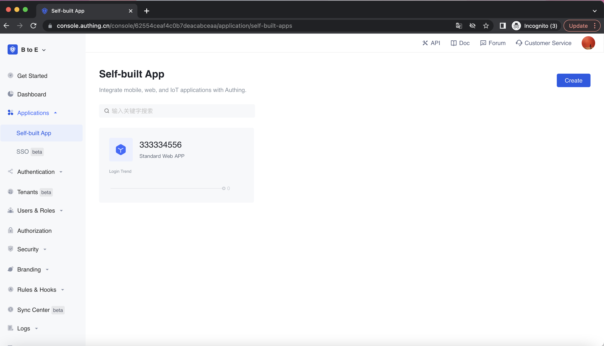
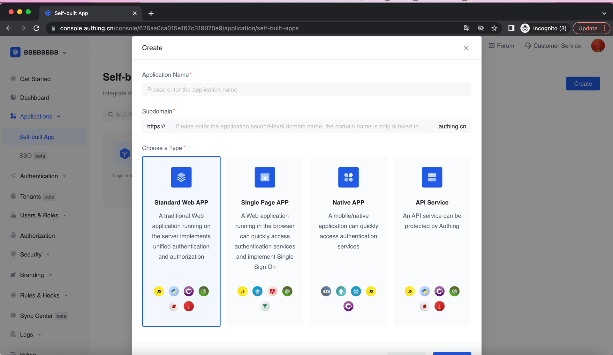

To connect the user and IdP, you need to create an application. In [**Console**](https://console.authing.cn) -> **Applications** -> click **Add App**.

Fill in Application Name and Subdomain. Then **Create**.

