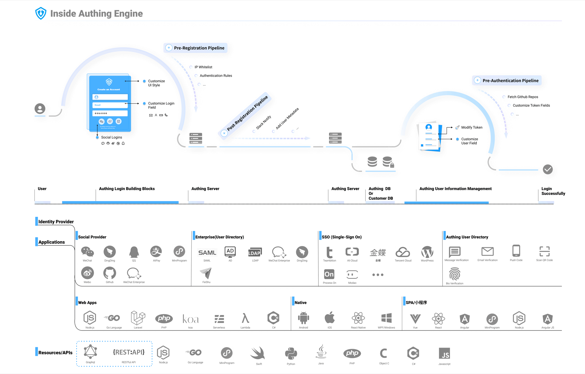

# What is {{$localeConfig.brandName}} 

<LastUpdated/>

{{$localeConfig.brandName}} provides professional identity authentication and authorization services for enterprises and developers on the cloud.

You can connect any platform application to the {{$localeConfig.brandName}} system (whether it is a newly developed application or an old application), and customize the login method of the application (such as: email/password, SMS/verification code, socialization Login, etc.).

You can choose our SDK (software development kit)  or call related API (application programming interface)  to access your application to the current technology you are using. When a user initiates an authorization request, {{$localeConfig.brandName}} will help you authenticate their identity and return the necessary user‘s information to your application.

## Inside {{$localeConfig.brandName}} Engine

## Why use {{$localeConfig.brandName}}

The following are some of the usage scenarios of {{$localeConfig.brandName}} we have compiled:

- If you want to develop a program, then you want to add user authentication and authorization. For example, you want your users to be able to access the log in of  WeChat and GitHub. During this you also want to be able to track the user's registration source and activity data so that you can follow-up user‘s growth.
- If you made an API, you would want to use the OAuth 2.0 protocol to ensure the security of the API.
- You have made a lot of applications, and you hope that the user data of these applications can be exchanged through single sign-on (Single Sign On).
- You made a JavaScript front-end application and a mobile-end application, and you hope that both client applications can safely access your API.
- You need to make a web application that supports SAML login.
- You think the password is very fragile, so you want the users to log in with a one-time mobile verification code or email verification code.
- If your client user's password is leaked on another website, you want to be notified right away so that you can notify your client's user to reset the password.
- If a user fails to log in continuously, you want to ban their IP to prevent DDOS attacks or brute force password cracking.
- You are in a large company that wants to federate its existing corporate directory, to allow its employees to use their existing corporate credentials, to log in to various internal and third-party applications.
- You don't want (or you don't know how) to implement your own user management solution. You don’t want to develop repetitive UIs such as password reset, create, configure, block and delete users. You just want to focus on your own business development and product design. At this time, you can choose {{$localeConfig.brandName}} as the authentication middleware.
- You want to enforce multi-factor authentication when users want to access sensitive data.
- You are looking for an identity solution that can help you be compatible with the compliance requirements of SOC2, GDPR, OpenID Connect, etc.
- You want to use data analysis to track users on your website or app. At the same time, you would want to use this data to expand customer acquisition channels, measure user retention, and gradually improve the registration process.

## What industry standards does {{$localeConfig.brandName}} follow?

In the past, computers were an independent system, and the Internet did not break out, the identity authentication and user data existed in one computer. Now in this present generation times have changed. You can use the same login information on multiple applications and websites (such as the "Login with WeChat" that can be seen everywhere). This is achieved by following the same identity authentication standard. These standards are a set of open specifications and protocols. Following this set of standards can help developers and enterprises design good identity authentication and authorization systems. At the same time it can stipulate how to properly manage identities, transfer data, and authorization.

**The industry standard protocols used by {{$localeConfig.brandName}} include:**

- **OAuth 2.0:** An authorization standard allows users to grant limited access to their resources on one site to other sites without having to obtain their credentials (usually account passwords). For example, you will use this standard when you click "Log in with WeChat'' on your mobile phone. The system will ask you whether you agree to share your avatar, nickname and other data with the application.
- **Open ID Connect:** This is a superset of OAuth 2.0. It provides more user information and access permissions and standards on top of OAuth 2.0. For example, User defines the avatar as a picture.
- **JSON Web Tokens:** An open standard, mainly used to transmit information securely. Its format is very compact and independent. After the parsing, it will alternate into a JSON format.
- **Security Assertion Markup Language (SAML):** An open data format based on XML. SAML allows enterprise applications to seamlessly connect with internal and external programs.
- **LDAP:** LDAP is a lightweight directory access protocol. The full English name is Lightweight Directory Access Protocol, which is generally referred to as LDAP for short. You can understand it as a tree-shaped database used to store user and organization information, often used for single sign-on (SSO) and corporate employee information management.
- **CAS**: Central Authentication Service (CAS) is a single sign-on protocol. Its purpose is to allow a user to access multiple applications. It only needs to provide credentials (such as user name and password) to the authentication server once. This way, users not only need to re-authenticate when logging in to Web applications, but the applications will not obtain sensitive information such as passwords.

