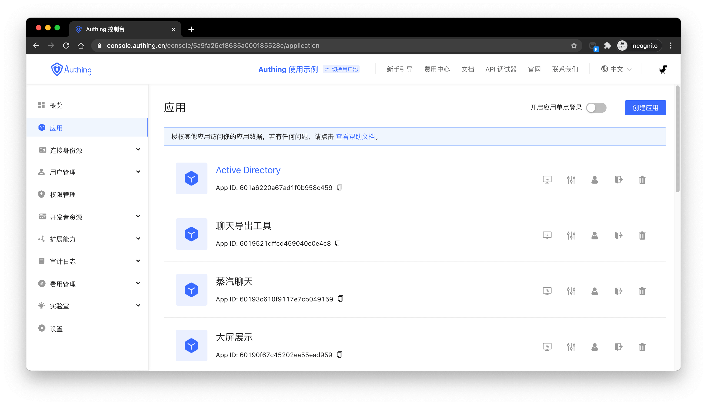
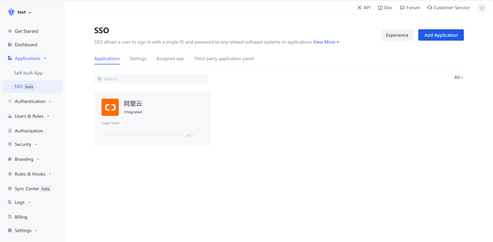
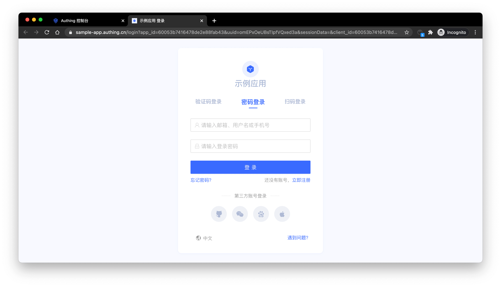
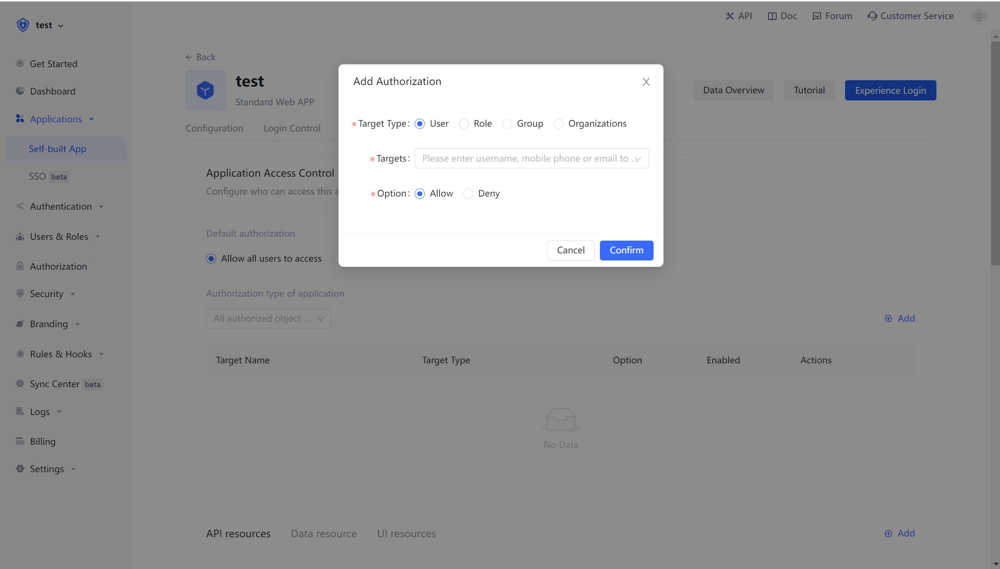

# What is Application

<LastUpdated/>

Earlier we introduced that the user pool(./user-pool.md) is the smallest unit of tenant isolation in {{$localeConfig.brandName}}. This stores all user data in your user system, and the application corresponds to the business application you create in reality.

A user pool may have multiple applications. For example, all students at school are using a user pool. The school will develop multiple applications such as course selection application, email application, teacher-student service center, etc.. These applications use the same user system.

## Where can I see all my apps

You can view all your applications on the application page of the [console](https://console.authing.cn)(opens new window):

## Share a user directory between applications

The first thing you need to remember is that all applications in a user pool share a user directory. This design fundamentally solves the problem of user system fragmentation that is common in old systems.

## Single sign-on between applications

You need to enable single sign-on between applications on the application management page, as shown in the following figure:

After turning on this switch, the user logs into application A, the user will automatically log in when accessing application B. For further details, please refer to the implementation of [single sign-on (SSO)](/guides/authentication/sso/) guidelines and [single sign-on SDK](/en/reference/sdk-for-sso.md).

## Access the online version of the login form

In {{$localeConfig.brandName}}, each application has an online login registration page for end users to use. You can visit:
`https://<YOUR_APP_DOMAIN>.authing.cm/` or `https://<YOUR_APP_DOMAIN>. authing.cm/login` to access:

## To Integrate the component version of the application login box into your application system

{{$localeConfig.brandName}} provides an embedded login component is a lightweight, modern, and highly extensible front-end login component. This supports native JavaScript and the three front-end frameworks of React, Vue, and Angular. The embedded login component is basically the same as the login page hosted by {{$localeConfig.brandName}}, and has strong customization capabilities. The component has built-in functions such as password reset, MFA, social login, and scan code login, all of which are highly configurable.

For details, [use the embedded login component to complete the authentication](/guides/basics/authenticate-first-user/use-embeded-login-component/).

## Visit the online version of the personal center

In {{$localeConfig.brandName}}, each application has an online personal center page for end users to use, you can visit:
`https://<YOUR_APP_DOMAIN>. authing.cm/u` to visit:

## Control whether users can access a specific application

By default, all users in your user pool can log in to your application. You can also control who can access this application in the application access control of the application details.

> You can authorize users, roles, groups, and organizations to access the application.

## Other functions

Each application in {{$localeConfig.brandName}} has the following capabilities:

- [Become an OIDC identity source](/guides/federation/oidc.md)；
- [Become an OAuth identity source](/guides/federation/oauth.md)；
- [Become a SAML identity source](/guides/federation/saml.md)；
- Customize the login style by configuring login and registration methods, [configuring social login](/guides/connections), customizing CSS, etc.;
- Open the registration agreement;
- Complete registration information. For details, [please learn about extending the authentication process-complete custom field data when registering](/guides/authentication/extensibility/user-defined-field.md)；
- Turn on multi-factor authentication;
- Manage and authorize API resources. For details, [please understand the inter-application authorization granted by the user](/guides/authorization/user-consent-authz.md)；
- Application access control, control which users can access your application;
- Sub-account, add sub-account login capability;
- Login status management, you can [view the current online users of the application](/guides/user/login-state.md).
