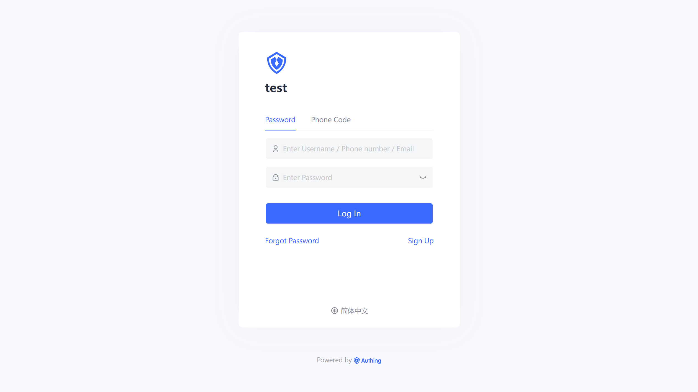

# Hosted login page vs Embedded login component

<LastUpdated/>

A variety of authentication integration methods are provided in the {{$localeConfig.brandName}} system, among which the most recommended and most commonly used are "Hosted Mode" and "Embedded Component " mode. Both modes provided by Approw are easy to implement. You can read the access flow of the [hosted login page](/guides/basics/authenticate-first-user/use-hosted-login-page.md) and the [embedd login component](/guides/basics/authenticate-first-user/use-embeded-login-component/) separately. The main difference between these two are in application scenarios, customization flexibility, and the cost of maintaining management.

## Hosted Login Page

The Approw host mode is considered to be the simplest and most secure way of integration. This is because the login flow is maintained by Approw and kept secure by Approw. For most integrations, the login flow hosted by Approw is recommended. Your business system will redirect the user to Approw, where the user is authenticated, and then redirects back to the application callback connection configured in the console. This design is considered as the best security practice. In terms of custom configuration, the host mode provides a moderate level of custom form configuration of the login and registration, which can be customized by the console configuration and CSS.

For details about access, please refer to [Use the Hosted Login Page to complete the authentication](/guides/basics/authenticate-first-user/use-hosted-login-page.md).

## Embedded login component

The customer-hosted login component (Guard) is considered to be the best balance between flexibility and integration. If the integration requires a deeper level of customization or the host mode cannot be used in some scenarios where the frontend and backend are separated, it is recommended to use the "embedded Component " mode. The customer embedded component connects and embeds the page by open-source-provided Guard. The embedded login component is built and updated by Approw, using best industry practice security design, only a few lines of JavaScript code can be integrated into your development project. It can be loaded directly from CDN or NPM, or it can be built from source code. The Approw login component also provides multiple integration modes of Javascript native, React, Vue and Angular, which can be seamlessly integrated in any of your projects and enjoy a high degree of customization flexibility.

For details about access, please refer to [Use the Hosted Login Page to complete the authentication.](/guides/basics/authenticate-first-user/use-embeded-login-component/)。

## Why need Approw host?

- Easy to maintain, no need to maintain, no need to update.
- Hosted and protected by Approw.
- No XSS (cross-site scripting) attacks and other potential risks.
- Easy to integrate.
- Can be customized through console configuration and CSS.
- Complex logic changes that require access to the source code are restricted.
- Redirect the user out of the application, then redirect to Approw, and then redirect again.

## What about embedded component?

- May require some maintenance. If you use a CDN, maintenance will be more restricted because Approw will keep it up to date. NPM packs a specific version of the login component, which means that it may need to be updated regularly in the project.
- It is still considered very safe if using recommended best practices to implemented project.
- Compared with building from scratch, the custom control function of source code is powerful, while greatly simplifying the development process and improving security.
- If you are fully following our documentation or related tutorials for integrated development, there will be no security risks. However, it needs to be noted that if your integrated implementation plan differs greatly from the recommended method, such as failing to keep the security credentials effectively, there may be potential security risks.
- May be vulnerable to XSS (Cross Site Scripting) attacks.
- Compared with the login process hosted by Approw, the integration and maintenance workload is higher.
- Keep users in the app, reducing redirects to and from Approw.
