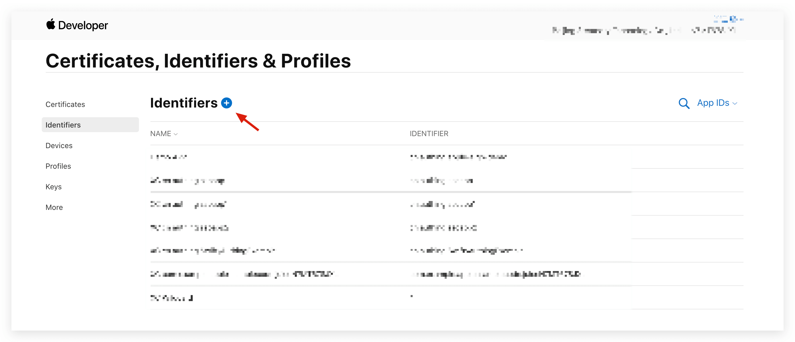
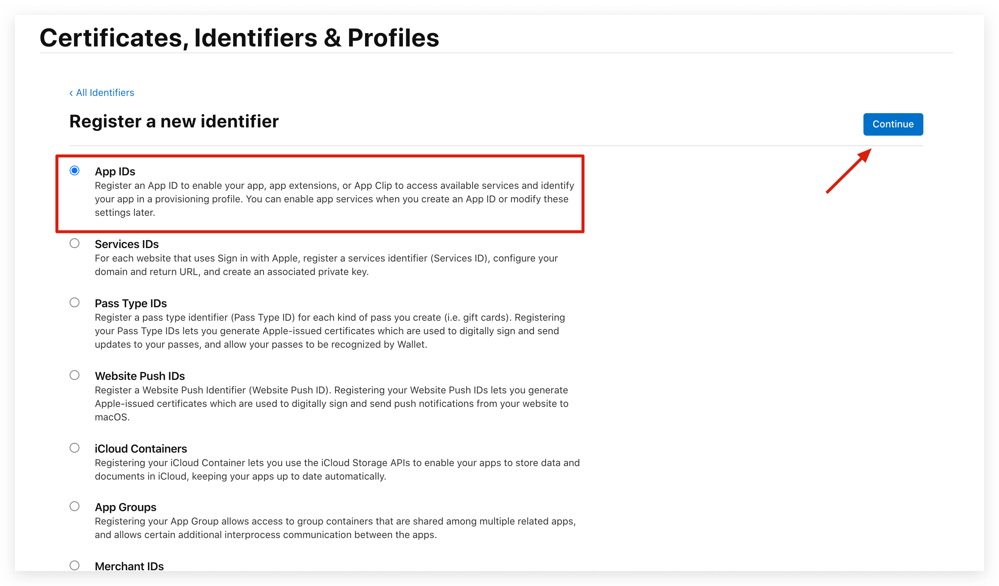
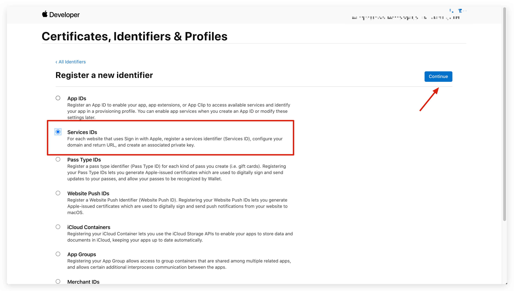
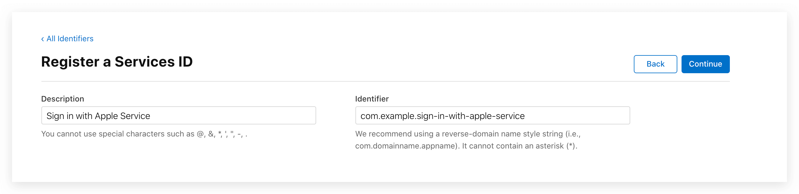
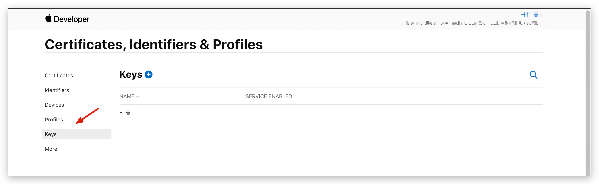
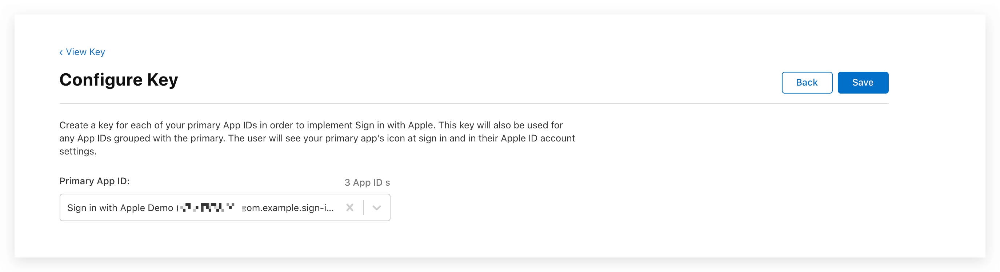
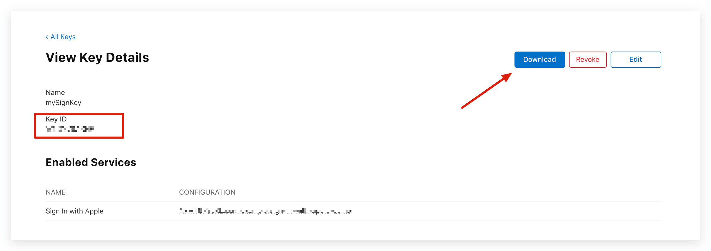

<IntegrationDetailCard title="获取 Team ID">

在 {{$localeConfig.brandName}} 控制台中配置 Sign in with Apple 社会化登录之前，你需要先在 [Apple Developer Portal](https://developer.apple.com/account/#) 中注册你的 iOS 应用。完成此操作后，你可以使用从 Apple 获取到的 ID 和 Secret 填入 {{$localeConfig.brandName}} Dashboard 配置表单。

</IntegrationDetailCard>

<IntegrationDetailCard title="创建一个 App ID">

前往 [Apple Developer Portal](https://developer.apple.com/account/#) 的 [Membership 页面](https://developer.apple.com/account/#/membership)，记录下 **Team ID**：

1. 在 Apple Developer Portal,  **Certificates, IDs, & Profiles** > **Identifiers** 页面，点击 ➕ 图标创建应用：

2. 选择 **App IDs** 然后点击 **Continue** 按钮继续：

3. 选择格式的应用类型，然后点击 **Continue** 按钮继续：

4. 填写应用描述和 **Bundle ID**，请记录下此 **Bundle ID**：

5. 滑动浏览器到下面找到 Sign in with Apple 并勾选

6. 最后点击点击 **Continue** 按钮创建应用。

</IntegrationDetailCard>

<IntegrationDetailCard title="创建一个 Service ID">

1. 回到 **Certificates, IDs, & Profiles** 点击 ➕ 图标，选择 **Services IDs** 然后点击 **Continue** 按钮继续：

2. 填写描述信息和 Identifier，然后点击 **Continue** 按钮创建 Service：

3. 找到刚刚创建的 Service，选中 **Sign In with Apple**，点击 **Configure**：

4. 填写 **Domains and Subdomains** 和 **Return URLs**:

- **Domains and Subdomains** 请填 **core.authing.cn**
- **Return URLs** 请填 `https://core.authing.cn/connection/social/apple/<YOUR_USERPOOL_ID>/callback`，请将 `<YOUR_USERPOOL_ID>` 替换成你的用户池 ID。

5. 点击 **Save**, **Continue**, 最后点击 **Register**.

6. 请记录下该 **Service ID**.

</IntegrationDetailCard>

<IntegrationDetailCard title="配置 Signing Key">

1. 回到 **Certificates, IDs, & Profiles** 页面，切换到 **Keys** Tab，点击 ➕ 图标：

2. 输入名称并勾选上 **Sign in with Apple**, 点击 **Configure**，确保选中的 **Primary App ID** 是你刚刚创建的那一个：

1. 点击 **Save**, **Continue**, 最后点击 **Register**.

2. 创建之后，记录下 **Key ID**，然后点击 **Download** 下载该密钥：

</IntegrationDetailCard>
