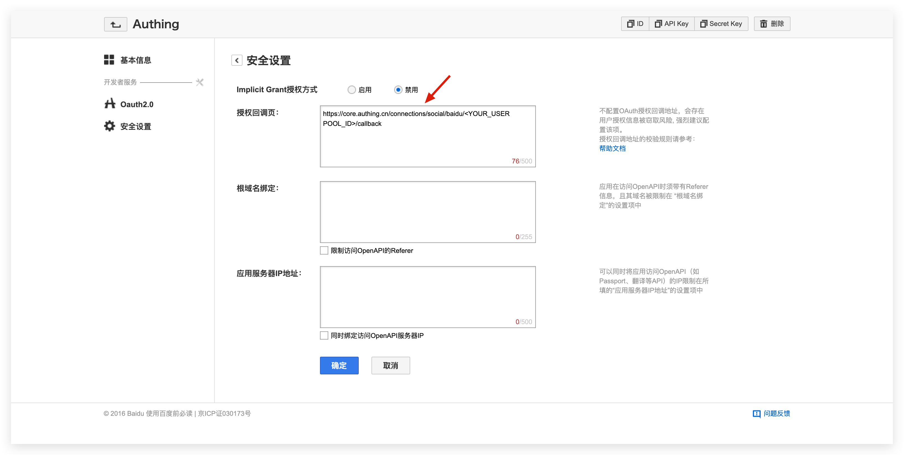

<IntegrationDetailCard title="在百度开放平台创建一个网站应用">

## 创建一个百度 OAuth 应用

前往[百度开发者服务管理控制台](http://developer.baidu.com/console#app/project) 创建一个工程（应用）：

你需要记录下该应用的 **API Key（即 Client ID）** 和 **Secret Key（即 Client Secret）**，后面需要用到。

在安全设置页面，设置授权回调页地址为：

| Field                      |                                       值                                       |
| -------------------------- | :----------------------------------------------------------------------------: |
| Authorization callback URL | `https://core.authing.cn/connection/social/baidu/<YOUR_USERPOOL_ID>/callback` |

> 将其中的 <YOUR_USERPOOL_ID> 替换为你的用户池 ID。

</IntegrationDetailCard>