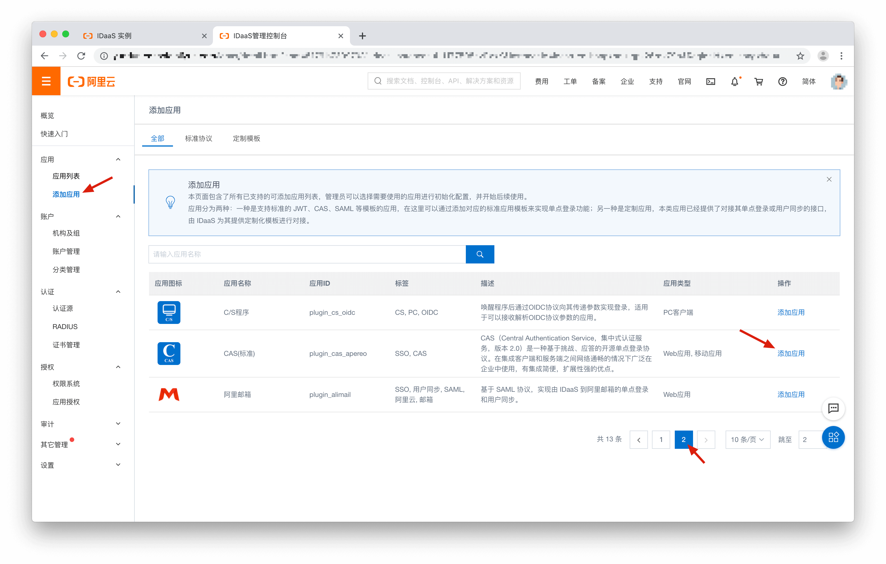
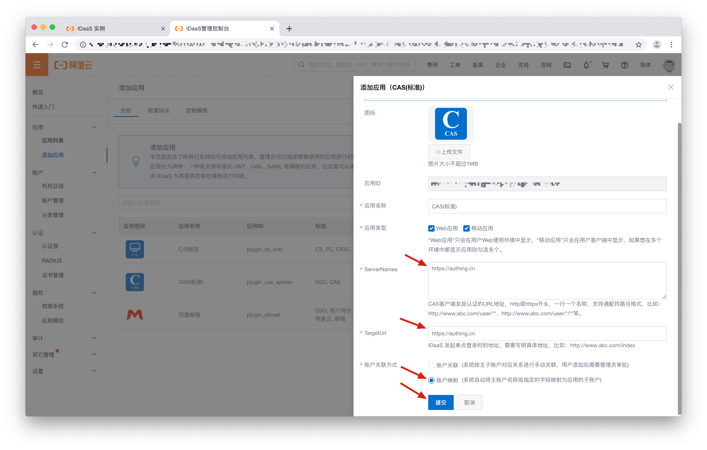
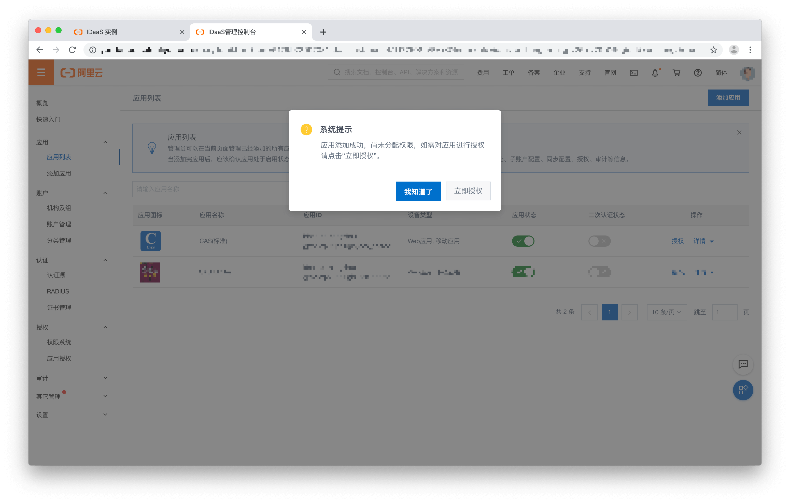
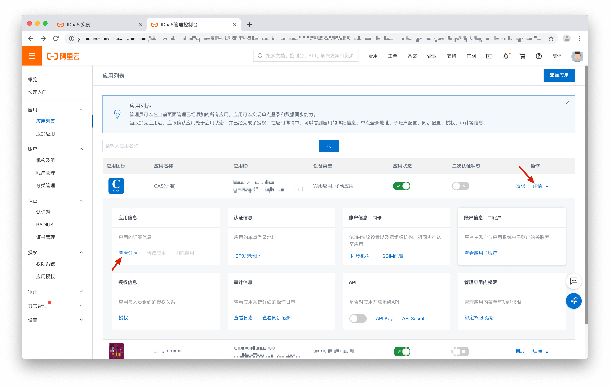
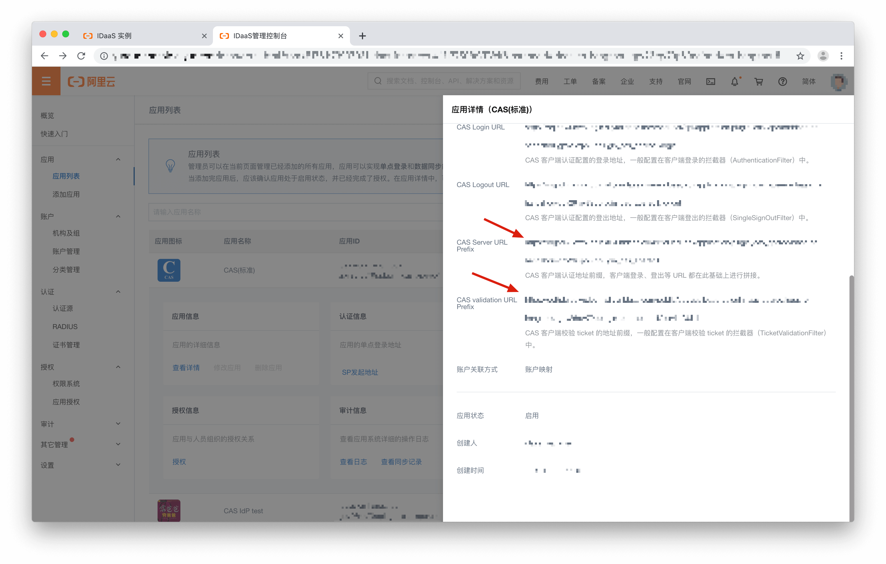

<IntegrationDetailCard title="Create CAS IdP">

Sign up in CAS IdP and gather information. Here use Alibaba Cloud CAS IdP as an example.
Subscribe Alibaba Cloud. In Identity console, located your instnace, click into detail.

On the left side, Applications -> Add Applications. Located CAS (standard) on the second page. Click Add Application

In configuration window, fill in ServerNames and TargetURL. Can be modified after complete Authing configuration. Account link method chose Account Mapping. Than Submit.

Successfully create.

Locate your application. Detail -> More Detail. As shown below:

Copy **CAS Server URL Prefix** and **CAS validation URL Prefix** for {{$localeConfig.brandName}} configuration.

</IntegrationDetailCard>
