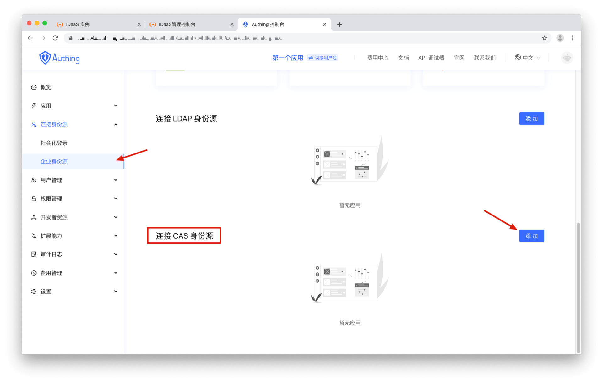
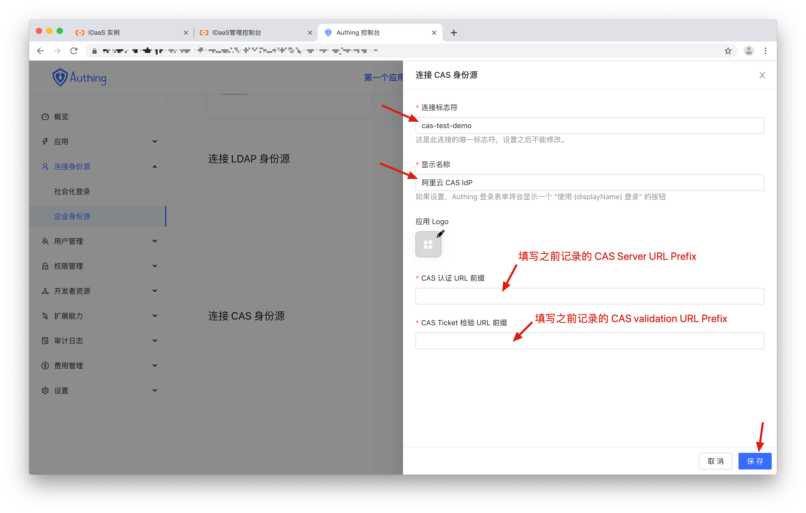
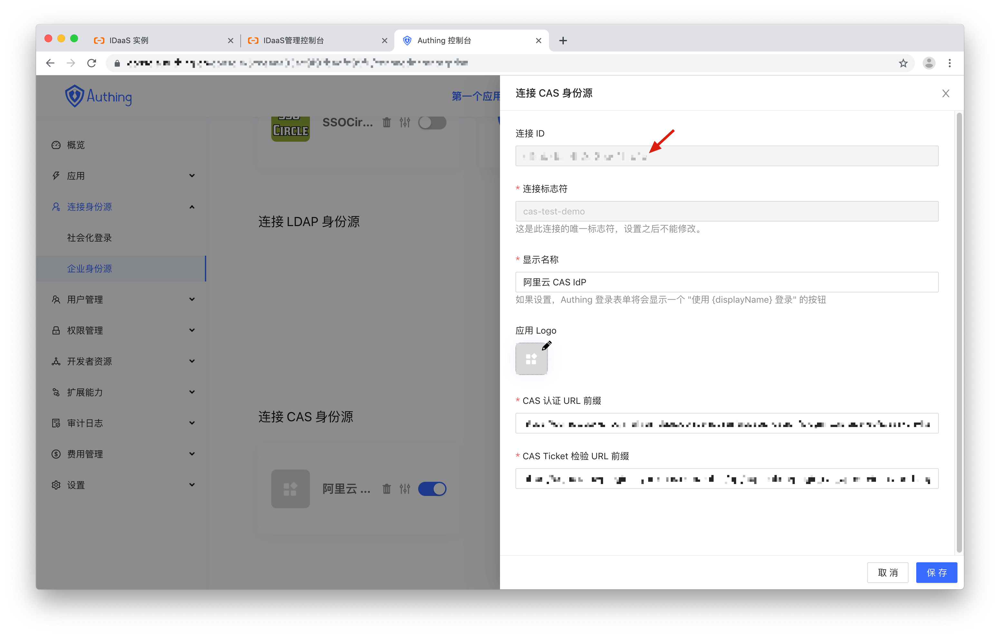
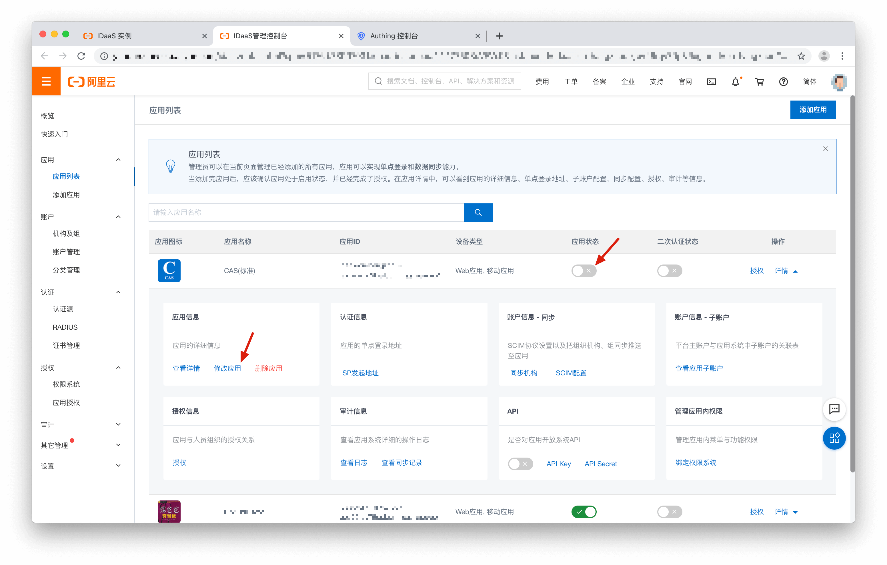
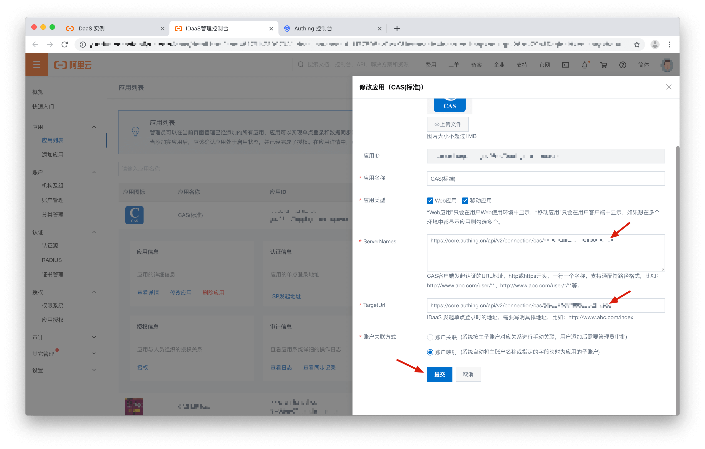

<IntegrationDetailCard :title="`Configure CAS IdP in {{$localeConfig.brandName}}`">

After create CAS IdP. Now need link CAS with {{$localeConfig.brandName}}.

In {{$localeConfig.brandName}} **Console** -> **Integrate IdP** -> **Enterprise IdP** locate **Integrate CAS IdP** than click **Add**

Fill Link labe, Display Name and copy **CAS Server URL Prefix** and **CAS validation URL Prefix** than click **Save**

Locate CAS Link click **Edit**, copy Link ID.

## Configure CAS IdP

Return to Alibaba Cloud CAS application setting. **Disabel** application then Modify ServerNames and TargetURL

Input `https://core.approw.com/api/v2/connection/cas/Link ID` in ServerNames and TargetURL. Click Save. Than **Enable** Applicaiton 

</IntegrationDetailCard>