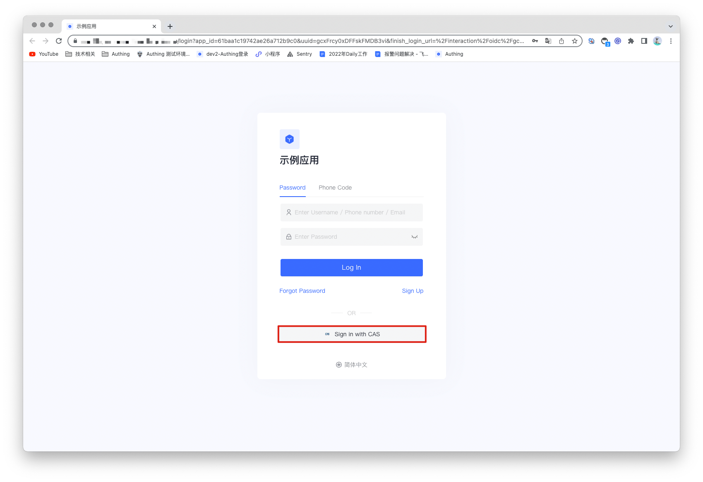
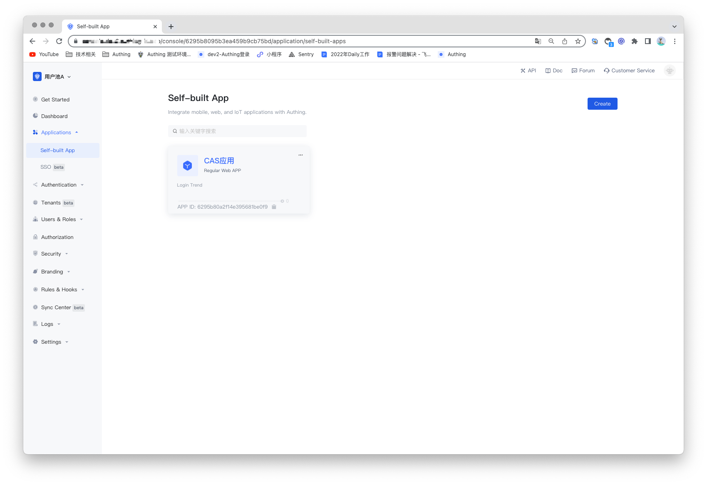
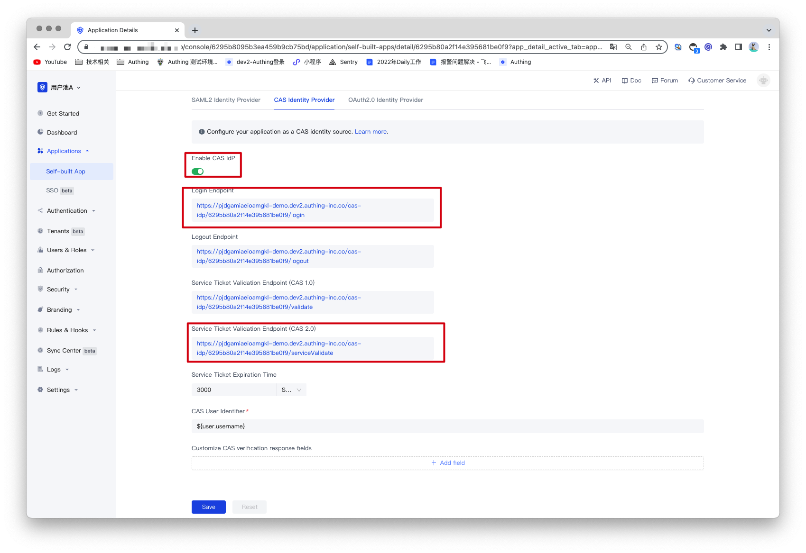
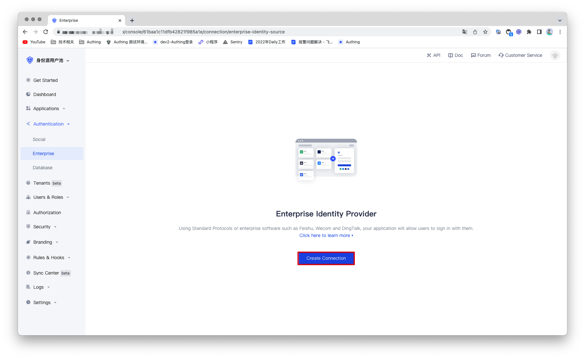
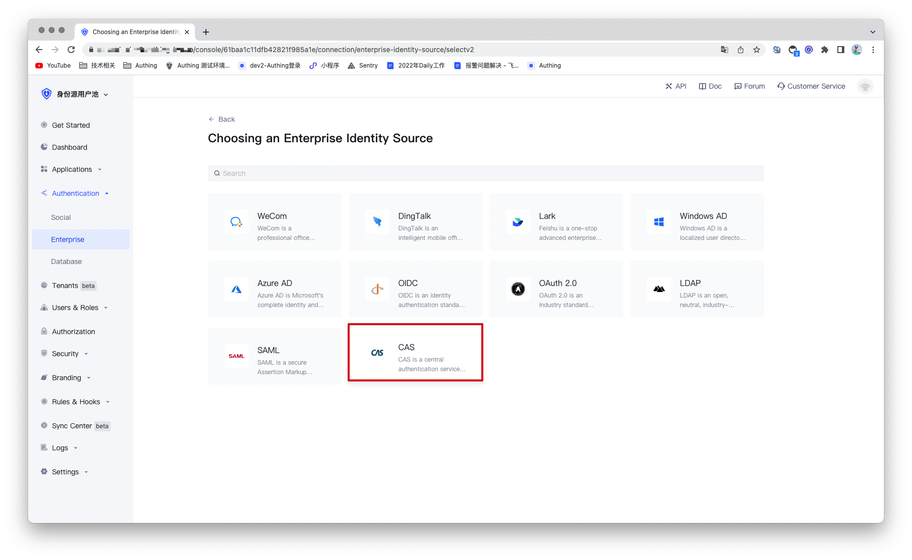
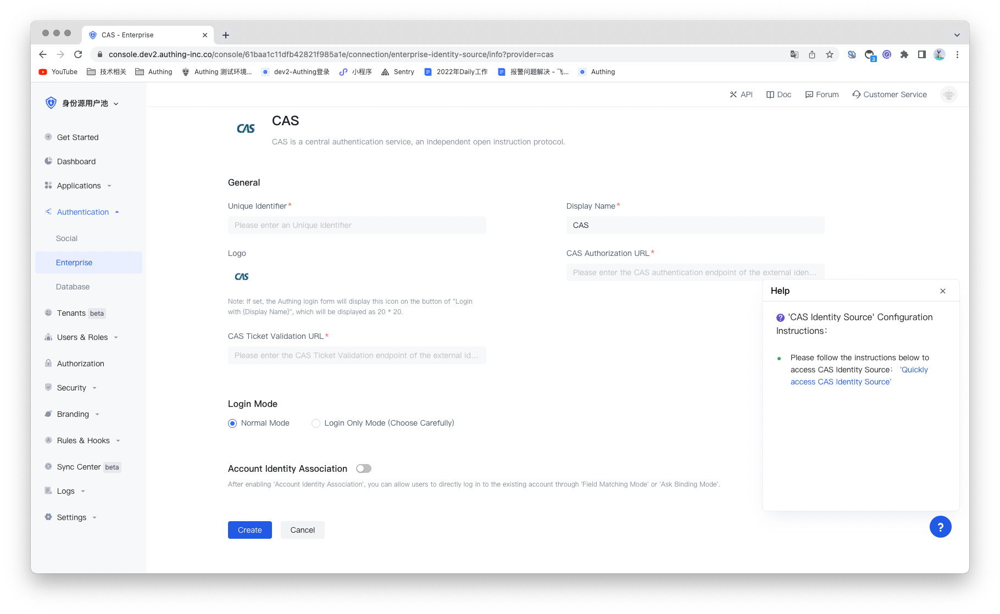
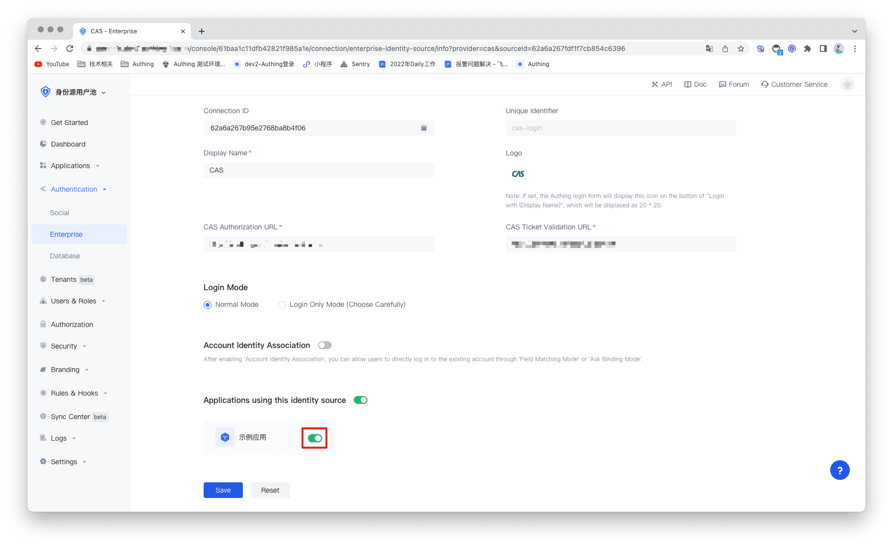

## CAS Identity Source

<LastUpdated/>

## Introduce

- **Overview**：CAS (Central Authentication Service ) is a single sign-on/single sign-out protocol for the Web. It allows users to access multiple applications while providing credentials (such as user ID and password) to the central CAS server application only once. Authing supports the authentication capabilities of the CAS protocol, and users only need to provide the services and configurations required for CAS protocol authentication. By configuring the CAS identity source, you can use it to complete the single sign-on and logout functions.
- **Application scenarios**：PC WebSite
- **End-User Perview **：

## Precautions：

- requires a CAS protocol capable service;
- This example will take the CAS IdP that comes with Authing as an example. The user pool connecting to the CAS identity source and the user pool serving as the CAS identity source cannot be the same.
- If you do not have an Authing console account, please go to the [Authing Console](https://authing.cn/) to register a developer account;

## Step 1: Create An CAS Identity Source

You need to configure your own CAS identity source (i.e. Identity Provider IDP) and get the relevant information. This example will take the CAS IdP that comes with Authing as an example. If you already have a CAS identity source, you can go directly to step 2 to configure it.

1.1 Open the **Authing console** and enter the user pool that you want to use as the identity source, here called **"User Pool A"**. Click the "Apps" option on the left menu, find the app you want to enable CAS IdP capability on the right panel, and click to enter the app configuration page.

1.2 Find "Other Configurations" in the "App Configuration" tab, turn on the "Enable CAS IdP" switch, and click the "Save" button in the upper right corner. Record the contents of "Login Endpoint" and "Service Ticket Verification Endpoint (CAS 2.0)", which will be used in subsequent configurations.

## Step2: Configure CAS identity Source in the Authing console

2.1 Open the **Authing console** and enter the user pool that you want to connect to the CAS identity source, here called **"User Pool B"**. On the left menu, select Connect to Identity Source > Enterprise Identity Source, and select Create Enterprise Identity Source on the right panel.

2.2 Find "CAS" in the right panel and click it.

2.3 According to the configuration requirements of CAS, fill in the configuration content required by the CAS protocol.

| Code  | Field/Function               | Description                                                  |
| ----- | ---------------------------- | ------------------------------------------------------------ |
| 2.3.1 | Uniquely identifies          | a. The unique identifier consists of lowercase letters, numbers, and -, and the length is less than 32 digits. b. This is the unique identifier of this connection and cannot be modified after setting. |
| 2.3.2 | Display Name                 | This name will be displayed on the button on the end user's login screen. |
| 2.3.3 | Application Logo             | The identity source logo displayed on the login screen button. |
| 2.3.4 | CAS Authorization URL        | The URL used to initiate an authentication request to the CAS IdP. Fill in the "Login Endpoint" recorded earlier. |
| 2.3.5 | CAS Ticket test URL          | The URL used to obtain identity information from the CAS IdP. Fill in the previously recorded "service ticket verification endpoint (CAS 2.0"). |
| 2.3.7 | Login Mode                   | After enabling the "Login Only Mode", you can only log in to an existing account and cannot create a new account. Please choose carefully. |
| 2.3.8 | Account identity association | When "Account Identity Association" is not enabled, a new user is created by default when a user logs in through an identity source. After enabling "Account Identity Association", you can allow users to log in to existing accounts directly through "Field Matching" or "Asking for Binding". |

After the configuration is complete, click the "Save" button to complete the creation.

## Step 3：Development Access

- **Recommended development access method**：Use a hosted login page
- **Description of advantages and disadvantages**：The operation and maintenance are simple, and Authing is responsible for  the operation and maintenance. Each user pool has an independent  second-level domain name; if you need to embed it into your application, you need to use the pop-up mode to log in, that is: after clicking the  login button, a window will pop up, the content is the login page hosted by Authing, or the browser The server redirects to the login page  hosted by Authing.
- **Detailed access method**：

3.1 Create an app in the Authing console. For details, see: [How to create an app in Authing](https://docs.authing.cn/v2/guides/app/create-app.html).

3.2 On the created CAS identity source connection details page, open and associate an app created in the Authing console.

3.3 Experience the enterprise login of CAS on the login page.

